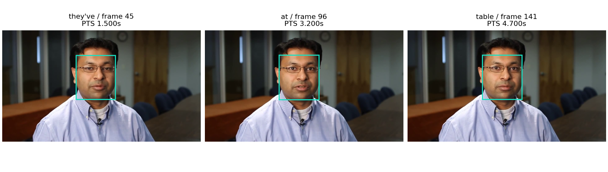

# 问题一：三模态特征提取与时间对应

## 1 任务与建模思路

附件一的100条视频及给定文本需要转化为可使用、可追溯的三模态特征。本问的核心是说明“提取什么、怎样对应、缺失如何表示”，并交付全部样本的实际特征。

采用一条处理主线：核对样本与素材 → 按实际时间解码 → 分别提取文本、声音和视觉特征 → 建立词与声音的对应 → 按时间交叠汇聚 → 保存特征、时间及有效标记。模型均作为固定提取器使用，不以附件一情感标签训练或调参。

## 2 特征定义与提取

### 2.1 时间基准

音频转为16 kHz单声道，采样时间和视频呈现时间戳PTS均相对容器起点。设音频起点为a、采样数为N，末帧PTS为t，末帧包时长为δ，观测终点定义为：

`D = max(a + N/16000, t + δ).`

此定义保留实际静音和画面，不把容器声明中没有观测的空尾计为有效数据；各模态真实覆盖范围另行记录。

### 2.2 三模态表示

|模态|表示与维度|提取方式及作用|
|---|---|---|
|文本|上下文词向量，768维|bert-base-uncased最后层；原文字符范围对应的子词向量平均，保留语义及上下文。|
|声音|原生47维；汇聚后97维|MFCC、能量、频谱、F0与有声概率，描述音色及韵律。|
|视觉|表情52维；场景512维|MediaPipe面部形变参数与ResNet18全局池化表示，分别描述面部运动和画面外观。|

文本编码保留标点和数字；说话人元数据用等长空白替代。对齐文本另作大小写统一及数字、缩写的口语展开，并保存每个词到原文字符、BERT子词的位置映射。设对应子词集合为B_w，则 h_w = Σ(k∈B_w) H_k / |B_w|。本批无超长截断及未知词元。[1]

声音采用25 ms Hann窗、20 ms步长、512点FFT、64个Mel滤波器（20–8000 Hz）；13维MFCC及各13维一、二阶差分，加log-RMS、过零率、谱质心、带宽、85%滚降频率、平坦度、F0和有声概率，共47维。差分窗口9帧；pYIN窗64 ms、F0范围50–500 Hz。[2]

汇聚输出47维均值、47维标准差、F0半音值12log₂(F0/27.5)的均值与标准差、有声比例，共97维。F0及半音仅用有声观测计算；无声不当作0 Hz参与平均，音高四列单独设置有效标记。

视觉约每100 ms取帧，保留实际PTS和原帧索引。MediaPipe最多检测3张脸，取面积最大者；整帧失败时用YuNet框选区域重试。检测及存在阈值均为0.5。ResNet18采用IMAGENET1K_V1权重、短边256及中心裁剪224。表情和场景独立设有效标记。[3–4]

<!-- pagebreak -->

## 3 时间对应与统一汇聚

### 3.1 估计词的时间权重

用MMS_FA处理音频和规则化文本，在CTC合法路径上作对数域前后向递推，允许状态停留、前进一步及合法跨两步转移，并用首尾上下文状态容纳句外声音。[5] 设词w的进入、退出分布分别为a_w(t)、b_w(t)，其在声学位置t的占用权重为：

`γ_w(t) = Σ(u≤t) a_w(u) − Σ(u<t) b_w(u).`

保留进入、退出的5%、50%、95%分位，中位数用于展示词区间，完整γ用于特征汇聚；低于10⁻⁴的尾部置零。模型步长320采样、感受野400采样，第k个位置的时间锚点为a+(320k+199.5)/16000；相邻锚点中点划分时间单元C_t，首尾截于真实音频范围。

另用固定Whisper small识别结果检查给定文字与声音是否相符。词级使用标记G_w要求：英语；词匹配且整句差异比例≤0.25或属于至少3词的连续匹配段；识别词概率≥0.5；CTC词分数≥0.3；条件时间宽度和两种估计的区间间隙均≤0.2 s。阈值固定用于决定是否使用词级对应，不解释为正确概率。

### 3.2 用同一时间规则连接模态

把相邻原生观测间的特征近似为分段常值。设观测x_j的时间单元为I_j、有效标记为M_j，以时间交叠量定义权重：

`q_wj = M_j Σ_t γ_w(t) |C_t ∩ I_j|.`

`μ_w = Σ_j q_wj x_j / Σ_j q_wj;   σ²_w = Σ_j q_wj (x_j − μ_w)² / Σ_j q_wj.`

声音保存均值与标准差，表情和场景保存均值；音高计算再乘有声标记。有声比例为有效有声权重之和除以全部有效声音权重。视频单元由相邻采样帧PTS的中点划分。

仅当G_w=1且有效时间不少于max(5 ms, 0.05×Σ_t γ_w(t)|C_t|)时采用该模态输出；音高另需至少5 ms有声时间。无效值置零并关闭标记，使用者不能凭数值是否为零判断缺失。表情缺失不影响同一词的场景分支。

### 3.3 未建立词级对应的处理

所有样本均保存原生序列；无法建立词级对应时，保留文本和实际音视频，不强行分配词时间。读取器可按需生成100 ms网格 J_l=[0.1l,min(0.1(l+1),D))：声音、视觉直接按交叠时长汇聚，文本只通过γ及G映射到相应网格。

磁盘保存变长序列；批处理才按批内最大长度在右侧补零，同时输出lengths、sequence_mask和各模态掩码。原生、词级、时间网格是同一数据的不同组织方式；词级关系缺失不会导致原始样本被删除。

上述设计用统一的时间权重处理采样尺度差异，并将“存在该模态”和“可与文字对应”分开。其价值在于结果可读、可追溯和能处理异常，不另增预测器或扩大特征拼接。

<!-- pagebreak -->

## 4 结果与典型样本

### 4.1 全量处理结果

100条样本全部生成NPZ和对应JSON，共1948个文本词、7905个100 ms网格位置。观测终点合计786.278 s，容器声明合计1120.144 s；其中82条声明空尾超过0.5 s，故序列长度依据实际观测计算。

|输出|可用数量|结果说明|
|---|---|---|
|文本|1948词|全部保留原文字符及子词对应|
|词级声音、场景|各1464词|仅在词级使用规则通过时汇聚|
|词级音高、表情|1253词、1420词|按各自有效标记读取|
|声音、场景网格|各100条样本|不依赖词级关系是否可用|
|表情网格|96条样本|其余4条保留其他模态|

20条没有可采用的词级音视频关系，484个未对应词仍保留文本。现有自动诊断包括未检出语音4条、英文文本一致性低13条、非英语或语言判断不确定3条；这些诊断不作为人工事实标注。全部20条仍有声音和场景网格，其中16条有表情网格。

### 4.2 一个可回查的三模态对应实例

样本-3g5yACwYnA$_$13的原文为“They've been able to find solutions or at least bring some answers to the table.”，观测终点5.500 s。以下区间均按零基、左闭右开表示。

|原文片段与字符区间|声音区间/s|视频原帧段|使用方式|
|---|---|---|---|
|find [21,25)|2.162–2.402|[65,73)|词级三模态对应|
|solutions [26,35)|2.442–2.962|[74,89)|词级三模态对应|
|or [36,38)|不采用词级估计|不作词级对应|保留文本与原生音视频|

solutions对应第5行：text[5]为768维，BERT位置为[8]；word_audio[5]为97维，F0均值103.28 Hz、有声比例0.692；word_expression[5]为52维，左/右口角参数0.042/0.041；word_scene[5]为512维。该区间包含原帧81，PTS为2.700 s。示例展示区间使用中位数，实际向量按完整时间权重汇聚。

完整逐词关系见typical_example.json及样本JSON。示例说明文字、声音时段、视频帧和特征行可逐项连接，而不是只展示三个互不对应的向量。

<!-- pagebreak -->

## 5 验证、方法取舍与适用范围

### 5.1 计算与复现检查

逐条核对来源摘要、样本编号、数组维度、时间范围及补零标记，并独立按时间交叠重算音高汇聚。共3700项来源与结构检查通过，独立音高汇聚的最大缩放误差为5.53×10⁻⁸。对全部1948词检查了原文映射；50/100/200 ms网格的有效观测时间积分一致。

已从空结果目录重新运行16个步骤，未复用样本特征，100条样本的3400个数组及掩码逐元素重现。复用固定模型与镜像时，成功步骤累计696.10 s。该耗时属于提取、推理与检查；固定模型无需从头训练，首次下载和构建环境另计。

### 5.2 同源公开结果对照

先以波形匹配确定公开长视频与题目片段的起点，再比较同一内容上的结果；37个源视频中，97条片段通过定位检查，归一化互相关中位数0.9911。声音、视觉使用同源公开计算序列，文本另用附件二中相同输入上下文的预计算表示。不读取情感标签值，也不将参考特征回填为本问输出。[6]

|对照项目|范围|主要结果|
|---|---|---|
|文本（附件二）|14个相同BERT上下文、275词|向量平均绝对差5.86×10⁻⁷|
|声音|38174个匹配帧|有声判定一致78.10%；19466个共同有声帧的F0差中位数0.1283半音，93.16%在1半音内|
|人脸可用性|7728个匹配位置|本地检测标记与公开OpenFace2成功标记一致97.96%|

这些结果支持来源对应及所测属性的一致性；不同视觉描述体系不作逐维等同，公开算法输出也不是人工真值。所测差异和可用范围随结果保留，用于评估提取过程是否合理。

### 5.3 为什么保留当前主方案

在100条音频的原始、前置0.6 s静音、振幅减半和20 dB白噪声条件下，MMS与Wav2vec2共运行800次推理。固定1464个可用词，MMS扣除已知平移后的边界变化95分位依次为20、0、20 ms；加噪时MMS无变化超过100 ms的词，Wav2vec2有9词。

后续Qwen多起点与物理约束方案改善了部分公开时间参考的一致性，但在全部可对照词及噪声下的特征稳定性上未形成一致优势。因此主输出保留已完成全量复现的MMS时间权重方案；不把多个候选并列拼接，也不宣称MMS在所有目标下最优。对照摘要及完整研究档案入口见资料索引。

### 5.4 局限与结论

多脸场景取最大脸，未验证其一定是说话人；强制对齐依赖文字与声音基本相符；20条样本暂不能提供可用词级关系。相应影响已通过独立模态掩码、原生序列及时间网格显式保留。若后续任务确需说话人归属或更细语音对应，再针对这些样本研究，不能把当前输出解释为已解决这些问题。

本问已完成全100条特征提取、时间组织、缺失处理、示例展示及复现交付。其结论限于这一处理任务；情感预测收益由后续问题在规定数据划分上另行评估。

<!-- pagebreak -->

## 6 文件、运行方式与参数

### 6.1 输出文件与读取

每个sample_id唯一对应features/samples中的一份NPZ和同名JSON；文件名将“$_$”替换为“__”，JSON保留原编号。NPZ存原生序列、词级向量、时间及掩码；JSON存原文、词映射、素材摘要与处理来源。features/全100条特征汇总.csv给出精确时长、长度和文件摘要；input_contract.json定义字段。

原生声音为L_A×47、表情为L_V×52、场景为L_V×512；词级文本、声音、表情、场景依次为L_W×768、L_W×97、L_W×52、L_W×512。100 ms网格采用相同输出维度并按需生成，不能将网格总长度当作每种模态的有效长度。

Python 3.11与NumPy 2.2.6可直接读取。运行 python scripts/q1v6_reader_check.py --features features，即检查100条、1948词和7905个网格位置。load_sample支持native、word、clock三种读取方式，collate输出填充序列及标记；可直接运行的例子见README.md。

### 6.2 完整运行流程

把原题附件父目录设为.env中的DATA_ROOT_HOST，使/data下出现附件1；使用空results目录，按基础、q1、q1-next、q1-refinement顺序构建随附Docker镜像。在最终镜像中依次运行：

`q1_prepare → q1_extract → q1_quality → q1_scene → q1n_prepare → q1n_asr → q1n_posterior → q1n_audit → q1f_prepare → q1f_faces → q1v6_alignment → q1v6_media_clock → q1v6_features → q1v6_validate → q1v6_geometry → q1v6_visualize.`

最终特征生成于results/q1_deep_v6/features_v2。该顺序包含原生提取、对齐检查及验证所需中间结果；最后一级按本文的有声F0与时间汇聚定义生成交付特征。README.md提供完整命令，rebuild_logs及reproduction保存既有重建记录。不同硬件下允许比较合理浮点误差，掩码和来源需另行核对。

|组件|固定版本或权重|
|---|---|
|基础运行|Python 3.11.13；PyTorch/Torchaudio 2.7.1+cu126；NumPy 2.2.6|
|文本、声音|Transformers 4.52.4；bert-base-uncased固定revision；Librosa 0.11.0；MMS_FA固定权重|
|识别与视觉|faster-whisper 1.2.1（small）；MediaPipe 0.10.32；OpenCV 4.11.0.86；ResNet18 IMAGENET1K_V1|

模型摘要、BERT revision、Whisper锁文件与人脸恢复参数随evidence保存；参数以最终features配置、input_contract和本文定义为准，早期中间层配置不覆盖最终接口。容器文件保留固定依赖和基础镜像摘要；原视频及大型通用权重不重复打包。

### 6.3 参考资料

[1] Devlin等. BERT: Pre-training of Deep Bidirectional Transformers for Language Understanding. NAACL, 2019. https://aclanthology.org/N19-1423/

[2] Librosa 0.11.0. pyin：基频、有声标记与概率接口. https://librosa.org/doc/0.11.0/generated/librosa.pyin.html

[3] Google AI Edge. Face Landmarker：面部标志点与表情参数. https://ai.google.dev/edge/mediapipe/solutions/vision/face_landmarker

[4] Torchvision. ResNet18及IMAGENET1K_V1预处理. https://docs.pytorch.org/vision/0.22/models/generated/torchvision.models.resnet18.html

[5] Torchaudio 2.7.0. MMS_FA及强制对齐接口. https://docs.pytorch.org/audio/2.7.0/generated/torchaudio.pipelines.MMS_FA.html

[6] CMU Multimodal SDK及MOSEI计算序列. https://github.com/CMU-MultiComp-Lab/CMU-MultimodalSDK 。本次镜像、版本与摘要另见external_validation/sources。

<!-- pagebreak -->

## 7 全100条样本特征汇总（1/2）

所有样本均保留文本、声音及视觉文件；缺失位置用掩码表示。共同维度：文本768，声音原生47/汇聚97，表情52，场景512。原生声音步长20 ms，视觉约100 ms；词级按词汇聚，网格100 ms。

D为观测终点（秒，表内保留3位小数）；A/V为原生声音/视觉行数；W/U为总词数/可用词级声音与场景数；E为可用词级表情数；gA/gE/gS为声音/表情/场景有效网格数；L为网格总长度。各模态未观测区间不计有效长度，详细区间及精确数值见对应JSON和CSV。

|样本ID|D/s|A/V|W/U|E|gA/gE/gS|L|
|---|---|---|---|---|---|---|
|-3g5yACwYnA$_$13|5.500|270/55|15/14|14|54/55/55|55|
|-3g5yACwYnA$_$3|14.367|717/144|29/28|28|144/144/144|144|
|-3g5yACwYnA$_$2|9.367|462/93|14/11|11|93/94/94|94|
|-3g5yACwYnA$_$9|8.800|435/88|23/22|22|87/88/88|88|
|-3nNcZdcdvU$_$5|7.867|390/79|18/16|16|78/78/79|79|
|-HwX2H8Z4hY$_$2|3.967|196/40|4/3|2|40/14/40|40|
|-HwX2H8Z4hY$_$5|5.633|278/56|9/9|2|56/20/57|57|
|-HwX2H8Z4hY$_$6|3.333|163/33|7/6|4|33/23/34|34|
|-HwX2H8Z4hY$_$9|7.733|382/78|22/17|1|77/6/78|78|
|-NFrJFQijFE$_$1|5.720|283/57|16/0|0|57/0/58|58|
|-NFrJFQijFE$_$2|6.840|335/68|18/0|0|67/0/69|69|
|-THoVjtIkeU$_$12|14.867|741/149|39/37|37|149/149/149|149|
|-THoVjtIkeU$_$2|4.267|212/43|10/10|10|43/43/43|43|
|-THoVjtIkeU$_$6|8.067|400/81|30/23|23|80/81/81|81|
|-UuX1xuaiiE$_$1|10.333|514/104|27/27|27|103/104/104|104|
|-UuX1xuaiiE$_$0|3.700|179/37|9/8|8|36/37/37|37|
|-UuX1xuaiiE$_$3|4.100|202/41|9/8|8|41/41/41|41|
|-UuX1xuaiiE$_$6|8.100|398/81|23/22|22|80/81/81|82|
|-a55Q6RWvTA$_$3|22.133|1105/222|65/61|61|221/222/222|222|
|-aNfi7CP8vM$_$7|8.667|427/87|18/14|14|86/87/87|87|
|-aqamKhZ1Ec$_$0|11.000|545/110|17/10|10|109/110/110|110|
|-dxfTGcXJoc$_$1|16.133|801/162|38/35|35|161/162/162|162|
|-dxfTGcXJoc$_$0|20.533|1021/206|45/37|30|205/161/206|206|
|-dxfTGcXJoc$_$2|16.667|832/167|37/31|31|167/167/167|167|
|-dxfTGcXJoc$_$6|12.733|632/127|30/26|26|127/128/128|128|
|-egA8-b7-3M$_$26|6.000|297/60|15/15|15|60/60/60|60|
|-egA8-b7-3M$_$17|7.267|355/72|16/16|16|71/73/73|73|
|-egA8-b7-3M$_$18|8.367|414/84|22/21|21|83/84/84|84|
|-egA8-b7-3M$_$16|5.533|275/56|11/11|11|55/56/56|56|
|-egA8-b7-3M$_$13|4.167|202/42|11/11|11|41/42/42|42|
|-egA8-b7-3M$_$1|10.233|508/102|22/16|16|102/103/103|103|
|-egA8-b7-3M$_$6|6.233|310/63|12/12|12|62/63/63|63|
|-egA8-b7-3M$_$9|5.067|247/51|10/10|10|50/51/51|51|
|-egA8-b7-3M$_$20|6.633|324/66|20/20|20|65/67/67|67|
|-iRBcNs9oI8$_$3|5.606|277/56|8/0|0|56/57/57|57|
|-iRBcNs9oI8$_$7|4.071|201/41|9/0|0|41/41/41|41|
|-iRBcNs9oI8$_$6|2.870|142/29|5/0|0|29/29/29|29|
|-iRBcNs9oI8$_$9|3.403|169/34|5/0|0|34/25/34|35|
|-iRBcNs9oI8$_$8|8.075|402/81|21/0|0|81/81/81|81|
|-lzEya4AM_4$_$5|7.667|379/77|19/18|18|76/77/77|77|
|-lzEya4AM_4$_$6|14.767|738/148|43/41|41|148/148/148|148|
|-mJ2ud6oKI8$_$1|6.073|303/61|13/0|0|61/0/61|61|
|-mJ2ud6oKI8$_$2|5.706|286/57|11/0|0|57/25/58|58|
|-mJ2ud6oKI8$_$6|2.236|112/23|5/0|0|23/23/23|23|
|-mJ2ud6oKI8$_$9|7.007|346/70|22/0|0|70/71/71|71|
|-mJ2ud6oKI8$_$8|4.171|209/42|11/0|0|42/42/42|42|
|-mqbVkbCndg$_$0|6.500|320/65|14/13|13|64/65/65|65|
|-t217m2on-s$_$2|5.667|282/57|12/10|10|57/57/57|57|
|-t217m2on-s$_$7|17.167|852/172|45/44|44|171/172/172|172|
|-tANM6ETl_M$_$3|6.733|331/68|22/21|21|66/68/68|68|

<!-- pagebreak -->

## 7 全100条样本特征汇总（2/2）

所有样本均保留文本、声音及视觉文件；缺失位置用掩码表示。共同维度：文本768，声音原生47/汇聚97，表情52，场景512。原生声音步长20 ms，视觉约100 ms；词级按词汇聚，网格100 ms。

D为观测终点（秒，表内保留3位小数）；A/V为原生声音/视觉行数；W/U为总词数/可用词级声音与场景数；E为可用词级表情数；gA/gE/gS为声音/表情/场景有效网格数；L为网格总长度。各模态未观测区间不计有效长度，详细区间及精确数值见对应JSON和CSV。

|样本ID|D/s|A/V|W/U|E|gA/gE/gS|L|
|---|---|---|---|---|---|---|
|-tPCytz4rww$_$11|5.467|269/55|17/10|10|54/55/55|55|
|-tPCytz4rww$_$10|4.767|234/48|12/10|10|47/48/48|48|
|-tPCytz4rww$_$12|11.833|587/119|26/18|18|118/119/119|119|
|-tPCytz4rww$_$16|7.200|357/72|16/12|12|72/72/72|72|
|-tPCytz4rww$_$18|6.633|329/66|16/14|14|66/67/67|67|
|-vxjVxOeScU$_$4|9.100|452/91|21/18|18|91/91/91|92|
|-wMB_hJL-3o$_$7|6.033|299/61|22/22|22|60/60/61|61|
|-wny0OAz3g8$_$1|6.833|339/68|22/21|21|68/69/69|69|
|-wny0OAz3g8$_$0|3.333|164/33|9/9|9|33/34/34|34|
|-wny0OAz3g8$_$3|6.133|305/61|20/19|19|61/62/62|62|
|-wny0OAz3g8$_$2|6.667|327/67|23/23|23|66/67/67|67|
|-wny0OAz3g8$_$5|6.900|338/69|20/20|20|68/69/69|69|
|-wny0OAz3g8$_$7|8.067|396/81|29/25|25|80/81/81|81|
|-wny0OAz3g8$_$9|6.200|303/62|20/19|19|61/62/62|62|
|-571d8cVauQ$_$0|5.167|250/52|12/10|10|50/51/52|52|
|-571d8cVauQ$_$5|15.267|756/152|43/41|41|152/153/153|153|
|-I_e4mIh0yE$_$1|7.600|373/76|18/18|18|75/76/76|76|
|-I_e4mIh0yE$_$3|9.133|450/91|22/15|15|90/92/92|92|
|-UacrmKiTn4$_$10|7.333|363/73|18/18|18|73/74/74|74|
|-UacrmKiTn4$_$4|4.733|235/48|14/14|14|47/48/48|48|
|-hnBHBN8p5A$_$7|7.341|366/73|13/0|0|74/52/74|74|
|-hnBHBN8p5A$_$6|6.381|317/64|13/0|0|64/37/64|64|
|-qDkUB0GgYY$_$6|4.667|231/47|16/14|14|47/47/47|47|
|-uywlfIYOS8$_$4|6.033|295/61|18/17|17|59/61/61|61|
|-6rXp3zJ3kc$_$8|12.800|637/128|34/30|30|128/128/128|128|
|-9y-fZ3swSY$_$0|6.900|338/69|22/10|10|68/69/69|69|
|-9y-fZ3swSY$_$4|2.800|134/28|11/10|10|27/28/28|28|
|-9y-fZ3swSY$_$8|4.967|246/50|12/10|9|50/46/50|50|
|-AUZQgSxyPQ$_$2|22.500|1121/225|41/32|32|224/225/225|225|
|-HeZS2-Prhc$_$2|8.233|408/82|16/15|15|82/83/83|83|
|-MeTTeMJBNc$_$0|9.333|461/94|21/21|21|93/94/94|94|
|-MeTTeMJBNc$_$13|5.400|263/54|14/12|12|53/54/54|54|
|-MeTTeMJBNc$_$7|10.500|521/105|31/28|28|105/105/105|105|
|-RfYyzHpjk4$_$11|5.233|254/52|17/17|17|51/53/53|53|
|-RfYyzHpjk4$_$8|4.567|227/46|17/16|16|46/46/46|46|
|-RfYyzHpjk4$_$2|5.500|270/55|25/18|18|54/55/55|55|
|-UUCSKoHeMA$_$0|7.867|387/79|18/18|18|78/79/79|79|
|-ri04Z7vwnc$_$0|2.794|139/28|8/0|0|28/0/28|28|
|-ri04Z7vwnc$_$2|6.006|296/60|16/0|0|60/24/61|61|
|-ri04Z7vwnc$_$5|3.504|172/35|8/0|0|35/35/35|36|
|-s9qJ7ATP7w$_$1|4.767|233/47|11/9|9|47/48/48|48|
|-s9qJ7ATP7w$_$0|6.867|336/69|24/16|16|68/69/69|69|
|-s9qJ7ATP7w$_$5|8.533|420/85|19/19|19|84/86/86|86|
|-s9qJ7ATP7w$_$4|4.400|213/44|9/8|5|43/31/44|44|
|-s9qJ7ATP7w$_$7|6.933|342/70|28/20|13|69/53/70|70|
|-s9qJ7ATP7w$_$6|2.467|116/24|5/3|3|24/19/25|25|
|-s9qJ7ATP7w$_$8|3.267|160/33|12/11|11|32/33/33|33|
|-yRb-Jum7EQ$_$1|29.267|1456/293|49/0|0|292/293/293|293|
|-yRb-Jum7EQ$_$5|13.167|653/132|25/0|0|131/132/132|132|
|-yRb-Jum7EQ$_$6|11.243|563/112|19/0|0|113/112/112|113|
