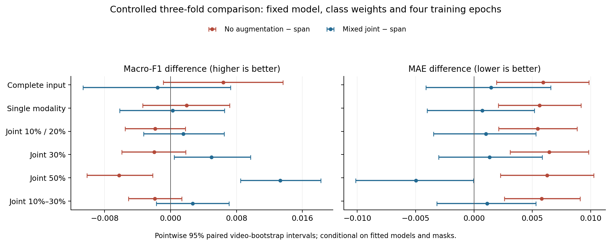

# 关闭增强的配对对照与三种方案比较

结论：保留原连续缺失增强。关闭增强使完整输入的分类点估计略升，但该改善的区间跨零；共同缺失下的分类表现下降，所有评价场景的三折平均MAE均增加。新候选未通过训练前固定的性能保持条件。

## 受控比较

仅改变训练期增强方式，固定12层文本编码器、音视频融合、逆频率类别权重、预训练参数、样本顺序、训练种子42与4轮训练。三折按视频划分，3395条训练样本各作为折内评价样本一次。每折使用完全相同的46组评价条件。

本次新训练3个无增强模型，复用3个已核验原增强模型，共276组配对评价，其中138组预测为新生成。混合共同缺失增强来自前一轮相同折、相同对照的结果；三方案共9个模型、414组不同的场景评价。以下数值为内部三折等权平均，与官方728条验证集成绩分开报告。

## 三种方案的表现

| 场景 | 原增强F1 | 无增强F1 | 混合增强F1 | 原增强MAE | 无增强MAE | 混合增强MAE |
|---|---:|---:|---:|---:|---:|---:|
| 完整输入 | 0.6282 | 0.6346 | 0.6266 | 0.6042 | 0.6101 | 0.6057 |
| 单模态连续缺失 | 0.6105 | 0.6124 | 0.6107 | 0.6230 | 0.6286 | 0.6237 |
| 共同缺失10%/20% | 0.6037 | 0.6019 | 0.6053 | 0.6286 | 0.6341 | 0.6296 |
| 共同缺失30% | 0.5805 | 0.5785 | 0.5854 | 0.6538 | 0.6603 | 0.6552 |
| 共同缺失50% | 0.5300 | 0.5237 | 0.5433 | 0.7047 | 0.7110 | 0.6998 |
| 共同缺失10%—30%合计 | 0.5960 | 0.5941 | 0.5987 | 0.6370 | 0.6428 | 0.6381 |

完整输入的四项指标：

| 方案 | Accuracy | Macro-F1 | MAE | Pearson |
|---|---:|---:|---:|---:|
| 原连续增强 | 0.6516 | 0.6282 | 0.6042 | 0.7070 |
| 关闭增强 | 0.6570 | 0.6346 | 0.6101 | 0.7032 |
| 混合共同缺失增强 | 0.6529 | 0.6266 | 0.6057 | 0.7055 |

关闭增强在46个场景中的15个场景取得更高的三折平均F1，31个场景下降；46个场景的MAE全部增加。场景共享样本与扰动结构，这些计数用于描述，不能当作46次独立统计试验。所有Accuracy、F1、MAE和Pearson逐场景对照见[对比表](comparison_by_condition.csv)。

完整输入的类别F1：

| 方案 | 负面 | 中性 | 正面 |
|---|---:|---:|---:|
| 原连续增强 | 0.6977 | 0.4615 | 0.7253 |
| 关闭增强 | 0.7074 | 0.4688 | 0.7274 |
| 混合共同缺失增强 | 0.7008 | 0.4507 | 0.7283 |

无增强在完整输入上的分类点估计改善涉及三个类别。该变化同时伴随回归误差增加，不能仅凭分类均值认定整体方法更优。

## 配对差值与不确定性

以下差值均为“关闭增强−原连续增强”。F1正值为改善，MAE正值为退化。按视频分组进行2000次配对Bootstrap，在各折内重采样后等权平均折差值。

| 场景 | F1差值［95%区间］ | MAE差值［95%区间］ |
|---|---:|---:|
| 完整输入 | +0.0064 [-0.0009, +0.0136] | +0.0059 [+0.0019, +0.0098] |
| 单模态连续缺失 | +0.0020 [-0.0034, +0.0072] | +0.0056 [+0.0021, +0.0092] |
| 共同缺失10%/20% | -0.0019 [-0.0055, +0.0018] | +0.0055 [+0.0021, +0.0088] |
| 共同缺失30% | -0.0020 [-0.0059, +0.0018] | +0.0065 [+0.0031, +0.0098] |
| 共同缺失50% | -0.0063 [-0.0102, -0.0022] | +0.0063 [+0.0023, +0.0103] |
| 共同缺失10%—30%合计 | -0.0019 [-0.0051, +0.0014] | +0.0058 [+0.0026, +0.0091] |

完整输入F1的改善区间跨零；重度共同缺失F1的差值区间完全低于零。各组MAE的差值区间均高于零，支持原增强在本次对照中更有利于强度预测。区间以本次固定模型和缺失掩码为条件，属于分项区间，未作多重比较校正，也未包含重新训练与反复选择的不确定性。

## 按预设条件作出的判断

简化条件除了检查点估计，还要求F1和MAE区间支持性能保持。完整输入与单模态F1的容差为0.01，各共同缺失分组F1的容差为0.005，MAE容差为0.02。重度共同缺失的F1平均下降0.0063，超出容差；低度、中度、重度与低中度合计的F1区间均未满足各自的性能保持条件。

低、中度综合分数由0.744898变为0.743468，下降0.001429；三个配对折的差值分别为−0.003565、−0.000994、+0.000271。平均分数及“两折处于容差内”条件通过，但不足以抵消共同缺失分类条件的失败。提升判定与简化判定均未通过，实验依照协议结束于内部比较阶段。

三种方案呈现清晰的取舍：

- 原连续增强：兼顾完整输入、强度预测与缺失鲁棒性，作为当前采用的方法。
- 关闭增强：完整输入分类点估计较高，但共同缺失分类和各场景强度预测付出代价。
- 混合共同缺失增强：重度共同缺失分类改善更明显，低、中度综合收益未达到前次预设门槛。

这些结果支持当前配方保留连续缺失增强，不构成原方案对所有增强策略、训练预算和数据分布的普遍最优证明。

## 完整性与复现

三折标准化参数、归一化数组、类别权重和缺失掩码已从原始输入重新构建核验；对照模型权重与原实验完全一致。276张预测表的四项指标已逐表复算，CSV哈希再次核验；两组模型配置仅增强方式不同。67项自动检查通过，覆盖既有流程与本次性能保持判定。

训练及场景评价、配对统计共约6.4分钟。完整运行目录：`/workspace/q2-noaug-study-20260927`。模型和逐样本预测保存在该目录，仓库保存[汇总与区间](analysis.json)、[逐场景指标](condition_metrics.json)、[模型与训练记录](runs.json)、[固定协议](protocol.json)、[简化条件判定](development_simplicity.json)与[核验结果](verification.json)。运行方式见[实验说明](../关闭增强对照实验.md)。

当前模型和专项预测沿用已核验版本；本次没有官方验证集确认成绩，也没有附件3准确率。
