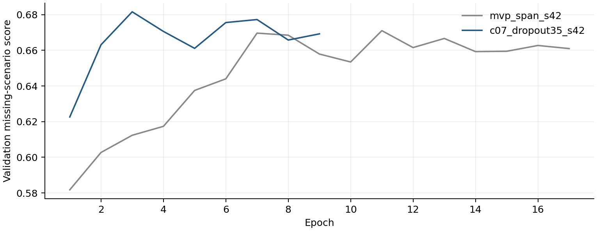
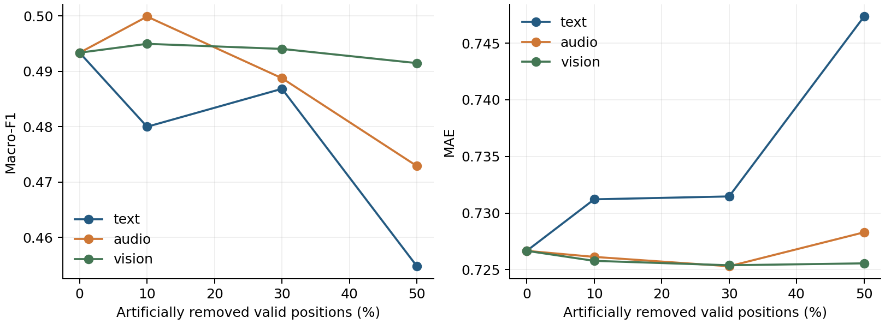
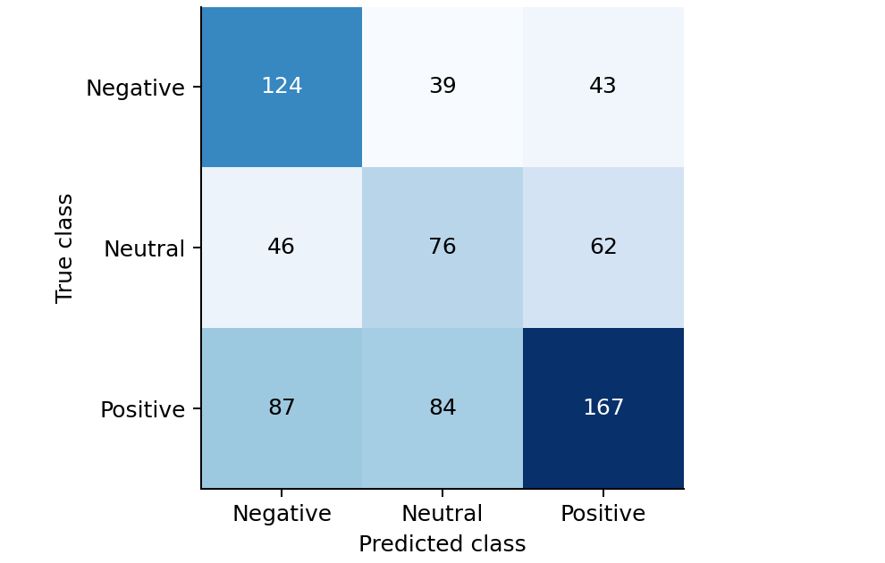

# E题问题2解决方案与实验报告

## 1 结果与交付范围

本报告仅解决模态局部缺失条件下的情感极性与强度预测。最终模型为 `c07_dropout35_s42`。候选模型通过预先固定的三种子稳定性规则，因此作为最终模型。验证集完整输入 Macro-F1 为 0.4933，MAE 为 0.7267；冻结后测试集对应结果为 0.4553 和 0.8220。附件3共30条预测已生成。这里的完整输入指不额外施加人工缺失，原文件自身的零向量仍按缺失处理。

本次完成可行版、有限候选比较、配对随机种子验证、冻结后测试和可复现交付。需要强调：虽然候选在验证集三种子比较中通过规则，但在封存测试集上，完整输入Macro-F1低于连续缺失基线的0.4857，MAE也高于基线的0.8045。因此，本次仅能确认验证集改进，不能宣称测试泛化提升。按预先固定的协议保留冻结模型，不利用测试结果改选。附件3无标签，不能报告其准确率。

## 2 题目理解与数据接口

问题2关注局部连续片段不可用时的预测稳定性，不要求重做问题1的原始特征提取，也不要求实现问题3的解释输出。缺失模态、缺失位置和缺失比例是需要控制的实验因素。三分类与连续强度是两个并行输出任务。

| 用途 | 样本数 | 使用边界 |
| --- | --- | --- |
| 训练 | 3395 | 拟合参数及标准化统计量 |
| 验证 | 728 | 早停和模型选择 |
| 测试 | 727 | 冻结后最终评价 |
| 附件3 | 30 | 接口检查及最终预测，无标签 |

全部使用 aligned_50 版本。文本输入读取 text_bert 的词元编号通道，整数性、取值范围和注意力通道先行验证；不使用连续 text 字段，也不把两者作为不同模态。text_bert 在附件3中为 float32，但其值通过整数性检查。全量4850条编号、注意力掩码和分段编号与本地 bert-base-uncased 分词器逐项一致。轻量模型采用可训练嵌入，而非调用完整BERT编码器；因此没有借用已经看到完整文本的预编码表征。

语音与视觉分别为50×74和50×35。类别0、1、2分别为Negative、Neutral、Positive，且与强度小于0、等于0、大于0逐条一致。三份官方划分没有重复样本ID。附件3以文件名和文件内从0开始的序号命名，例如 附件3_01.pkl::row000，不假造视频ID。

## 3 有效位置与可观测掩码

有效位置掩码回答某个位置是否属于样本内容；模态可观测掩码回答该位置的文本、语音或视觉是否可用。两者不能合并：填充位、CLS和SEP不是缺失的真实内容。有效范围由词元、注意力和其他模态的联合证据确定，排除第0位及可识别特殊词元，内部空缺仍保留为有效位置。

原题将局部整条特征向量全零定义为缺失。因此在有效区间内，音频或视觉整向量为零才判不可用；单个分量为零仍是有效数值。若尾部所有模态同时为零且特殊词元也丢失，无法可靠区分缺失与填充，程序记录边界不确定性，不猜造长度。本批数据均能识别SEP边界。全部模态不可用时采用零汇总与有限数值输出，不能把这种兜底输出解释为可靠识别。

| 划分 | 内容位置 | 语音零向量位置 | 视觉零向量位置 |
| --- | --- | --- | --- |
| train | 76882 | 65 | 4249 |
| valid | 17172 | 46 | 980 |
| test | 16855 | 0 | 1024 |

各模态标准化均值和标准差仅用训练集有效且可观测位置计算。标准差下限为0.00001，标准化后固定截断到[-10,10]，不可观测位置重置为零。验证、测试和专项样本均只使用保存的训练统计量。原文件不修改，哈希与处理后文件清单保存在审计记录中。

## 4 模型与训练方法

首版将词元映射为64维嵌入，语音和视觉分别线性投影到64维，经LayerNorm后按可观测位置进行掩码平均。三模态表示与三个可用比例拼接，经128维和64维前馈层，连接三分类头和强度回归头。回归输出为3乘以tanh，限制在[-3,3]。

时序候选用三支小型双向GRU替代直接平均，每个方向隐藏维度32，并把位置可观测指示作为额外输入。打包序列避免尾部填充影响双向递归；缺失位置不参加最终汇总。门控候选用共享小网络读取各模态表示与可用比例，再归一化获得样本级权重；全不可用时权重和汇总均安全归零。

最终配置为 encoder=gru，fusion=gate，augmentation=scattered，dropout=0.35，class_weight=True，regression_weight=1.0。完整配置可直接加载，不依赖论文描述重新猜测。

目标函数由三分类交叉熵和强度Huber损失加权相加，Huber转折点为1。类别加权候选采用训练集类别频次倒数归一化权重。AdamW学习率0.001、权重衰减0.01、初始批量64、最多40轮；梯度范数截断到5。每轮均用相同九种缺失验证场景选优，连续6轮未提高超过0.000001则早停。显存不足时批量减半，不终止其他程序。

连续缺失训练默认对70%的样本随机选一种模态，按10%、30%或50%的有效位置数删除连续片段，其余样本保持原状。零散增强候选保持相同删除数量但分散采样位置。文本ID在嵌入和GRU之前置零，不能先编码完整语义再把结果置零。

## 5 固定评价协议

主验证共九种场景，即文本、语音、视觉分别删除10%、30%、50%的有效位置。每个样本与场景的随机起点由固定种子和样本ID的SHA256确定。数量四舍五入，非空样本至少删除1个位置；报告选中位置数与新增不可观测位置数，以区分原有缺失。补充场景采用前部、中部、后部和多个短段，三档比例均覆盖。没有可靠时间戳，因此仅报告位置数和比例，不换算为秒。

内部选择分数为0.5乘以九场景平均Macro-F1，加上0.5乘以一减九场景平均MAE除以6。该式不是官方评分公式。候选在完整输入下，相对首版连续缺失模型的Macro-F1下降不能超过0.01，MAE增加不能超过0.03。阈值在首轮结果前已保存。

最佳合格候选与基线在42、2026、3407三个相同种子下比较。至少两个种子同时提高内部得分并满足完整输入保护条件，且三种子均值也满足保护条件和得分提高，才接受候选。最终交付固定为选定结构的42种子模型，不从多个种子中挑最好的一次。均值±标准差反映本次随机初始化波动，不是置信区间。

所有模型报告Accuracy、Macro-F1、各类F1、MAE和Pearson。F1固定包含三类，零分母记0。Pearson遇常量向量时未定义，记录原因而不填0。分类概率没有另行校准，不能视为真实正确率。

## 6 对照与单因素比较

多数类参考的验证Accuracy为0.4643、Macro-F1为0.2114；训练均值回归MAE为0.7808，中位数回归MAE为0.7690。常量回归的Pearson未定义。首版完整训练模型的MAE高于朴素参考，因此不能宣称两项任务都已明显改善。

| 实验 | 完整F1 | 完整MAE | 缺失F1 | 缺失MAE | 内部分数 |
| --- | --- | --- | --- | --- | --- |
| mvp_clean | 0.4843 | 0.7896 | 0.4721 | 0.7973 | 0.6696 |
| mvp_span | 0.4641 | 0.7615 | 0.4696 | 0.7651 | 0.6711 |
| c01_gru | 0.4890 | 0.7361 | 0.4775 | 0.7383 | 0.6772 |
| c02_gate | 0.4826 | 0.7588 | 0.4806 | 0.7563 | 0.6773 |
| c03_scattered | 0.4977 | 0.7582 | 0.4817 | 0.7597 | 0.6775 |
| c04_weighted | 0.4849 | 0.7309 | 0.4808 | 0.7330 | 0.6793 |
| c05_reg2 | 0.4931 | 0.7338 | 0.4814 | 0.7365 | 0.6793 |
| c06_reg05 | 0.4869 | 0.7323 | 0.4798 | 0.7327 | 0.6789 |
| c07_dropout35 | 0.4933 | 0.7267 | 0.4848 | 0.7296 | 0.6816 |
| c08_augment100 | 0.4850 | 0.7357 | 0.4833 | 0.7369 | 0.6803 |

候选按当前最佳合格配置每次只修改一个主要参数；因此表格是逐步消融路径，不是所有因素的全组合对照。每个实验的父配置和修改项保存在study/search.json，失败或不提升的记录均保留。

| 候选 | 父配置 | 唯一修改 | 刷新最佳 |
| --- | --- | --- | --- |
| c01_gru | mvp_span | {'encoder': 'gru'} | 是 |
| c02_gate | c01_gru | {'fusion': 'gate'} | 是 |
| c03_scattered | c02_gate | {'augmentation': 'scattered'} | 是 |
| c04_weighted | c03_scattered | {'class_weight': True} | 是 |
| c05_reg2 | c04_weighted | {'regression_weight': 2.0} | 否 |
| c06_reg05 | c04_weighted | {'regression_weight': 0.5} | 否 |
| c07_dropout35 | c04_weighted | {'dropout': 0.35} | 是 |
| c08_augment100 | c07_dropout35 | {'augmentation_probability': 1.0} | 否 |

本次停止新增候选的原因是 candidate_limit。预训练辅助为可选项，本轮没有执行；训练中未使用任何额外情感标注数据，也未开展未对齐版本搜索。

## 7 三种子稳定性与最终选择

| 模型 | 完整F1 | 完整MAE | 缺失F1 | 缺失MAE | 内部分数 |
| --- | --- | --- | --- | --- | --- |
| reference | 0.4857 ± 0.0188 | 0.7614 ± 0.0105 | 0.4796 ± 0.0087 | 0.7682 ± 0.0105 | 0.6758 ± 0.0043 |
| candidate | 0.4980 ± 0.0100 | 0.7263 ± 0.0111 | 0.4920 ± 0.0096 | 0.7300 ± 0.0080 | 0.6852 ± 0.0043 |

| 种子 | 得分变化 | 完整F1变化 | 完整MAE变化 | 通过 |
| --- | --- | --- | --- | --- |
| 42 | 0.0106 | 0.0293 | -0.0349 | 是 |
| 2026 | 0.0131 | 0.0122 | -0.0346 | 是 |
| 3407 | 0.0045 | -0.0046 | -0.0358 | 是 |

候选模型通过预先固定的三种子稳定性规则，因此作为最终模型。

## 8 冻结后评价与缺失规律

| 划分和场景 | Accuracy | Macro-F1 | MAE | Pearson |
| --- | --- | --- | --- | --- |
| valid 完整 | 0.5041 | 0.4933 | 0.7267 | 0.3782 |
| test 完整 | 0.4842 | 0.4553 | 0.8220 | 0.3980 |

| 冻结后测试对照 | 完整F1 | 完整MAE | 缺失F1 | 缺失MAE |
| --- | --- | --- | --- | --- |
| mvp_clean | 0.4903 | 0.8178 | 0.4846 | 0.8269 |
| mvp_span | 0.4857 | 0.8045 | 0.4841 | 0.8137 |
| c07_dropout35 | 0.4553 | 0.8220 | 0.4477 | 0.8271 |

上述测试对照仅作冻结后外部检验，不据此重新选择模型。最终候选相对连续缺失基线的完整测试Macro-F1下降约3.04个百分点，MAE增加约0.0175；缺失场景平均F1同样下降。验证集选择偏差、划分之间的分布差异和结构归纳偏好均可能相关，但本轮实验不能区分其因果贡献。所有基线权重和预测保留于本地，供团队如实讨论这一负面结果。

| 缺失场景 | 验证F1 | 验证MAE | 测试F1 | 测试MAE |
| --- | --- | --- | --- | --- |
| text_10_random | 0.4800 | 0.7312 | 0.4408 | 0.8300 |
| text_30_random | 0.4868 | 0.7315 | 0.4414 | 0.8401 |
| text_50_random | 0.4548 | 0.7473 | 0.4308 | 0.8418 |
| audio_10_random | 0.4999 | 0.7261 | 0.4601 | 0.8214 |
| audio_30_random | 0.4887 | 0.7253 | 0.4595 | 0.8232 |
| audio_50_random | 0.4729 | 0.7283 | 0.4492 | 0.8203 |
| vision_10_random | 0.4949 | 0.7258 | 0.4555 | 0.8210 |
| vision_30_random | 0.4940 | 0.7254 | 0.4475 | 0.8201 |
| vision_50_random | 0.4915 | 0.7256 | 0.4444 | 0.8257 |

在固定九种验证场景中，Macro-F1最低的是text_50_random，为0.4548；MAE最高的是text_50_random，为0.7473。这是本次模型与固定掩码下的观测，不构成对所有缺失机制的排序。

缺失导致的信息损失与噪声移除可能同时发生，单个场景的曲线不一定单调。应依据完整结果描述哪种模态、哪个比例更敏感，不能用少数起点宣称普遍规律。下表在相同30%预算下对比位置与片段形态，其余比例均保存在逐场景数据中。

| 模态 | 位置或形态 | 验证F1 | 验证MAE |
| --- | --- | --- | --- |
| text | random | 0.4868 | 0.7315 |
| text | front | 0.4711 | 0.7257 |
| text | middle | 0.4822 | 0.7377 |
| text | back | 0.4763 | 0.7425 |
| text | multi | 0.4800 | 0.7335 |
| audio | random | 0.4887 | 0.7253 |
| audio | front | 0.4817 | 0.7290 |
| audio | middle | 0.4840 | 0.7262 |
| audio | back | 0.4856 | 0.7228 |
| audio | multi | 0.4883 | 0.7260 |
| vision | random | 0.4940 | 0.7254 |
| vision | front | 0.5021 | 0.7253 |
| vision | middle | 0.4840 | 0.7250 |
| vision | back | 0.5007 | 0.7277 |
| vision | multi | 0.4948 | 0.7244 |

## 9 错误分析与局限

| 类别 | 验证F1 | 测试F1 |
| --- | --- | --- |
| Negative | 0.5356 | 0.4930 |
| Neutral | 0.3969 | 0.2979 |
| Positive | 0.5475 | 0.5751 |

验证集两个输出头的类别与强度符号不一致共217条，占29.8%。这包含中性分类而回归仅接近零的样本，不能简单等同于预测错误。当前不强制两个头一致，也不利用附件3的预测分布选择阈值。最大回归误差的10个样本及原文位于largest_valid_regression_errors.csv，便于逐例复核，但不能仅凭原文臆测音视频原因。

官方划分的相同视频ID交集数为{'train_valid': 0, 'train_test': 0, 'valid_test': 0}。本实验保留官方划分；若存在同源视频片段跨划分，结果不应外推为严格跨视频或跨说话人泛化。掩码依赖原题全零定义，真实静默或检测器输出零可能存在语义歧义。人工随机删除不等价于真实传感器故障分布。

模型规模小、随机词元嵌入语义先验弱，训练集只有3395条，复杂否定、长文本截断和模态冲突仍可能带来误判。本轮最多八个候选且仅三种子，不构成充分结构搜索或统计显著性证明。对完全不可用输入仅保证数值有限，不保证准确。

## 10 附件3预测与字段说明

专项CSV共30行。sample_id由文件名与行号构成；class_id取0/1/2；sentiment为对应英文类别；intensity范围[-3,3]；prob_negative、prob_neutral、prob_positive为三类softmax概率且和为1；scenario=clean表示不叠加人工缺失，原始缺失仍保留。表内为便于阅读四舍五入的展示值，提交CSV保留完整数值。

| 文件 | 类别 | 强度 | 负向概率 | 中性概率 | 正向概率 |
| --- | --- | --- | --- | --- | --- |
| 附件3_01.pkl | Negative | -0.4875 | 0.5483 | 0.3249 | 0.1268 |
| 附件3_02.pkl | Neutral | 0.0447 | 0.2602 | 0.4367 | 0.3031 |
| 附件3_03.pkl | Negative | -0.3394 | 0.5221 | 0.3194 | 0.1585 |
| 附件3_04.pkl | Positive | 0.0949 | 0.2149 | 0.3853 | 0.3998 |
| 附件3_05.pkl | Negative | -0.9052 | 0.7754 | 0.1506 | 0.0741 |
| 附件3_06.pkl | Positive | 0.8337 | 0.1350 | 0.1747 | 0.6903 |
| 附件3_07.pkl | Negative | -0.0356 | 0.4221 | 0.3659 | 0.2120 |
| 附件3_08.pkl | Negative | -0.3185 | 0.5418 | 0.2557 | 0.2025 |
| 附件3_09.pkl | Positive | 0.5130 | 0.1812 | 0.3101 | 0.5088 |
| 附件3_10.pkl | Negative | -0.1128 | 0.4407 | 0.3723 | 0.1870 |
| 附件3_11.pkl | Neutral | -0.0339 | 0.3263 | 0.4141 | 0.2596 |
| 附件3_12.pkl | Positive | 0.3064 | 0.2986 | 0.3117 | 0.3897 |
| 附件3_13.pkl | Neutral | 0.1270 | 0.2296 | 0.4125 | 0.3579 |
| 附件3_14.pkl | Positive | 0.6406 | 0.2040 | 0.2475 | 0.5485 |
| 附件3_15.pkl | Positive | 0.7138 | 0.1167 | 0.2392 | 0.6440 |
| 附件3_16.pkl | Neutral | 0.1024 | 0.2224 | 0.4184 | 0.3592 |
| 附件3_17.pkl | Positive | 0.0833 | 0.3186 | 0.2844 | 0.3970 |
| 附件3_18.pkl | Neutral | 0.1430 | 0.2524 | 0.4098 | 0.3378 |
| 附件3_19.pkl | Positive | 0.2200 | 0.2120 | 0.3743 | 0.4137 |
| 附件3_20.pkl | Negative | -0.7774 | 0.6316 | 0.2734 | 0.0950 |
| 附件3_21.pkl | Negative | -0.0733 | 0.3835 | 0.3249 | 0.2917 |
| 附件3_22.pkl | Neutral | -0.2097 | 0.3685 | 0.4058 | 0.2257 |
| 附件3_23.pkl | Neutral | 0.0181 | 0.3638 | 0.3812 | 0.2550 |
| 附件3_24.pkl | Negative | -0.4977 | 0.6468 | 0.2070 | 0.1462 |
| 附件3_25.pkl | Positive | 0.4796 | 0.1842 | 0.2565 | 0.5593 |
| 附件3_26.pkl | Positive | 0.3093 | 0.1599 | 0.3745 | 0.4656 |
| 附件3_27.pkl | Positive | 0.3497 | 0.2286 | 0.2941 | 0.4773 |
| 附件3_28.pkl | Neutral | 0.1271 | 0.2793 | 0.3947 | 0.3259 |
| 附件3_29.pkl | Neutral | -0.1485 | 0.3637 | 0.3683 | 0.2680 |
| 附件3_30.pkl | Positive | 0.3826 | 0.1894 | 0.3267 | 0.4839 |

## 11 复现和交付核验

运行环境为WSL2 Ubuntu 22.04，GPU NVIDIA GeForce RTX 5070，Python 3.10，PyTorch 2.8.0，CUDA 12.8。推理只需要模型、训练标准化参数及源码，不需要完整BERT权重。模型参数约200万，实际文件体积以交付清单为准。

统一入口为python -m q2，包含audit、train、evaluate、predict和report。详细命令见README.md；固定配置、依赖版本、每轮日志、逐样本预测和场景掩码可核验。最终模型重载、单条与批量推理、CPU与GPU推理以及同种子重新训练均单独验证。

最终核验发现cuDNN TF32使GRU单条与批量推理的强度相差约0.000038，超出原定0.00001容差。关闭推理TF32后差异降至约0.0000001；模型权重和验收阈值不变。训练保留原数值设置以验证精确重训。三种子选择表来自原训练评估，最终独立评价表来自统一FP32推理，因此小数尾位可能略有差异。

正式参赛包与本地实验档案分开。正式包仅保留核心代码、最终参数、专项预测、方法报告及必要结果；原始数据和多次训练权重留在本地，不重复提交。全队仍需核算总附件不超过50MB，本题体积小于上限并不等于整队已满足。

本报告表格来自保存的JSON和逐样本CSV，图形来源列于figure_sources.json。没有附件3真实标签，不提供其准确率；没有证明稳定提高时，以基线和负面实验结论交付。

## 12 材料与方法依据

题目依据为官方E题题面、附件2 aligned_50.pkl及附件3对齐版本。框架使用PyTorch、NumPy和scikit-learn，具体版本在requirements-lock.txt；本地bert-base-uncased分词器仅用于编号核验。所有性能数字以本项目实际日志为来源。
