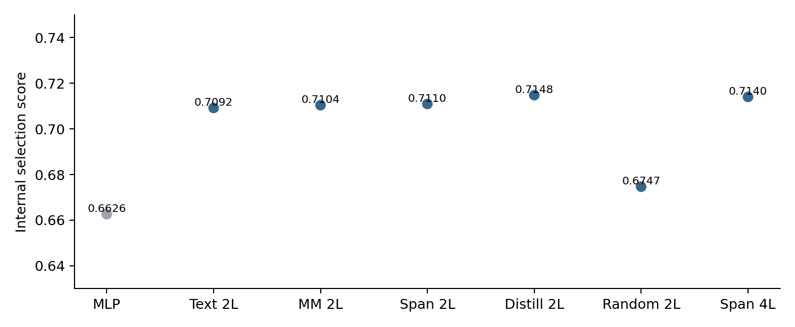
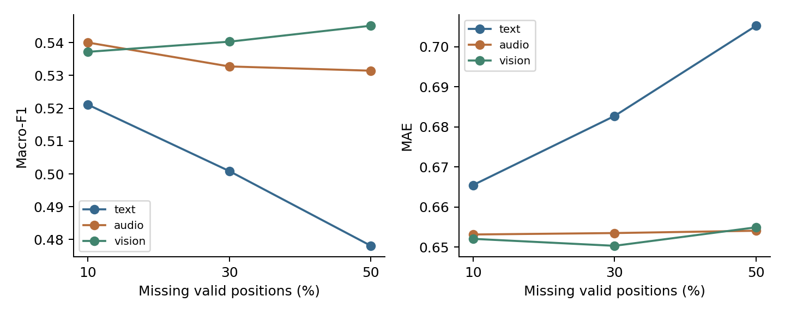
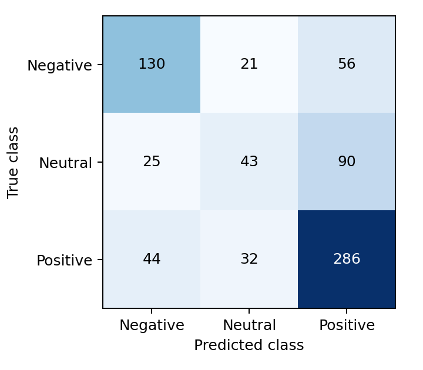

# E题问题2第二轮优化方案与实验报告

本报告供问题2实验负责人和论文负责人使用，给出已经运行并完成核验的第二轮方案、实验结果及交付接口。最终采用两层预训练文本编码器、语音视觉汇总、多任务预测与本地教师蒸馏，并以32列分组的8位权重量化保存。上一轮材料原样保留，新版应作为问题2的优先交付版本。

三种子官方验证确认全部通过：完整输入 Macro-F1 为 0.5409，MAE 为 0.6534。最终压缩模型的专项预测覆盖全部30条。模型文件为 23.15 MB（十进制），无需教师模型或在线下载即可推理。比赛名次及未知样本表现不能由这些结果保证。

## 1 问题理解与数据边界

问题2要求在局部模态信息缺失时预测情感类别与强度。核心困难是让模型在编码前正确屏蔽不可用信息，并利用剩余文本、语音和视觉线索。这里的对齐序列长50，每个有效位置对应对齐后的特征位置；没有可靠时间戳，不能将缺失比例换算成秒。

训练、验证、测试分别为3395、728、727条，附件3为30个文件各1条。文本统一使用 text_bert 的词元编号，语音74维、视觉35维。训练中的连续 text 特征未用于推理接口。4850条带文本样本已完成本地 BERT 分词核验；附件3没有原始文本。类别映射固定为0负向、1中性、2正向，强度范围为−3至3。

有效位置掩码与模态可观测掩码分别保存。特殊词元、填充位置不参与汇总；有效区域内整条音视频向量全零按题意记为缺失，单个坐标为零不算缺失。缺失位置的文本编号先屏蔽，再进入注意力编码器。缺失边界不可辨识时留下审计记录，不通过猜测恢复。标准化仅拟合训练集有效观测，内部每折重新拟合，标准化结果固定裁剪到−10至10。

## 2 最终模型与训练方法

从本地 bert-base-uncased 通用预训练权重抽取第0层与第11层，构成两层、隐藏宽度768的文本编码器。保留位置嵌入、词元嵌入及标准BERT注意力结构。完整12层实现与缓存原版在核验样例上的最大绝对差为8.11×10⁻⁶。该核验验证实现兼容性，不代表小模型与完整BERT具有相同能力。

词表仅保留训练子集出现的编号与必要特殊编号。最终词表为7574项，未见编号统一映射到UNK；官方验证可观测文本位置中 5.81% 属于未见编号。这减少体积，但可能损失稀有情感词信息。词表没有根据验证集、测试集或附件3扩展。

对可观测文本隐状态做掩码均值汇总并投影到128维；语音与视觉分别在有效观测上汇总并投影到64维。将三个表示与三类模态可用比例拼接，经128维融合层送入三分类头和强度回归头。强度输出通过3倍双曲正切限制范围。全模态不可用时输出有限值，但不能将其解释为可靠识别。

基础监督损失由交叉熵与等权Huber回归损失组成。蒸馏教师为同一拟合子集上训练的12层多模态BERT；学生与教师接收完全相同的缺失输入，不让教师通过完整输入绕过缺失条件。额外损失包括温度2的类别分布KL、回归均方误差和标准化文本汇总表示均方误差，权重依次为0.5、0.25、0.1。这里只借鉴知识蒸馏思想，不宣称完整复现某篇蒸馏算法。

训练采用AdamW，文本编码器学习率2×10⁻⁵，其余参数5×10⁻⁴，批量32，权重衰减0.01，梯度裁剪1；偏置和归一化参数不衰减。前10%步数线性预热，其后线性衰减。CUDA训练使用BF16自动混合精度，评价为FP32且关闭TF32。以0.7概率随机选一个模态，按10%、30%或50%有效位置施加连续缺失。最终教师固定训练5轮，学生固定7轮。

## 3 比较规则与防止信息泄漏

第二轮只在官方训练集内进行按视频ID分组的三折开发，分组随机种子为240924，各折视频交集为零。每折保留自己的标准化参数与词表。六组候选均使用相同缺失场景和种子42；教师是辅助诊断，不计入六组候选，也不随正式包交付。

主要场景为文本、语音、视觉分别缺失10%、30%、50%，连续片段起点由样本ID和场景名称确定，共9类。补充前部、中部、后部及多个短片段，共36类。clean指不额外施加人工缺失，仍可能含自然缺失。固定选择分数等于缺失平均Macro-F1的一半，加上1减缺失平均MAE除以6的结果的一半；它不是比赛官方评分。

候选至少在2个内部折提高选择分数，三折完整输入平均Macro-F1下降不得超过0.01、MAE增加不得超过0.03。先按内部得分选择并完成压缩检查，再用内部最佳轮数的中位数固定正式训练轮数。官方验证集只做42、2026、3407三个种子的确认，不据其结果重新挑轮数或结构。测试集上一轮已经查看，因此新测试结果仅作冻结后的描述性评价。

## 4 内部三折对照与消融

| 方案 | 完整F1 | 完整MAE | 缺失F1 | 缺失MAE | 选择分数 |
| --- | --- | --- | --- | --- | --- |
| 连续缺失 MLP | 0.4712 | 0.8227 | 0.4637 | 0.8306 | 0.6626 |
| 两层文本 | 0.5517 | 0.7159 | 0.5398 | 0.7286 | 0.7092 |
| 两层多模态 | 0.5502 | 0.7076 | 0.5410 | 0.7208 | 0.7104 |
| 两层加缺失训练 | 0.5502 | 0.7026 | 0.5410 | 0.7143 | 0.7110 |
| 两层加蒸馏 | 0.5575 | 0.6938 | 0.5475 | 0.7073 | 0.7148 |
| 两层随机初始化 | 0.4921 | 0.7692 | 0.4790 | 0.7777 | 0.6747 |
| 四层加缺失训练 | 0.5586 | 0.6935 | 0.5461 | 0.7081 | 0.7140 |

表中为三折指标的算术平均，不是把三个验证折拼接后重新计算F1。完整与缺失F1均为Macro-F1。六组全部运行并保留日志，随机初始化和压缩失败结果没有删除。

两层蒸馏方案的内部选择分数为 0.7148，高于两层连续缺失方案和四层方案，但与四层方案差距很小，不能据此宣称蒸馏必然显著优于增加层数。12层教师内部平均完整F1为 0.6025、MAE为 0.6094，只用作能力与压缩参照。

## 5 官方验证集三种子确认

| 方案 | 完整F1 | 完整MAE | 缺失F1 | 缺失MAE |
| --- | --- | --- | --- | --- |
| 原连续缺失基线 | 0.4857 ± 0.0188 | 0.7614 ± 0.0105 | 0.4796 ± 0.0087 | 0.7682 ± 0.0105 |
| 上一轮GRU | 0.4980 ± 0.0100 | 0.7263 ± 0.0111 | 0.4920 ± 0.0096 | 0.7300 ± 0.0080 |
| 第二轮蒸馏模型 | 0.5409 ± 0.0050 | 0.6534 ± 0.0012 | 0.5291 ± 0.0043 | 0.6621 ± 0.0013 |

表中为均值±样本标准差，第二轮数据为压缩前模型，用于原定三种子稳定性确认。三个种子均通过与对应原连续缺失基线的配对条件。上一轮GRU仅用于交付版本横向说明，不作为本轮新增调参依据。

| 种子 | 选择分数变化 | 完整F1变化 | 完整MAE变化 | 通过 |
| --- | --- | --- | --- | --- |
| 42 | +0.0364 | +0.0754 | -0.1085 | 是 |
| 2026 | +0.0351 | +0.0491 | -0.1194 | 是 |
| 3407 | +0.0294 | +0.0410 | -0.0962 | 是 |

## 6 压缩过程与部署代价

逐行8位量化在某些内部折超过F1允许下降0.005的阈值；四层模型的混合4位方案也失败。随后完成原计划中的分组量化检查，先试128列一组，再试32列一组。所有旧记录保留，新增检查协议在官方验证前单独记录，模型结构排名、数据划分和阈值均未更改。最终32列一组方案在三个内部折全部通过。

最终模型从 81.08 MB 压缩到 23.15 MB。官方验证确认中，压缩前后完整F1变化为 +0.001797，MAE变化为 +0.000233；缺失平均F1变化为 -0.000226。最终模型只包含学生权重，不暗中依赖教师或全量词表。

量化用于缩小磁盘文件，加载后反量化为FP32运算；不能据此宣称推理显存同比缩小或速度提升。本机4线程CPU对30条已处理样本的5次热运行中位耗时为 0.130 秒，不含模型加载和PKL处理。正式附件应与另外两问合并检查50 MB上限。

## 7 冻结后最终评价

| 数据与版本 | Accuracy | Macro-F1 | MAE | Pearson |
| --- | --- | --- | --- | --- |
| 验证 新压缩模型 | 0.5810 | 0.5413 | 0.6532 | 0.5584 |
| 测试 原连续缺失基线 | 0.5585 | 0.4857 | 0.8045 | 0.4255 |
| 测试 上一轮GRU | 0.4842 | 0.4553 | 0.8220 | 0.3980 |
| 测试 新压缩模型 | 0.6314 | 0.5665 | 0.7122 | 0.5735 |

该测试集已经在上一轮查看，表中改善不能当作对全新未触碰测试集的无偏估计。第二轮训练与选择脚本没有使用测试结果，最终权重先冻结再评价；不会根据这张表重新选择模型。

| 场景 | 验证F1 | 验证MAE | 测试F1 | 测试MAE |
| --- | --- | --- | --- | --- |
| text_10 | 0.5211 | 0.6655 | 0.5593 | 0.7413 |
| text_30 | 0.5009 | 0.6827 | 0.5293 | 0.7501 |
| text_50 | 0.4781 | 0.7053 | 0.5320 | 0.7776 |
| audio_10 | 0.5400 | 0.6531 | 0.5626 | 0.7123 |
| audio_30 | 0.5328 | 0.6535 | 0.5708 | 0.7114 |
| audio_50 | 0.5315 | 0.6541 | 0.5614 | 0.7076 |
| vision_10 | 0.5372 | 0.6521 | 0.5633 | 0.7129 |
| vision_30 | 0.5403 | 0.6503 | 0.5669 | 0.7121 |
| vision_50 | 0.5452 | 0.6549 | 0.5663 | 0.7122 |

9类主要缺失场景平均：验证F1 0.5252、MAE 0.6635；描述性测试F1 0.5569、MAE 0.7264。36类补充场景的全部逐样本预测与指标见 final/predictions 和 metrics 文件。

## 8 错误分析与局限

中性类别仍是主要短板：完整验证集中性F1为 0.3819，描述性测试集中性F1为 0.3386；测试集中 90 条真实中性样本被判为正向。对语气、否定范围、讽刺和说话人背景的理解，不能仅凭这些汇总特征充分确认。

词表裁剪会把未见词元映射到UNK；语音视觉使用均值汇总，未显式建模精细时序；固定的随机连续缺失仍不能覆盖真实设备故障的全部模式。分类与回归为独立输出头，可能出现类别与连续强度符号不完全一致；没有通过事后改阈值修饰结果。附件3无标签，30条输出覆盖率只能证明接口正确，不能证明预测准确。

缺失掩码保留了原序列位置和特殊词元边界，因此模型仍可利用可观测序列长度信息。全缺失且边界不可辨识时只能给出先验式有限输出。三个种子描述优化随机性，不等于三个独立数据集；内部交叉验证已经用于选模型，不能把它包装成完全独立的泛化证明。

## 9 复现与交付核验

已完成13项自动测试，包括标签、掩码、指标、极短及空序列、局部零值、全部模态不可用、隐藏词元不影响其他位置、量化奇数尺寸与零行。对最终验证与测试的92组场景，从逐样本CSV独立复算F1和MAE并一致。

同环境同种子重新训练学生模型得到逐张量一致权重；统一命令从通用预训练参数重训教师及学生，也分别得到一致权重。CPU与GPU专项类别一致，最大强度差为 8.34e-07；单条与批量推理、模型重载均通过1×10⁻⁵容差或精确重载检查。跨硬件、跨PyTorch版本的逐位一致性不作承诺。

统一入口为 python -m q2v2，提供audit、train、evaluate、predict、report。直接预测不需要数据预处理缓存、原始文本、transformers或教师。完整重训需要通用预训练权重，本地使用已存在的固定快照；其来源和SHA256写入 training_recipe.json。实际命令、依赖锁定与文件放置规则详见README。

本地完整训练权重和教师留在WSL实验目录，正式附件只带最终紧凑权重、源码、配置、审计和实验记录，不复制原始题目数据。训练日志中的CUDA峰值为进程累计峰值，不能直接当作每个小模型独占显存。

## 10 附件3全量预测

下表强度保留四位小数便于阅读；CSV保留计算精度并包含三类softmax概率。概率未经校准，不等于经过统计校准的置信度。文件内序号为row000；这些标识不冒充原始视频ID。

| 文件 | 类别 | 强度 |
| --- | --- | --- |
| 附件3_01.pkl | 负向 | -0.9609 |
| 附件3_02.pkl | 正向 | 0.3389 |
| 附件3_03.pkl | 正向 | 0.2374 |
| 附件3_04.pkl | 正向 | 0.4815 |
| 附件3_05.pkl | 负向 | -1.8009 |
| 附件3_06.pkl | 正向 | 1.4898 |
| 附件3_07.pkl | 正向 | 0.4802 |
| 附件3_08.pkl | 正向 | 0.4439 |
| 附件3_09.pkl | 正向 | 1.0651 |
| 附件3_10.pkl | 中性 | 0.2267 |
| 附件3_11.pkl | 正向 | 0.1874 |
| 附件3_12.pkl | 正向 | 0.2930 |
| 附件3_13.pkl | 正向 | 0.5051 |
| 附件3_14.pkl | 负向 | -0.1284 |
| 附件3_15.pkl | 正向 | 0.9390 |
| 附件3_16.pkl | 正向 | 1.7283 |
| 附件3_17.pkl | 正向 | 0.1903 |
| 附件3_18.pkl | 负向 | 0.1801 |
| 附件3_19.pkl | 正向 | 0.2298 |
| 附件3_20.pkl | 中性 | 0.1518 |
| 附件3_21.pkl | 正向 | 0.6118 |
| 附件3_22.pkl | 正向 | 0.5697 |
| 附件3_23.pkl | 正向 | 0.7997 |
| 附件3_24.pkl | 正向 | 0.2131 |
| 附件3_25.pkl | 中性 | 0.3407 |
| 附件3_26.pkl | 正向 | 0.7868 |
| 附件3_27.pkl | 正向 | 0.6902 |
| 附件3_28.pkl | 正向 | 0.7594 |
| 附件3_29.pkl | 正向 | 0.8156 |
| 附件3_30.pkl | 正向 | 1.1100 |

## 11 方法来源

BERT采用双向预训练文本表示，本研究使用其通用预训练参数作为初始化。来源：Devlin等，BERT: Pre-training of Deep Bidirectional Transformers for Language Understanding，https://arxiv.org/abs/1810.04805 。

模型来源与许可：google-bert/bert-base-uncased，Apache-2.0，https://huggingface.co/google-bert/bert-base-uncased 。缓存快照及权重摘要见 pretrained/provenance.json；正式推理无需访问该站。

蒸馏思想参考：Sun等，Patient Knowledge Distillation for BERT Model Compression，https://aclanthology.org/D19-1441/ 。本实现使用输出及最终汇总表示蒸馏，没有逐层复现其方法。
