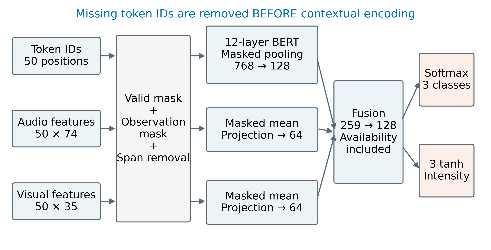
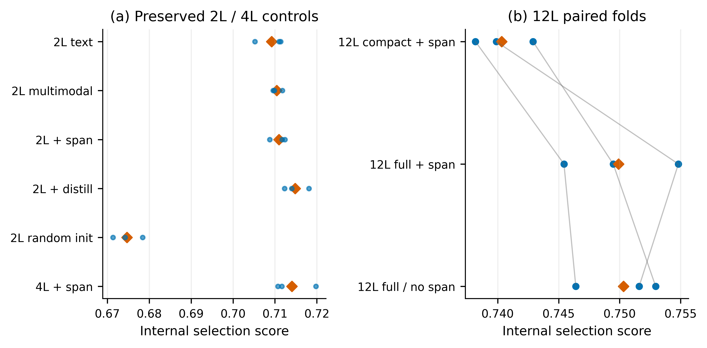
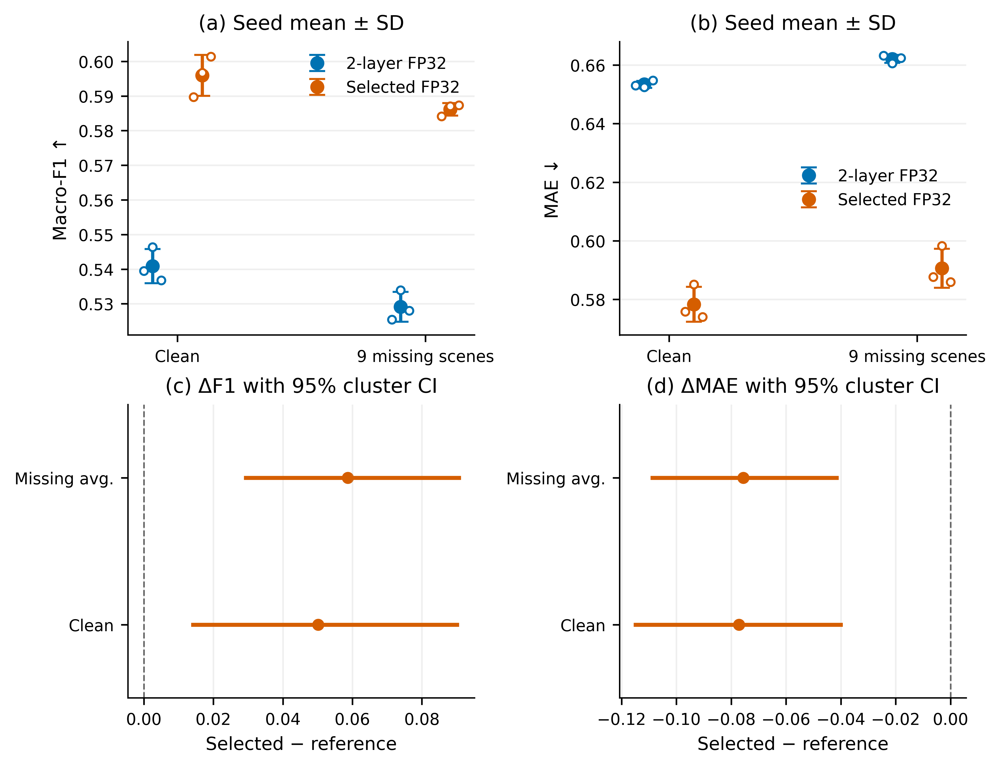
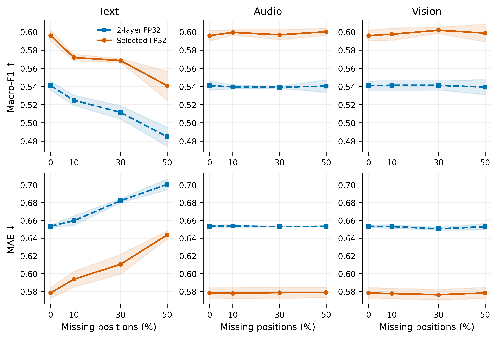
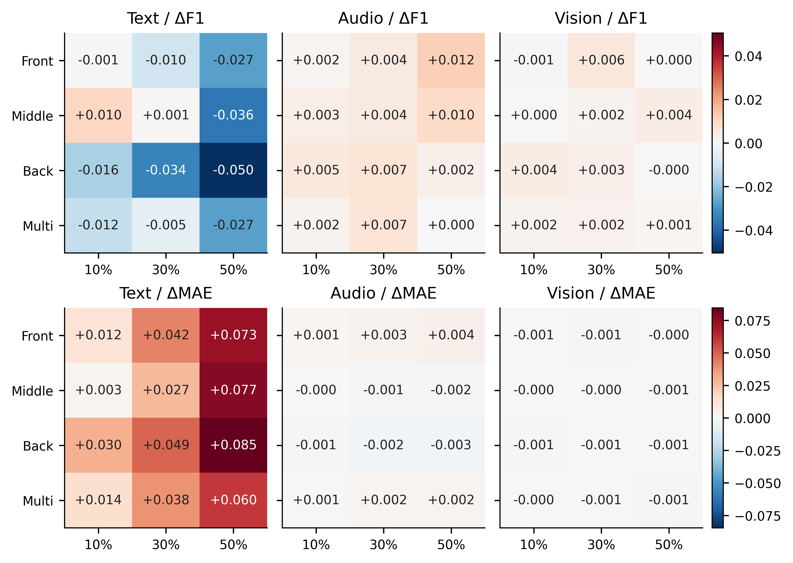
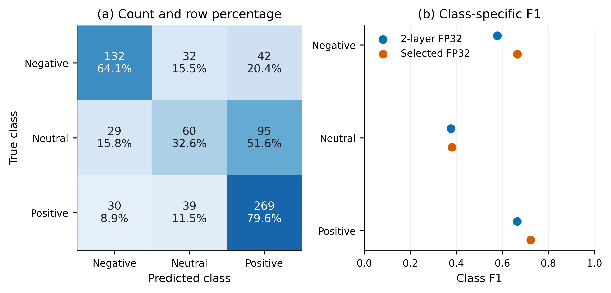
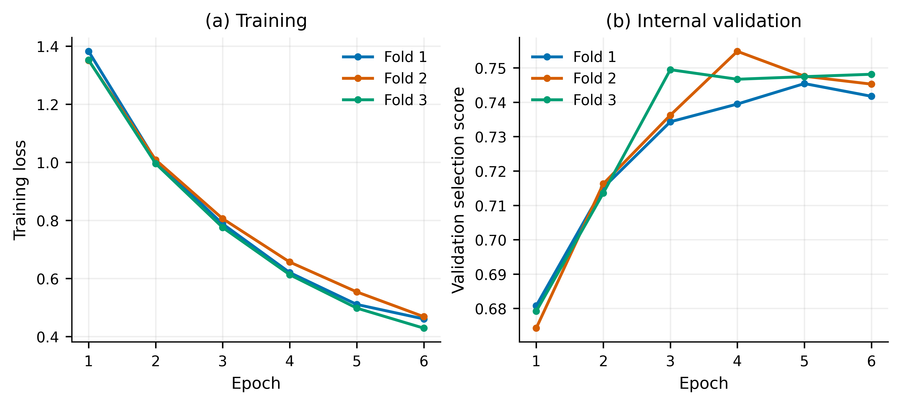
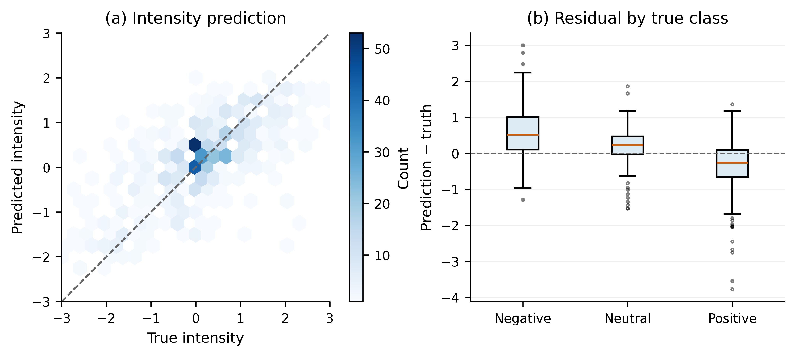

# 局部模态缺失条件下的多模态情感预测建模与验证

## 摘要

针对文本、语音与视觉在局部连续区间不可用的情感预测任务，我们建立了编码前缺失屏蔽、预训练文本表示与观测感知汇总相结合的多任务模型。方法将有效位置与模态观测状态分别建模，使用训练集统计量标准化音视频特征，并通过同一网络联合预测负向、中性、正向类别及连续情感强度。训练仅使用赛题附件2，专项推理保持与训练相同的对齐特征接口。

在按视频分组的内部三折开发后，完整词表12层模型通过三个随机种子的官方验证确认。完整输入Macro-F1为0.5959 ± 0.0059，MAE为0.5783 ± 0.0060；九类连续缺失场景平均Macro-F1为0.5862 ± 0.0018，MAE为0.5906 ± 0.0067。相同种子的第二轮FP32基准完整输入Macro-F1为0.5409 ± 0.0050。

我们进一步采用固定缺失位置与形状实验、视频分组配对Bootstrap以及类别和回归误差诊断分析模型边界，并完成附件3全部30条样本预测。结果仅支持本赛题划分与预定缺失机制下的结论；附件3没有标签，输出覆盖率不等同于预测准确率。

关键词：多模态情感预测；局部模态缺失；预训练语言模型；多任务学习；配对分组评估

## 1 问题分析与建模假设

问题2的核心不是在三模态齐全时追求最高分，而是在一个或多个模态的局部连续区间信息不可用时，仍利用其余可见线索输出情感极性和强度，并解释缺失类型、位置及长度变化与性能的关系。局部缺失与整个模态完全不存在不同；本研究的主实验围绕局部缺失展开，全缺失仅用于验证数值与接口安全性。

在赛题限定的输入条件下，我们采用附件2与附件3的aligned_50版本。对齐意味着不同模态以相同序列位置组织，不能据此认定各位置具有相同持续秒数。附件2未提供逐词时间戳，因此缺失长度以有效特征位置数及比例表述，且不将位置号伪装为原始视频时间。

建模采用以下可检验假设。第一，字段内相同样本索引与相同对齐位置具有一致的组织含义。第二，依题意，有效区域内音视频整条特征向量为零表示不可观测，单个坐标为零仍是合法观测。第三，在未提供可靠时间戳的条件下，可用固定位置规则研究局部缺失敏感性，但不能宣称完整模拟了真实设备故障。第四，监督标签遵循负值、零值、正值分别对应负向、中性、正向的定义。

这些假设存在边界：尾部各模态同时为零且缺少分隔词元时，无法可靠区分真实缺失与填充；我们保留审计标记而不猜测原始长度。模型得到的softmax概率未经校准，不能直接解释为真实正确概率。后文同时报告算法构造、实验发现及其限制。

## 2 数据组织与数学定义

表1 数据划分与使用规则

| 数据部分 | 样本数 | 作用 |
| --- | --- | --- |
| 训练集 | 3395 | 拟合模型与预处理统计量；内部三折开发 |
| 验证集 | 728 | 固定候选的三种子确认和规律分析 |
| 测试集 | 727 | 模型冻结后的描述性评价 |
| 附件3 | 30 | 无标签专项最终预测 |

训练数据包含text_bert、audio、vision及标签。文本统一使用text_bert中的词元编号；不在训练中使用768维连续text特征后又于专项推理临时更换输入。训练、验证与测试共4850条样本已完成本地BERT分词编号核验。附件3的text_bert虽为浮点存储，读取时先验证数值有限且为整数，再转为整型编号。

$$
X_i^a\in\mathbb{R}^{T\times74},\quad X_i^v\in\mathbb{R}^{T\times35},\quad T=50\tag{1}
$$

表2 主要符号与维度

| 符号 | 含义 | 维度或范围 |
| --- | --- | --- |
| i，j，m | 样本、位置、模态索引 | m∈{t,a,v} |
| tᵢ | 文本词元编号 | 50；编号0至30521 |
| Xᵢᵃ，Xᵢᵛ | 语音与视觉输入 | 50×74，50×35 |
| vᵢⱼ | 有效位置标记 | 0或1 |
| oᵢⱼᵐ，dᵢⱼᵐ | 原观测标记与人工缺失标记 | 0或1 |
| õᵢⱼᵐ | 施加缺失后的可用标记 | 0或1 |
| cᵢ，yᵢ | 极性标签与强度标签 | {0,1,2}；[−3,3] |
| pᵢ，ŷᵢ | 三类概率与预测强度 | 概率单纯形；[−3,3] |
| hᵢᵗ，hᵢᵃ，hᵢᵛ | 三模态投影表示 | 128，64，64 |
| aᵢ，zᵢ | 三模态可用比例与融合表示 | 3，128 |

有效位置通过文本注意力、词元编号及音视频非零观测的并集确定可辨识边界，排除位置0与CLS、SEP特殊词元。区域内部连续全零仍保留其位置，而不压缩序列。观测掩码则分别判断文本注意力与编号有效性、音视频有限性和整向量全零情况。两类掩码分离，使填充、特殊词元与真实缺失具有不同语义。

$$
\widetilde{o}_{ij}^{m}=v_{ij}o_{ij}^{m}(1-d_{ij}^{m})\tag{2}
$$

式（2）中的d=1表示人工移除信息，õ=1表示模型实际可使用该模态位置。人工缺失操作在编码之前生效。原观测掩码在标准化前确定并保存，不能因为标准化后某些数值恰好为零而重新判为缺失。

## 3 鲁棒多模态预测模型

### 训练集统计量与输入处理

不同模态的数值尺度差异会影响优化。我们仅使用当前拟合子集内可观测位置估计每个音视频坐标的均值与总体标准差；内部三折各自重新估计，官方完整训练后固定一份统计量用于验证、测试与附件3。

$$
\mu_k^m={\sum_{i,j}o_{ij}^m x_{ijk}^m\over\sum_{i,j}o_{ij}^m}\tag{3}
$$

$$
\sigma_k^m=\max\left(\sqrt{{\sum_{i,j}o_{ij}^m(x_{ijk}^m-\mu_k^m)^2\over\sum_{i,j}o_{ij}^m}},10^{-5}\right)\tag{4}
$$

$$
\widetilde{x}_{ijk}^{m}=\widetilde{o}_{ij}^{m}\,\operatorname{clip}((x_{ijk}^{m}-\mu_k^m)/\sigma_k^m,-10,10)\tag{5}
$$

式（3）与式（4）的求和仅覆盖拟合子集，m取语音或视觉。标准差下界为10⁻⁵，标准化后固定裁剪至[−10,10]以限制极端数值的影响；该规则在实验前已固定，不依据验证结果改变。不可观测向量置零但另保留掩码，因此模型不会把占位零当成正常测量。

### 编码前屏蔽与文本上下文表示

文本编码器采用本地bert-base-uncased通用预训练权重初始化[1,2]。词元、位置及全零segment嵌入经LayerNorm与dropout送入Transformer；每层为12个注意力头、768维隐状态和3072维前馈层。只保留前50个位置嵌入以匹配赛题输入。词表裁剪版将拟合子集未出现的编号映射为UNK；完整词表版保留预训练模型原有30522个编号，未读取专项样本建立词表。

对于缺失的普通词元，先将编号置为占位值并从注意力键中屏蔽，再进行上下文编码；CLS与可辨认的SEP保留为结构边界，CLS位置始终开启以避免全屏蔽注意力的数值问题。汇总仅使用实际观测词元，特殊词元与缺失位置不进入均值。位置与边界信息仍然可见，因此本文没有宣称模型对缺失长度本身完全不知情。

$$
\operatorname{Attn}(Q,K,V)=\operatorname{softmax}(QK^{\mathsf T}/\sqrt{64}+B)V\tag{6}
$$

式（6）给出单个注意力头的核心计算。Q、K、V为线性投影，头宽为64；B在不可用键位置取−10000，其余位置取0。实现使用残差连接、后置LayerNorm和GELU前馈变换。对于缺失位置形成的查询隐状态，不在后续池化中采用，也不允许其作为有效键传递给其他位置。

$$
\bar h_i^t={\sum_{j=1}^T\widetilde{o}_{ij}^t H_{ij}\over\max(1,\sum_{j=1}^T\widetilde{o}_{ij}^t)}\tag{7}
$$

H为最终文本隐状态。式（7）的分母截为至少1避免空序列除零，池化结果经768→128线性层、LayerNorm与GELU；若文本完全不可用，投影后的表示再次乘以可用性指示，使其严格为零。BERT是已有方法，本文的具体实现与缓存原模型在核验样例上的最大绝对差为8.11×10⁻⁶，该检查用于验证实现兼容性，并非预测性能证据。

### 音视频汇总与多模态融合

$$
\bar x_i^m={\sum_{j=1}^T\widetilde{o}_{ij}^m\widetilde{x}_{ij}^m\over\max(1,\sum_{j=1}^T\widetilde{o}_{ij}^m)},\quad m\in\{a,v\}\tag{8}
$$

语音和视觉采用观测掩码均值汇总，再分别通过74→64与35→64的线性层、LayerNorm和GELU。均值编码在小样本条件下参数量较低、实现稳定，但不显式区分可见片段内部的细粒度顺序，不能将其描述为精细时序建模。完全缺失的模态输出置零。

$$
a_i^m={\sum_j\widetilde{o}_{ij}^m\over\max(1,\sum_jv_{ij})},\quad z_i=\operatorname{GELU}(W_f[h_i^t;h_i^a;h_i^v;a_i]+b_f)\tag{9}
$$

式（9）将128维文本、64维语音、64维视觉和3维可用比例拼接为259维向量，再映射为128维融合表示，训练时使用0.2的dropout。可用比例告知融合层各模态剩余观测量，但此结构是带可用信息的拼接融合，不是显式门控或动态专家模型，也不构成模态重要性的因果解释。

$$
p_i=\operatorname{softmax}(W_cz_i+b_c),\quad\hat c_i=\arg\max_kp_{ik},\quad\hat y_i=3\tanh(w_r^{\mathsf T}z_i+b_r)\tag{10}
$$

分类头输出三类softmax概率，回归头通过3tanh限制强度范围。标签约定0、1、2分别为负向、中性、正向。两头共享融合表示但分别监督，因而可能出现类别与强度符号不一致；本研究原样保存两头输出，不以事后阈值修饰预测。

### 联合目标函数与缺失增强

$$
\mathcal L={1\over N}\sum_{i=1}^N[-\log p_{i,c_i}+H_1(\hat y_i-y_i)]\tag{11}
$$

$$
H_1(e)=\begin{cases}e^2/2,&|e|\le1,\\|e|-1/2,&|e|>1.\end{cases}\tag{12}
$$

交叉熵利用离散类别监督，Huber损失在小残差区间提供平滑二次惩罚，在大残差区间降低异常误差的梯度增长。两项损失等权，Huber阈值为1。三类未使用额外类别权重，本阶段也未基于官方验证的中性类别表现事后搜索权重或分类阈值。

$$
k_i=\min(n_i,\max(1,\lfloor r n_i+0.5\rfloor)),\quad n_i=\sum_jv_{ij}\tag{13}
$$

对每个训练样本，以0.7概率选取一个模态施加连续缺失，模态均匀抽样，比例r从0.1、0.3、0.5中均匀抽样。式（13）适用于有效长度nᵢ>0；空序列不额外移除位置。连续性按有效位置的顺序定义，随机起点保证所选片段在边界内。该增强使优化目标包含人工缺失下的监督风险，但不能保证所有缺失条件都改善，其作用由消融实验判断。

## 4 求解流程与实验协议

算法1 模型训练与选择

| 步骤 | 操作 |
| --- | --- |
| 1 | 固定官方划分；在训练集内按原视频标识生成三折，各折视频组不重叠。 |
| 2 | 各折只以拟合样本估计标准化参数；按候选定义设置裁剪或完整预训练词表。 |
| 3 | 初始化预训练编码器和预测头；每个批量在编码前按规则生成局部缺失掩码。 |
| 4 | 计算分类与Huber损失，反向传播、梯度裁剪及AdamW更新。 |
| 5 | 内部每轮评价完整输入和九类固定缺失场景；按预定分数保存最佳轮次并早停。 |
| 6 | 对完成三折且满足保护条件的候选排序；以最佳轮数中位数固定正式训练轮数。 |
| 7 | 仅在官方训练集重新拟合，完成三个种子的验证确认；冻结模型后才开展描述性测试。 |

表3 固定训练参数

| 项目 | 取值 |
| --- | --- |
| 编码器学习率 | 2×10⁻⁵ |
| 投影与预测头学习率 | 5×10⁻⁴ |
| 优化器与权重衰减 | AdamW；0.01；偏置和归一化参数不衰减 |
| 有效批量与梯度裁剪 | 32；梯度范数上限1 |
| 学习率计划 | 前10%更新线性预热，其后线性衰减 |
| 内部训练预算 | 12层模型最多6轮；连续3轮无改善早停 |
| 训练与推理精度 | CUDA BF16自动混合精度训练；FP32评价；关闭TF32 |
| 随机种子 | 三折分组240924；确认42、2026、3407 |
| 连续缺失增强 | 概率0.7；三模态与三个比例均匀抽样 |
| 损失权重 | 交叉熵∶Huber=1∶1 |

AdamW采用解耦权重衰减[3]。显存不足时预设微批量从32降为16或8，并以样本数加权累积梯度，保持有效批量32；实际是否触发降批量以日志为准。固定轮数确认期间不逐轮读取官方验证指标选取检查点，训练结束后一次性评价。

$$
\operatorname{MacroF1}={1\over3}\sum_{c=0}^2{2TP_c\over2TP_c+FP_c+FN_c}\tag{14}
$$

$$
\operatorname{MAE}={1\over N}\sum_i|\hat y_i-y_i|,\quad S={1\over2}\overline{F1}_{miss}+{1\over2}(1-\overline{MAE}_{miss}/6)\tag{15}
$$

除式（14）与式（15）外，同时报告Accuracy、各类别F1和Pearson相关系数。F1对三类等权求平均，分母为零的类别按0计；Pearson在样本不足或真值、预测恒定时记为未定义并说明原因，不填造数值。内部选择分数S仅是团队预先固定的比较准则，不是比赛官方评分公式。

验证主场景为文本、语音、视觉分别缺失10%、30%、50%，共9类；每个样本的随机起点由固定种子、样本ID和场景名称的SHA256确定。补充场景采用前部、中部、后部以及分成最多三段的多个短区间，共36类。多个短片段不保证彼此间隔非零，极短样本中可能合并，报告按实际移除位置统计而非假定严格分离。

所有候选共享场景定义与样本顺序。S取九场景指标的算术平均，不是将场景样本拼接后计算一次F1。完整输入clean表示没有额外人工缺失，仍可能包含原始自然缺失。人工选择的位置若原本不可观测，不会产生额外的信息移除；因此同时记录所选位置数和新增不可观测位置数。

候选至少在两个内部折提高S，且三折完整输入平均F1下降不超过0.01、MAE增加不超过0.03。比较基准为第二轮两层蒸馏FP32模型，不混用量化模型结果。只确认一个内部最佳候选；三种子至少两组配对通过相同条件，平均结果也通过，才替换基准。官方测试在前期已被观察，本轮冻结后结果只能作描述性评价。内部交叉验证已用于选择，官方验证也已多轮使用，两者均不能表述为全新独立验证。

## 5 实验结果与消融分析

表4 内部三折平均结果

| 模型 | 完整F1 | 完整MAE | 缺失F1 | 缺失MAE | S |
| --- | --- | --- | --- | --- | --- |
| 第二轮两层蒸馏FP32 | 0.5575 | 0.6938 | 0.5475 | 0.7073 | 0.7148 |
| 12层裁剪词表＋缺失训练 | 0.6025 | 0.6094 | 0.5857 | 0.6301 | 0.7403 |
| 12层完整词表＋缺失训练 | 0.6218 | 0.6050 | 0.6038 | 0.6241 | 0.7499 |
| 12层完整词表 无缺失增强 | 0.6231 | 0.6031 | 0.6044 | 0.6227 | 0.7503 |

表4中的F1为Macro-F1，各数值为三折指标的算术平均。裁剪词表12层模型复用已完成的相同六轮协议记录；完整词表方案与关闭增强方案均在三折上训练。关闭增强方案预先指定为消融，不因其结果改变主候选集合。三折分别包含1205、1093、1097条验证样本，折间难度差异通过逐折配对展示。

完整词表相对于裁剪词表12层模型，三折平均S变化为+0.0096，完整F1变化为+0.0193，完整MAE变化为-0.0044。该比较提供词表保留策略的经验依据；由于词表维度变化也会影响同种子下后续随机初始化序列，且开发阶段只使用一个训练种子，不能将差异完全归因为未见词元本身。

连续缺失训练相对于不增强方案的三折平均S变化为-0.0004，缺失平均F1变化为-0.0006，缺失平均MAE变化为+0.0015。该结果未显示连续缺失训练在本配置下具有更高的综合得分，不能把缺失增强描述为已被充分证明有效的创新点。 两组模型均按自己的内部验证分数选最佳轮次，因此这里比较的是包含早停的训练策略，而非同一固定轮数的纯损失扰动。

保留的两层实验分别检验文本单模态、多模态输入、连续缺失增强、蒸馏与随机初始化；四层实验检验另一种编码深度。蒸馏模型与四层模型的内部S差距很小，不能仅凭排序宣称其具有显著优势。两层与12层模型训练轮数及训练目标可能不同，跨结构的总差异不应包装成严格的单因素消融。

### 三种子确认与效果区间

表5 官方验证集种子均值与样本标准差

| 模型 | 完整F1 | 完整MAE | 缺失F1 | 缺失MAE |
| --- | --- | --- | --- | --- |
| 第二轮FP32基准 | 0.5409 ± 0.0050 | 0.6534 ± 0.0012 | 0.5291 ± 0.0043 | 0.6621 ± 0.0013 |
| 本轮候选 | 0.5959 ± 0.0059 | 0.5783 ± 0.0060 | 0.5862 ± 0.0018 | 0.5906 ± 0.0067 |

表6 三种子配对确认

| 种子 | ΔS | Δ完整F1 | Δ完整MAE | 通过 |
| --- | --- | --- | --- | --- |
| 42 | +0.0356 | +0.0502 | -0.0772 | 是 |
| 2026 | +0.0318 | +0.0503 | -0.0673 | 是 |
| 3407 | +0.0360 | +0.0646 | -0.0807 | 是 |

表7 固定种子模型差异的95% Bootstrap区间

| 范围与指标 | 差值 | 95%区间 |
| --- | --- | --- |
| 完整 Macro-F1 | +0.0502 | [+0.0142, +0.0901] |
| 完整 MAE | -0.0772 | [-0.1149, -0.0400] |
| 缺失均值 Macro-F1 | +0.0587 | [+0.0293, +0.0906] |
| 缺失均值 MAE | -0.0756 | [-0.1087, -0.0416] |

区间估计以原视频为重采样单位，在验证集239个视频组中有放回抽取相同数量的组，保留组内全部片段及重复次数，共进行2000次。每次对两个模型和所有场景使用完全相同的抽样组，然后重新计算F1与MAE的差值。该配对设计保留组内相关性和模型比较的样本配对。95%区间取差值分布的2.5%与97.5%分位点，不是三个种子均值的置信区间，也未校正此前模型搜索带来的选择偏差。

### 缺失模态与比例的影响

表8 最终种子42验证集主缺失场景

| 模态 | 比例 | F1 | ΔF1 | MAE | ΔMAE |
| --- | --- | --- | --- | --- | --- |
| 文本 | 10% | 0.5704 | -0.0193 | 0.5884 | +0.0125 |
| 文本 | 30% | 0.5678 | -0.0219 | 0.6091 | +0.0333 |
| 文本 | 50% | 0.5562 | -0.0335 | 0.6396 | +0.0638 |
| 语音 | 10% | 0.5991 | +0.0094 | 0.5758 | -0.0000 |
| 语音 | 30% | 0.5911 | +0.0014 | 0.5764 | +0.0006 |
| 语音 | 50% | 0.5962 | +0.0065 | 0.5767 | +0.0009 |
| 视觉 | 10% | 0.5898 | +0.0001 | 0.5749 | -0.0010 |
| 视觉 | 30% | 0.5984 | +0.0087 | 0.5733 | -0.0025 |
| 视觉 | 50% | 0.5881 | -0.0016 | 0.5749 | -0.0009 |

在种子42的50%连续缺失条件下，F1下降最大的模态为文本，下降0.0335。这一现象说明当前模型对该模态的依赖更强，但并不说明该模态在所有真实交互任务中天然最重要。若音视频缺失曲线接近完整输入，应同时考虑其均值表示能力有限、文本主导及噪声移除等可能性；本实验不能独立区分这些机制。

曲线中的局部非单调变化予以保留。移除信息后某一分类指标小幅上升并不自动构成错误，也不等于缺失有益；可能涉及错误边界变化、被移除的噪声与有限样本波动。本文以所有预定场景和两个任务的联合结果判断鲁棒性，不仅选择符合预期的曲线。

### 缺失位置与连续形状的影响

表9 预定补充场景中的描述性范围

| 模态 | 最低F1场景 | F1 | 最高F1场景 | F1 |
| --- | --- | --- | --- | --- |
| 文本 | text_50_back | 0.5392 | text_10_middle | 0.6001 |
| 语音 | audio_50_multi | 0.5897 | audio_50_front | 0.6018 |
| 视觉 | vision_10_front | 0.5892 | vision_30_front | 0.5954 |

位置影响应在相同模态和比例下比较，而形状影响应比较随机单长片段与multi场景。表9仅用于定位预定网格内的极值，并非经验证的普遍最差或最佳位置；极值是观察后描述，不参与模型选择。正文图5覆盖全部36类场景，逐场景数值和实际缺失率保存在分析数据中。有效长度较短时，至少移除一个位置会使实际比例偏离名义比例；该偏差已单独统计，不能忽略。

固定文本缺失比例为50%时，前部、中部、后部缺失的F1依次为0.5622、0.5537、0.5392。本模型在该验证划分上对后部文本缺失更敏感，但没有原始逐词时间戳及专项定位核验，不能进一步断言后部对应特定情绪转折或结尾词。语音、视觉的位置变化幅度较小，也不能据此推断这些模态完全无用。

表10 同等缺失比例下的单长片段与多个短片段

| 模态 | 比例 | 单段F1 | 多段F1 | ΔF1 | ΔMAE |
| --- | --- | --- | --- | --- | --- |
| 文本 | 10% | 0.5704 | 0.5775 | +0.0071 | +0.0010 |
| 文本 | 30% | 0.5678 | 0.5848 | +0.0169 | +0.0045 |
| 文本 | 50% | 0.5562 | 0.5622 | +0.0061 | -0.0039 |
| 语音 | 10% | 0.5991 | 0.5914 | -0.0076 | +0.0005 |
| 语音 | 30% | 0.5911 | 0.5966 | +0.0055 | +0.0016 |
| 语音 | 50% | 0.5962 | 0.5897 | -0.0065 | +0.0015 |
| 视觉 | 10% | 0.5898 | 0.5914 | +0.0017 | +0.0005 |
| 视觉 | 30% | 0.5984 | 0.5919 | -0.0065 | +0.0020 |
| 视觉 | 50% | 0.5881 | 0.5906 | +0.0025 | -0.0002 |

表10的差值均为多个短片段减去随机单长片段。文本的三个比例下，多段缺失的F1均略高，但10%和30%时MAE并未同步下降；音视频的变化方向也不一致。因此，缺失形状的影响依赖模态、比例及评价任务，不能给出“多段一定优于单段”的普遍结论。这些比较使用预定随机起点的一组实现，尚未覆盖缺失起点本身的重复抽样不确定性。

名义缺失率10%、30%、50%对应的样本平均实际位置比例分别为11.20%、30.74%、51.64%。这些差异来自按有效长度取整和至少移除一个位置的规则，而不是修改场景定义；实际新增不可观测位置数另见完整分析表。

## 6 分类错误与回归诊断

最终模型完整验证集的负向、中性、正向F1分别为0.6650、0.3810、0.7231。真实中性样本共184条，其中29条被判为负向，95条被判为正向。中性采用强度严格等于零的定义，不能通过把接近零的标签事后合并为中性来改善指标。

分类头与回归符号的精确一致性检查发现140/728条输出不一致，占19.23%。该检查将回归值严格为零才计为中性，因此也包含分类头预测中性但回归头给出小幅非零值的情形；它是接口诊断，不等同于所有这些样本均预测错误。若未来采用一致性损失或阈值联结，需要在独立开发协议下比较，本轮未进行这种事后修改。

表11 按固定规则选择的验证案例

| 样本标识 | 类型 | 真类→预测 | 真实强度 | 预测强度 |
| --- | --- | --- | --- | --- |
| 266791$_$23 | 错误最大MAE | 0→2 | -2.6667 | 0.3308 |
| 243646$_$12 | 正确中位MAE | 0→0 | -1.3333 | -0.8578 |
| x2lOwQaAn4g$_$4 | 错误最大MAE | 1→2 | 0.0000 | 1.8582 |
| 273539$_$2 | 正确中位MAE | 1→1 | 0.0000 | -0.1461 |
| f_ZJ7L14oYQ$_$21 | 错误最大MAE | 2→0 | 2.0000 | -1.7774 |
| 4dV3slGSc60$_$10 | 正确中位MAE | 2→2 | 1.0000 | 0.6207 |

案例按每个真实类别分别选择最大MAE的误分类样本与MAE居中的分类正确样本。分类正确不代表强度误差小；反之，轻微跨越零点的预测也可能造成极性错误。此处只根据已有数值证据讨论错误类型，不在缺乏原始视频核查时断言讽刺、语气、否定范围或特定面部表情是原因。

## 7 专项预测与结果接口

算法2 附件3统一推理

| 步骤 | 操作 |
| --- | --- |
| 1 | 按文件名排序读取全部PKL；以文件名和文件内序号构造稳定样本标识。 |
| 2 | 执行与训练相同的整数性、形状、有限性和掩码规则检查。 |
| 3 | 加载冻结的训练集标准化参数及FP32模型；不在线下载或调用教师。 |
| 4 | 按统一接口输出类别、强度和三类概率；核对30条覆盖率与唯一性。 |
| 5 | 重载、单条与批量、CPU与GPU结果对照；保存校验记录和摘要。 |

表12 附件3全量预测

| 文件编号 | 预测类别 | 情感强度 | 最大类概率 |
| --- | --- | --- | --- |
| 附件3_01 | 负向 | -0.9591 | 0.9050 |
| 附件3_02 | 中性 | -0.0254 | 0.7089 |
| 附件3_03 | 中性 | 0.2856 | 0.5314 |
| 附件3_04 | 正向 | 0.4391 | 0.6478 |
| 附件3_05 | 负向 | -1.3739 | 0.9412 |
| 附件3_06 | 正向 | 0.7524 | 0.8653 |
| 附件3_07 | 正向 | 0.2239 | 0.4855 |
| 附件3_08 | 中性 | -0.0107 | 0.3936 |
| 附件3_09 | 正向 | 1.2030 | 0.9599 |
| 附件3_10 | 中性 | -0.0749 | 0.8008 |
| 附件3_11 | 正向 | 0.4757 | 0.6067 |
| 附件3_12 | 正向 | 0.4196 | 0.6136 |
| 附件3_13 | 正向 | 0.3204 | 0.6448 |
| 附件3_14 | 负向 | -0.8851 | 0.9291 |
| 附件3_15 | 正向 | 0.5062 | 0.8431 |
| 附件3_16 | 正向 | 1.4735 | 0.9670 |
| 附件3_17 | 中性 | 0.3088 | 0.5146 |
| 附件3_18 | 正向 | 0.4731 | 0.6765 |
| 附件3_19 | 负向 | -0.0173 | 0.4735 |
| 附件3_20 | 中性 | 0.1110 | 0.6254 |
| 附件3_21 | 正向 | 0.3000 | 0.6414 |
| 附件3_22 | 正向 | 0.4672 | 0.6727 |
| 附件3_23 | 正向 | 0.3222 | 0.5496 |
| 附件3_24 | 负向 | -0.1405 | 0.4105 |
| 附件3_25 | 中性 | 0.4231 | 0.5026 |
| 附件3_26 | 正向 | 0.6986 | 0.8453 |
| 附件3_27 | 正向 | 0.4242 | 0.6904 |
| 附件3_28 | 正向 | 0.4591 | 0.5862 |
| 附件3_29 | 正向 | 0.7166 | 0.7981 |
| 附件3_30 | 中性 | 0.4129 | 0.5350 |

专项CSV保留sample_id、scenario、class_id、sentiment、intensity、prob_negative、prob_neutral、prob_positive字段。表12为阅读方便保留四位小数，CSV保留计算精度。文件内序号row000不是原始视频ID，最大类概率也不是经过统计校准的置信度。全部30条无标签样本的预测分布未用于调参。

## 8 模型复杂度与适用边界

设序列长T、隐宽d、前馈宽d_ff、层数L。忽略常数与批量因子，文本编码主要计算量为O(L(Td²+T²d+Td·d_ff))；标准注意力实现保存的注意力矩阵规模为O(LhT²)。词表嵌入参数量为Vd，完整词表增加嵌入存储及优化器状态，但不直接增加长度为T的注意力矩阵规模。音视频汇总计算量分别为O(T·74)与O(T·35)，相对于文本编码较小。

本轮取消文件体积筛选，仅保存FP32研究模型，不据权重压缩推断速度或显存收益。实际耗时受显卡共享占用、批量和数据加载影响，日志中的进程累计峰值不能归因于单一模型。本阶段未开展统一硬件隔离条件下的效率基准，因此不作推理加速结论。

模型仍有四项重要局限。第一，音视频均值表示忽略细粒度时序，文本缺失较重时可能难以充分补偿。第二，主要场景一次只移除一个模态，尚未系统覆盖多模态同步局部故障。第三，模拟机制是预定位置遮蔽，不代表真实噪声、分布偏移和设备故障的全部形式。第四，样本规模与重复使用验证集限制了泛化证据强度。三种子改善不能保证未知专项样本或比赛排名。

## 9 结论

本轮在不以附件体积筛选的条件下，确认了较强12层文本编码器作为多模态模型组成部分的稳定收益。 方法的可复现要点在于编码前严格移除缺失信息、有效位置与观测状态分离、仅拟合训练集预处理统计量，以及使用相同缺失场景配对比较。通过类别与强度的联合评价、缺失位置和形状分析以及原样保留负面消融，结论的适用范围可以明确核验。

本研究的贡献定位为面向赛题接口的鲁棒预测流程构建与系统实证分析，而不是提出新的预训练基础模型、证明理论最优性或实现因果解释。附件3全量预测已形成统一结果文件；最终准确性仍须以赛方隐藏标签评价为准。

## 参考文献

[1] Devlin J, Chang M W, Lee K, Toutanova K. BERT: Pre-training of Deep Bidirectional Transformers for Language Understanding[C]. NAACL-HLT, 2019: 4171–4186. DOI: 10.18653/v1/N19-1423. https://aclanthology.org/N19-1423/

[2] Google. bert-base-uncased model card[EB/OL]. https://huggingface.co/google-bert/bert-base-uncased. 使用本地固定快照86b5e0934494bd15c9632b12f734a8a67f723594，Apache-2.0许可，访问核验日期2026-09-24。

[3] Loshchilov I, Hutter F. Decoupled Weight Decay Regularization[C]. ICLR, 2019. https://arxiv.org/abs/1711.05101.

[4] Hinton G, Vinyals O, Dean J. Distilling the Knowledge in a Neural Network[EB/OL]. arXiv:1503.02531, 2015. https://arxiv.org/abs/1503.02531.

[5] Sun S, Cheng Y, Gan Z, Liu J. Patient Knowledge Distillation for BERT Model Compression[C]. EMNLP-IJCNLP, 2019: 4323–4332. DOI: 10.18653/v1/D19-1441. https://aclanthology.org/D19-1441/

## 附录A 蒸馏基准与补充诊断

第二轮基准抽取预训练BERT第0和第11层构成两层文本编码器，其他汇总与融合结构保持一致。教师为相同拟合子集训练的12层模型；教师和学生接收完全相同的缺失输入，防止教师利用完整文本绕过缺失条件。蒸馏思想参考[4,5]，本实现只使用类别分布、回归输出与最终文本池化表示，不宣称复现逐层Patient Knowledge Distillation。

$$
\mathcal L_{student}=\mathcal L+0.5T_d^2D_{KL}(p_T^{(T_d)}\Vert p_S^{(T_d)})+0.25\mathcal L_{reg}+0.1\mathcal L_{feat}\tag{16}
$$

式（16）中温度T_d=2，KL按类别求和再对批量取平均；回归蒸馏为教师与学生强度输出的均方误差，特征蒸馏为各自768维池化表示经过无仿射LayerNorm后的均方误差。教师停止梯度。基准正式训练7轮，新增候选的轮数由内部三折中位数单独确定，因此两者的对比反映整体训练方案差异。

## 附录B 冻结后的描述性测试

表B1 已观察测试集上的冻结模型描述性结果

| 模型 | Accuracy | Macro-F1 | MAE | Pearson |
| --- | --- | --- | --- | --- |
| 第二轮FP32基准 | 0.6300 | 0.5667 | 0.7118 | 0.5738 |
| 冻结最终模型 | 0.6988 | 0.6321 | 0.6130 | 0.7064 |

测试集727条样本的上述结果来自模型冻结后的统一计算，不用于结构、超参数、阈值、种子或集成权重选择。该测试集在前轮已被查看，不能将本表作为从未触碰留出集的无偏性能估计。验证、测试各46场景与两个模型共184组指标均从逐样本预测独立复算。

## 附录C 复现与材料索引

实验在WSL2 Ubuntu 22.04及RTX 5070上完成。核心环境为Python 3.10.18、PyTorch 2.8.0+CUDA 12.8、NumPy 2.2.6、scikit-learn 1.7.2。原始题目数据未修改，预训练权重来源与SHA256、数据划分、种子、参数、逐轮日志和冻结摘要均保存。推理只需冻结模型、标准化参数与三模态输入，不依赖教师或网络连接。

表C1 实验材料与复现入口

| 材料或入口 | 用途 |
| --- | --- |
| study/protocol.json 与 frozen.json | 固定规则、模型选择及冻结证据 |
| runs 与 evidence/round2 | 本轮日志及保留的旧轮对照记录 |
| evaluation 与 analysis | 逐样本预测、指标、Bootstrap抽样和案例 |
| figures 与 figure_manifest.json | 8组矢量与高分辨率图及数据源摘要 |
| final/model.pt 与 scaler.npz | 最终FP32模型和训练集预处理参数 |
| audit/train/evaluate/predict | 自动检查、固定配方重训、冻结评价、专项推理 |
| analyze/figures/paper/report | 统计分析、重绘图形、生成论文材料和完整报告 |

本机同环境复现与CPU/GPU、单条/批量一致性以audit目录的实际核验记录为准，不承诺跨硬件或跨PyTorch版本逐位一致。论文素材不包含参赛单位、队员姓名或队伍编号。完整研究档案与正式竞赛附件分开管理，正式提交前还需按整队要求处理体积和统一论文格式。
