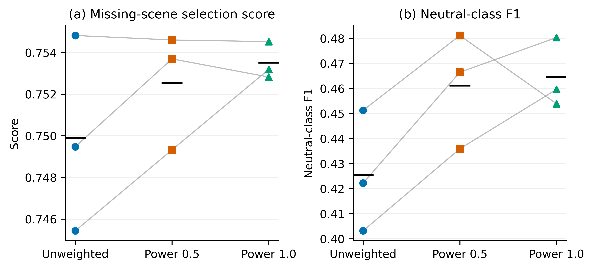
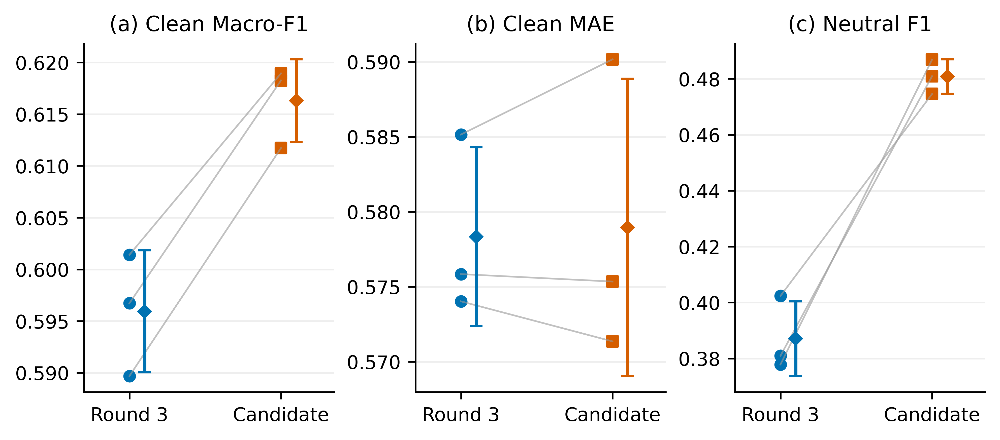
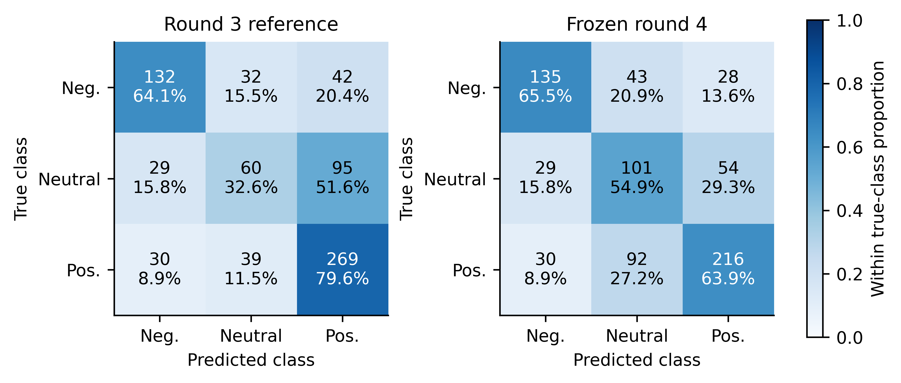
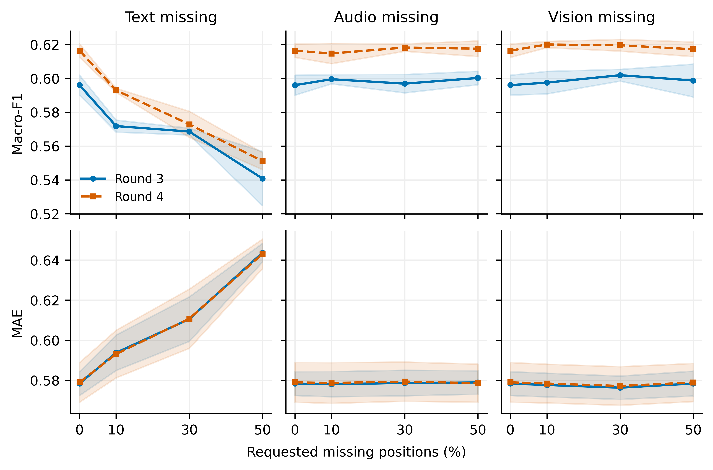

# 类别平衡训练与中性情感识别的补充验证

## 摘要

针对既有多模态模型中中性类别识别偏弱的问题，我们在不改变编码器、融合结构与缺失模拟规则的条件下，比较两档仅由拟合样本类别频率估计的分类权重。研究采用原视频分组内部三折进行开发，并以相同随机种子的官方验证结果进行一次确认。数据划分、类别权重来源和微批量累积方式均保留可复算记录。

候选balanced_inverse通过预定确认规则。完整输入Macro-F1由0.5959 ± 0.0059变为0.6163 ± 0.0040，中性类别F1由0.3871 ± 0.0133变为0.4808 ± 0.0062；上述波动为三种子样本标准差。本文同时报告回归与缺失场景表现，不将单项提升等同于所有指标改善。

官方验证已在多轮研究中重复使用，本文结论仅适用于既定开发与确认协议。配对Bootstrap描述固定模型预测下的不确定性，不校正反复模型选择的偏差。

## 1 问题诊断与研究假设

既有模型在三类任务上整体表现并不均衡。训练集负向、中性、正向样本量分别为967、758、1670，最多与最少类别之比约为2.20。该分布偏斜为检验类别平衡策略提供了动机，但不足以证明中性类别错误完全由样本数量造成；语义边界、表示能力和优化过程同样可能影响结果。

第三轮种子42模型在完整官方验证集中，中性类别共184条，识别正确60条，另有29条被判为负向、95条被判为正向。其召回率为32.61%，F1为0.3810。本轮据此提出可检验假设：在其余训练条件固定时，适度增加较少类别的分类损失权重，可能改善中性类别识别，同时保持整体缺失鲁棒性与强度回归性能。

类别平衡是已有的经验风险调整方法，不构成新的多模态网络理论。逆频率权重的常用形式可见scikit-learn官方文档[1]，加权交叉熵的归一化定义参照PyTorch文档[2]。平方根强度是本任务预先设定的较温和对照，其有效性必须由实验而非命名证明。

## 2 类别权重与优化目标

设当前拟合子集包含N条样本、C=3个类别，第c类计数为n_c。内部三折分别使用各自拟合子集的计数，官方训练确认只使用官方训练集计数。任何内部验证、官方验证、测试或附件3信息均不进入权重估计。定义权重强度α，并将权重的类别算术均值归一化为1：

$$
u_c=(N/(C n_c))^\alpha,\quad w_c=u_c/(C^{-1}\sum_{k=0}^{C-1}u_k),\quad\alpha\in\{0.5,1\}\tag{1}
$$

α=0.5对应平方根逆频率，α=1对应逆频率；不加权模型是独立的α=0参照。权重的公共缩放不改变下式的分类损失，因为分子、分母同时缩放。若拟合子集中缺少某一类别，代码明确失败，避免通过无穷权重掩盖划分问题。

表1 各内部拟合折估计的类别权重

| 配置 | 折 | 负向权重 | 中性权重 | 正向权重 |
| --- | --- | --- | --- | --- |
| balanced_sqrt | 1 | 1.0374 | 1.1772 | 0.7854 |
| balanced_sqrt | 2 | 1.0436 | 1.1670 | 0.7895 |
| balanced_sqrt | 3 | 1.0328 | 1.1730 | 0.7943 |
| balanced_inverse | 1 | 1.0486 | 1.3503 | 0.6011 |
| balanced_inverse | 2 | 1.0628 | 1.3290 | 0.6082 |
| balanced_inverse | 3 | 1.0412 | 1.3430 | 0.6158 |

对于有效批量B，模型输出分类概率p与连续强度预测。分类部分采用权重和归一化的交叉熵，回归部分保持原Huber损失及系数1不变：

$$
\mathcal L_B=-\frac{\sum_{i\in B}w_{y_i}\log p_{i,y_i}}{\sum_{i\in B}w_{y_i}}+\frac{1}{|B|}\sum_{i\in B}H_1(\hat s_i-s_i)\tag{2}
$$

其中y_i为类别标签，s_i为真实强度，H_1为阈值1的Huber函数。分类权重仅改变训练目标，不增加推理参数或额外网络分支；模型容量、词表和输入接口与第三轮相同。实际含义是改变训练错误的相对代价，而非自动校准预测概率。

若显存不足而将B拆为若干微批量B_j，不能先独立求各微批量的加权均值再简单平均，因为各微批量的类别组成可能不同。应使用整个有效批量的同一个权重和，累积每段对总目标的贡献：

$$
\mathcal L_B=\sum_j\left[-\frac{\sum_{i\in B_j}w_{y_i}\log p_{i,y_i}}{\sum_{i\in B}w_{y_i}}+\frac{\sum_{i\in B_j}H_1(\hat s_i-s_i)}{|B|}\right]\tag{3}
$$

代码对不同微批量大小与末尾不足整批的情况进行了梯度等价测试。实际实验仍采用有效批量32；若发生显存不足，事件日志记录微批量变化，不终止其他应用程序。本轮不通过额外标注数据、测试集阈值调整或附件3分布反馈改进指标。

## 3 预定比较协议与实现一致性

内部开发继续使用第三轮按视频分组的三折。每个候选仅改变分类权重强度，随机种子42，最多6轮、早停耐心3轮；标准化、原始预训练权重、完整词表、连续缺失训练概率0.7和AdamW参数保持一致。以九类主要缺失场景上的既有综合分数S选择最佳轮次，再用最佳轮数中位数确定官方训练确认的固定轮数。

$$
S=0.5\,\overline{\mathrm{MacroF1}}_{miss}+0.5(1-\overline{\mathrm{MAE}}_{miss}/6)\tag{4}
$$

S是团队内部选择准则，不是比赛官方评分公式。候选须至少在两个内部折提高S，同时完整输入平均Macro-F1下降不超过0.01、MAE增加不超过0.03。在满足条件者中只将均值最高的一个候选送入官方验证确认。种子42、2026、3407逐一配对第三轮结果；至少两个配对和总体均值同时改善S并通过上述完整输入保护条件，才替换正式模型。

为确认软件修改没有改变对照条件，先重跑不加权配置的第1折。重跑与第三轮对应模型的217个参数张量逐项完全一致，最大绝对差为0.0，选择分数差为0.0。该检查支持在同环境与同配方下复用旧对照；不能推广为跨硬件逐位一致保证。

## 4 内部三折结果

表2 内部三折算术均值

| 配置 | 完整F1 | 完整MAE | 缺失F1 | 缺失MAE | S |
| --- | --- | --- | --- | --- | --- |
| 不加权参照 | 0.6218 | 0.6050 | 0.6038 | 0.6241 | 0.7499 |
| balanced_sqrt | 0.6294 | 0.6059 | 0.6092 | 0.6250 | 0.7525 |
| balanced_inverse | 0.6327 | 0.6147 | 0.6124 | 0.6325 | 0.7535 |

balanced_sqrt在2/3折提高S，平均差为+0.00263；中性F1均值为0.4611。其内部保护条件判定为通过。该比较使用各配置在内部验证上选定的最佳轮次，反映受同一预算约束的整体训练方案差异，不是未经选择的泛化性能估计。

balanced_inverse在2/3折提高S，平均差为+0.00360；中性F1均值为0.4646。其内部保护条件判定为通过。该比较使用各配置在内部验证上选定的最佳轮次，反映受同一预算约束的整体训练方案差异，不是未经选择的泛化性能估计。

## 5 三种子确认与不确定性

表3 官方验证集三种子确认均值与样本标准差

| 指标 | 第三轮参照 | 新增候选 | 均值差 |
| --- | --- | --- | --- |
| 完整Accuracy | 0.6369 ± 0.0042 | 0.6277 ± 0.0060 | -0.0092 |
| 完整Macro-F1 | 0.5959 ± 0.0059 | 0.6163 ± 0.0040 | +0.0204 |
| 完整MAE | 0.5783 ± 0.0060 | 0.5790 ± 0.0099 | +0.0006 |
| 完整Pearson | 0.6815 ± 0.0063 | 0.6816 ± 0.0086 | +0.0001 |
| 负向类别F1 | 0.6770 ± 0.0109 | 0.6728 ± 0.0070 | -0.0042 |
| 中性类别F1 | 0.3871 ± 0.0133 | 0.4808 ± 0.0062 | +0.0937 |
| 正向类别F1 | 0.7238 ± 0.0020 | 0.6954 ± 0.0140 | -0.0284 |
| 缺失平均Macro-F1 | 0.5862 ± 0.0018 | 0.6026 ± 0.0013 | +0.0164 |
| 缺失平均MAE | 0.5906 ± 0.0067 | 0.5909 ± 0.0101 | +0.0002 |
| 内部选择分数S | 0.7439 ± 0.0009 | 0.7521 ± 0.0008 | +0.0082 |

表4 同种子配对的预定保护条件

| 种子 | ΔS | Δ完整F1 | Δ完整MAE | 通过 |
| --- | --- | --- | --- | --- |
| 42 | +0.00858 | +0.0220 | -0.0005 | 是 |
| 2026 | +0.00789 | +0.0215 | +0.0050 | 是 |
| 3407 | +0.00814 | +0.0175 | -0.0027 | 是 |

三种子确认使用固定4轮训练，不在官方验证上再次挑选轮次、阈值或候选。最终判定为通过，替换正式模型。三种子标准差只刻画本次种子波动；样本量较少，不宜把它表述为充分的随机性保证。

表5 种子42模型差异的95%视频分组配对Bootstrap区间

| 场景 | 指标 | 差值 | 区间 |
| --- | --- | --- | --- |
| clean | macro_f1 | +0.0220 | [-0.0079, +0.0525] |
| clean | mae | -0.0005 | [-0.0058, +0.0050] |
| missing_average | macro_f1 | +0.0170 | [-0.0052, +0.0397] |
| missing_average | mae | -0.0007 | [-0.0053, +0.0040] |

表5采用相同视频分组抽样同时作用于两个模型和各场景，共2000次重采样。区间跨零的指标不能据此声称方向明确；区间未跨零也只是在固定预测与该划分条件下的证据，不能消除前几轮研究及本轮候选选择造成的偏差。

## 6 中性类别与双输出的一致性解释

表6 类别权衡的补充分组Bootstrap诊断

| 指标 | 第三轮 | 第四轮 | 差值及95%区间 |
| --- | --- | --- | --- |
| accuracy | 0.6332 | 0.6209 | -0.0124 [-0.0427, +0.0176] |
| negative_f1 | 0.6650 | 0.6750 | +0.0100 [-0.0083, +0.0300] |
| neutral_f1 | 0.3810 | 0.4810 | +0.1000 [+0.0395, +0.1617] |
| positive_f1 | 0.7231 | 0.6792 | -0.0439 [-0.0806, -0.0108] |

类别权重改变了不同类别之间的错误代价，不能将宏平均F1提升表述为全面胜出。种子42的结果显示，中性识别改善伴随正向类别F1和整体Accuracy下降；表3保留其余种子的同类指标，表6同时报告全部类别与Accuracy，避免只展示有利类别。这些区间属于固定模型的次级描述分析，未用于选择，也未作多重比较校正。

三分类与强度回归是不同损失下的两个输出。若将所有非零回归值直接按符号分为正负，而只有精确零对应中性，则预测为中性的样本几乎都会被计入“类别与回归不一致”。这一严格定义容易把接近零的正常连续输出混入真正的正负方向冲突。因此，应分解统计，而不能把总不一致率直接称为模型自相矛盾率。

表7 完整验证集的严格符号不一致分解

| 模型 | 总不一致 | 中性类且回归非零 | 非中性正负相反 | 非中性且回归为零 |
| --- | --- | --- | --- | --- |
| 第三轮 | 140 | 131 | 9 | 0 |
| 最终冻结模型 | 249 | 236 | 13 | 0 |

该分解仅用于解释现有诊断指标，没有据官方验证重新设定回归阈值或改写预测。中性类别的精确率、召回率和F1仍按官方离散标签计算，强度误差仍按原连续标签计算。模型没有承诺两个任务在每条样本上满足确定性的符号约束。

图4保留各模态的完整输入参照与全部主要缺失比例。文本缺失增大时分类与回归指标整体恶化，而音视频缺失的响应较小且局部非单调。该现象刻画当前模型和既定验证集的响应，不证明音视频天然无用，也不能把少量缺失后的指标上升解释为移除信息必然有益。阴影只表示三种子训练波动，没有覆盖缺失起点的重复抽样不确定性。

## 7 结论与论文整合边界

本轮证据支持在原有编码与融合结构不变的条件下，采用选定的类别权重训练方案作为当前正式模型。结论应连同三折筛选、三种子保护条件及区间的适用范围一起陈述，不宜抽离其中表现最好的一折或一个种子作为总体成绩。未被选中的权重配置仍保留在消融表中。

冻结后共复算184组完整评价指标和160组开发与确认预测指标，并完成附件3的30条预测、单条与批量一致性、模型重载、CPU/GPU容差和空输入有限性检查。模型与标准化参数的校验值见study/frozen.json，图表源文件摘要见figures/round4_figure_manifest.json。

整合进总论文时，类别权重定义与微批量归一化可加入目标函数与求解部分；表2至表5用于扩展实验与消融部分，表6和表7用于完善局限与错误分析。应同步更新正文的最终模型名称和专项预测来源，避免把第三轮的中性错误计数与第四轮成绩混排。问题3的音视频原因解释不在本研究结论范围内。

## 附录 冻结后评价与复现索引

表8 冻结后的完整测试集描述性结果

| 模型 | Accuracy | Macro-F1 | MAE | Pearson |
| --- | --- | --- | --- | --- |
| 第三轮 | 0.6988 | 0.6321 | 0.6130 | 0.7064 |
| 第四轮 | 0.6933 | 0.6701 | 0.6133 | 0.7073 |

表8使用727条测试样本，仅在本轮冻结后计算，不参与权重强度、训练轮数或种子选择。该划分在此前研究中已经被观察，不是未触碰留出集的无偏评价；不能用表8替代内部开发与官方验证确认的完整说明。

固定种子42的配方重训得到与冻结模型逐项相同的217个参数张量，最大绝对差为0.0。该结果是本机同环境复现证据，不承诺跨设备或跨数值库版本逐位一致。完整模型、标准化参数和附件3预测分别保存在final/model.pt、final/scaler.npz与final/attachment3_predictions.csv。

本文件是第三轮完整问题建模材料的新增补充，而非替换原有数据、掩码、预训练编码和融合结构的定义。第四轮代码和协议独立归档；study记录预设比较及选择，runs保存逐轮日志和逐样本预测，analysis保存独立复算、分组Bootstrap和诊断，figures保存SVG、PDF、600 dpi PNG及来源摘要。论文整合时应以第四轮预测为当前输出，并保留第三轮作为明确命名的对照。

## 参考文献

[1] scikit-learn developers. compute_class_weight, scikit-learn 1.7.2 documentation[EB/OL]. https://scikit-learn.org/1.7/modules/generated/sklearn.utils.class_weight.compute_class_weight.html，访问日期2026-09-25。

[2] PyTorch contributors. CrossEntropyLoss, PyTorch 2.8 documentation[EB/OL]. https://docs.pytorch.org/docs/2.8/generated/torch.nn.CrossEntropyLoss.html，访问日期2026-09-25。
