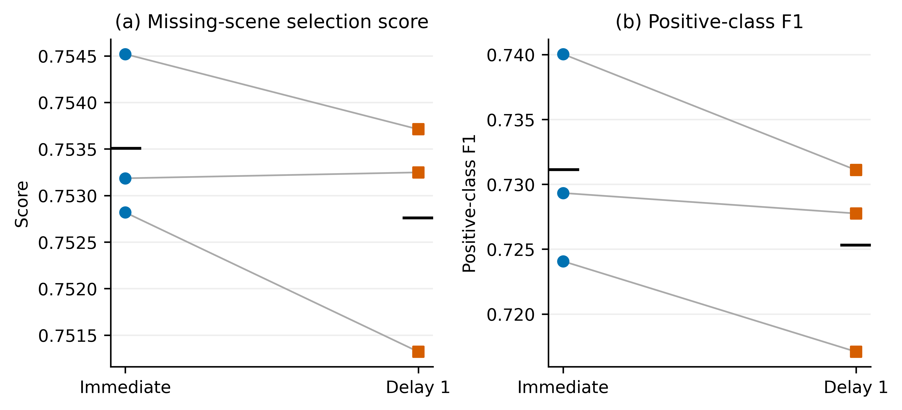
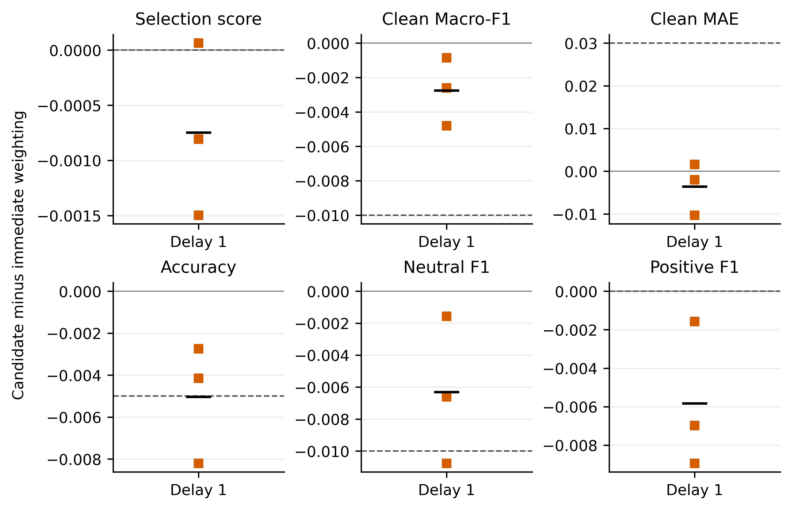

# 延后类别加权的对照实验与适用边界

## 摘要

本轮保留第四轮立即加权模型及其正式预测。预定研究包含前1轮和前2轮不加权的两个方案，其中前1轮方案完成内部三折，但未通过综合分数与类别性能的全部保护条件；前2轮方案因检查点保存中断未完成，不能形成有效性结论。本材料分别记录已完成的负面对照和未完成的运行状态，不把中断当作方法无效的证据。

本文区分内部开发、一次候选确认与最终交付。只有同时满足缺失综合分数和所有性能保护条件的方案才进入官方验证；不为某个候选临时放宽规则，也不依据测试集或附件3选择参数。

## 1 研究动机与方法来源

类别权重改变不同类别错误对参数更新的贡献。立即提高较少类别的损失权重可能改善其识别，也可能改变多数类别的决策边界。第四轮结果已经显示这种取舍，因此本轮不再扩大权重强度搜索，而是只改变权重开始作用的时点。研究问题是：先采用普通分类损失适配预训练表示，再启用同样的类别权重，能否改善正向类别表现并保留中性识别能力。

Cao等在NeurIPS 2019提出了延后重加权训练策略[1]。本研究借鉴其分阶段思想，但保留原有交叉熵、逆频率权重和线性学习率调度，没有采用LDAM间隔损失，也不声称复现原论文的完整算法。赛题仅含三个类别且类别不均衡程度有限，原文在视觉长尾数据上的发现不能直接作为本任务有效性的证据。

## 2 延后加权目标函数

设当前拟合子集含N条样本、C=3个类别，第c类样本数为n_c。类别权重仍只根据当前拟合样本计数确定，内部三折各自估计，不读取验证、测试或附件3标签。令e为从1开始的训练轮次，d为不加权阶段的轮数。立即加权对照取d=0，两个候选分别取d=1和d=2。

$$
u_c=N/(C n_c),\qquad w_c=u_c/(C^{-1}\sum_{k=0}^{C-1}u_k)\tag{1}
$$

$$
w_c^{(e)}=\begin{cases}1,&1\le e\le d,\\w_c,&e>d.\end{cases}\tag{2}
$$

$$
\mathcal L_B^{(e)}=-\frac{\sum_{i\in B}w_{y_i}^{(e)}\log p_{i,y_i}}{\sum_{i\in B}w_{y_i}^{(e)}}+\frac{1}{|B|}\sum_{i\in B}H_1(\hat s_i-s_i)\tag{3}
$$

式中B为有效批量，y_i为三分类标签，p为分类概率，s_i和预测强度分别为回归的真实值和模型输出；H_1为阈值1的Huber损失。前d轮各类权重均为1，分类项退化为普通交叉熵；之后使用已固定的逆频率权重。两阶段共享参数和优化器状态，切换时不重启模型、学习率或优化器。

微批量累积仍使用整个有效批量的同一个权重和作为分类分母，避免类别组成不同的微批量改变有效训练目标。该策略不增加推理参数、输入模态或外部标注数据。部署仍使用同一离线模型接口。

## 3 预定比较与核验规则

表1 比较中固定的条件与唯一改变因素

| 项目 | 设定 |
| --- | --- |
| 参照 | 第四轮立即逆频率加权，d=0 |
| 新增配置 | 前1轮不加权与前2轮不加权 |
| 模型与数据 | 12层完整词表编码器；原视频分组三折；各折独立标准化 |
| 开发训练 | 种子42，最多6轮，早停耐心3轮，有效批量32 |
| 其余训练条件 | 连续缺失概率0.7；原学习率、线性调度与Huber系数 |
| 检查点候选 | 仅允许e>d的轮次，早停耐心从加权阶段累计 |
| 确认规则 | 内部最佳轮数中位数固定训练长度；只确认一个配置，种子42、2026、3407 |

选择分数沿用缺失场景Macro-F1与归一化MAE的等权组合。与第四轮相比，至少两折的选择分数须提高，三折均值也须提高；完整Macro-F1下降不超过0.01、MAE增加不超过0.03、Accuracy下降不超过0.005、中性F1下降不超过0.01，正向F1还必须严格提高。所有条件在训练前固定。它们是团队内部选型条件，不是官方比赛评分标准。

在内部合格方案中，只选择平均分数最高的一项进入官方验证确认。最终替换还要求三个相同种子中至少两组配对、以及三种子均值同时通过全部条件。未完成的实验保留状态，不与完整确认方案同等对待。多轮使用官方验证会带来选择偏差，增加保护条件并不能消除这种偏差。

修改训练器后，首先重跑d=0的第1折。其217个参数张量与第四轮逐项完全相同，最大绝对差为0.0，选择分数差为0.0。因此可在本环境中复用第四轮同协议对照；这不是跨硬件逐位复现保证。

## 4 内部结果与类别取舍

以下表格与图形仅包含完成三折的候选及其立即加权对照。未完成的defer2不绘制均值、不填补缺失折，也不与完成实验进行性能排序。

表2 内部三折均值

| 配置 | S | Macro-F1 | MAE | Accuracy | 中性F1 | 正向F1 |
| --- | --- | --- | --- | --- | --- | --- |
| 立即加权 | 0.7535 | 0.6327 | 0.6147 | 0.6588 | 0.4646 | 0.7311 |
| defer1 | 0.7528 | 0.6299 | 0.6112 | 0.6538 | 0.4583 | 0.7253 |

表3 逐项选择判定

| 方案 | 提高S折数 | 固定轮数 | 是否合格 | 未通过条件 |
| --- | --- | --- | --- | --- |
| defer1 | 1/3 | 4 | 否 | 平均S未提高；Accuracy保护未通过；正向F1未提高；不足两折提高S |

defer1相对立即加权的平均S差为-0.00075，正向F1差为-0.0058，中性F1差为-0.0063，Accuracy差为-0.0050。这些结果应与表3的所有条件共同解读，不能仅以某一类别或单折的优势判断方案有效。

图中的点对应相同视频分组的三折验证，不是三个独立训练种子的重复实验。各配置的最佳轮次由内部验证选择，因此表2和图1反映同预算下训练方案的开发结果，而非未选择过的泛化精度。图2完整保留不利指标与阈值，不通过统一方向翻转或删去场景来隐藏取舍。

## 5 确认结果与最终模型

完成三折的候选未通过筛选，另一预定候选未完成。原优化截止时间已过，本轮按中断状态关闭，不修改原协议补算正式结果；没有启动新的官方验证确认或重新评价测试集。最终保留第四轮模型，新增分析与目录不代表新的性能提升。

方案defer2完成的内部折数为0/3。残缺检查点无法由标准加载器读取，原训练进程已不存在；保存停滞与退出的具体原因尚未确定。原文件、配置与日志保留作故障证据，不据其不完整输出推断方法效果。

逐样本独立复算覆盖70组开发及对照预测；拟合类别计数、逐轮权重切换、视频分组不重叠和选择规则均已核验。正式模型SHA256为56c8e2267dfa31f29929af9c68940d169ebe7fac3f1020cd05d697db0ea86e2e。附件3仍需以final目录的当前冻结模型和统一预处理参数生成，不依据专项预测分布调参。

## 6 结论与局限

完成三折的前1轮延后方案未提供替换第四轮模型的证据，其MAE小幅降低伴随分类指标下降，应作为有限预算下的负面对照保留。前2轮方案尚无完整结果，不能合并写成两个延后方案均无收益，更不能把保存故障归因于训练策略本身。

本研究预定检验两个切换时点，实际完成范围以运行状态为准，训练预算亦有限。现有证据不能排除其他预算、权重定义或模型结构下存在收益，也不能说明分类错误全部由类别不均衡造成。尚未对新的真实缺失机制、独立数据来源或更多训练种子建立广泛证据；后续研究应保持模型选择与最终评价的边界，并控制在同一数据上反复试验的规模。

本文件补充训练策略的消融证据，不替代此前的数据定义、掩码处理、编码器与融合结构说明。论文整合时将方法放入求解部分，将表2、表3和配对图放入消融分析；最终模型与附件3来源必须保持一致。

## 参考文献

[1] Cao K, Wei C, Gaidon A, Arechiga N, Ma T. Learning Imbalanced Datasets with Label-Distribution-Aware Margin Loss[C]. Advances in Neural Information Processing Systems 32, 2019. https://papers.neurips.cc/paper_files/paper/2019/hash/621461af90cadfdaf0e8d4cc25129f91-Abstract.html
