# 附件四全20条解释卡

本文件按无标签专项集展示预测与解释。秒数为交叉支持的候选回看范围，词级与短语级分别标注。截图展示实际帧时间对应的同步场景；贡献归属采用原特征索引。T/A/V分别表示文本/语音/视觉；有符号分数针对预测类与竞争类的间隔，正值支持、负值反对。

## 样本01

**预测极性 / 最终强度：** 中性 / +0.0000

**原始强度 / 竞争类别：** +0.1510 / 正向

**分类贡献 T / A / V：** 96.43% / 3.50% / 0.06%

**分类净分数 T / A / V：** +1.7858 / -0.0649 / -0.0012

**回归q贡献 T / A / V：** 48.27% / 29.52% / 22.21%

**分类 / 回归主要模态：** T / T

**分类间隔 / 偏置：** 1.2661 / -0.4537

**原文本：** Replacing these wear components when replacing the timing belt is essential to ensuring the new belt performs to its mileage requirements

**媒体对应状态：** 未触发双模型低内容支持提示；候选时间按关键项分别标注

**视觉特征可用性：** 对齐版非零视觉行22；未对齐版非零视觉行135（分别按各自序列统计）

**T关键证据：** 位置[7]，the，字符[[47, 50]]，分数+0.1881；词级候选 2.61—2.66s；同步画面2.633s；
位置[4]，components，字符[[21, 31]]，分数+0.1817；短语级回看 1.43—2.12s；同步画面1.767s；
位置[5]，when，字符[[32, 36]]，分数+0.1637；短语级回看 1.43—2.12s；同步画面1.767s

原视频帧79，时间2.633秒；对应关键位置[7]的回看范围。

原视频帧53，时间1.767秒；对应关键位置[4]的回看范围。

**A关键证据：** 位置[1]，Replacing，字符[[0, 9]]，分数-0.0186；语音定位支持不足（局部声学边界支持不足）；
位置[2]，these，字符[[10, 15]]，分数-0.0185；词级候选 0.98—1.17s；同步画面1.067s；
位置[5]，when，字符[[32, 36]]，分数-0.0077；短语级回看 1.43—2.12s；同步画面1.767s

原视频帧32，时间1.067秒；对应关键位置[2]的回看范围。

**V关键证据：** 位置[21]，age，字符[[121, 124]]，分数-0.0083；语音定位支持不足（局部声学边界支持不足）；
位置[20]，mile，字符[[117, 121]]，分数-0.0083；语音定位支持不足（局部声学边界支持不足）；
位置[22]，requirements，字符[[125, 137]]，分数-0.0079；语音定位支持不足（局部声学边界支持不足）

## 样本02

**预测极性 / 最终强度：** 正向 / +1.0e-06

**原始强度 / 竞争类别：** -0.0347 / 中性

**分类贡献 T / A / V：** 74.42% / 22.81% / 2.76%

**分类净分数 T / A / V：** +0.4064 / -0.1246 / -0.0151

**回归q贡献 T / A / V：** 30.04% / 21.84% / 48.12%

**分类 / 回归主要模态：** T / V

**分类间隔 / 偏置：** 0.7204 / +0.4537

**原文本：** We want to live by each other’s happiness - not by each other’s misery.

**媒体对应状态：** 未触发双模型低内容支持提示；候选时间按关键项分别标注

**视觉特征可用性：** 对齐版非零视觉行19；未对齐版非零视觉行50（分别按各自序列统计）

**T关键证据：** 位置[17]，s，字符[[62, 63]]，分数-0.1465；词级候选 2.20—2.43s；同步画面2.300s；
位置[18]，misery，字符[[64, 70]]，分数-0.1352；语音定位支持不足（局部声学边界支持不足）；
位置[4]，live，字符[[11, 15]]，分数+0.1288；词级候选 0.78—0.94s；同步画面0.867s

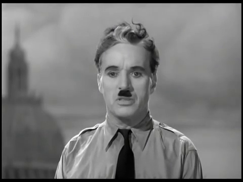

原视频帧69，时间2.300秒；对应关键位置[17]的回看范围。

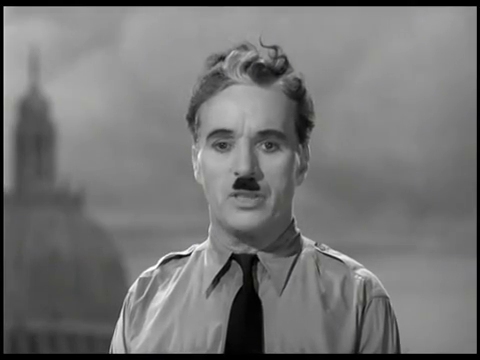

原视频帧26，时间0.867秒；对应关键位置[4]的回看范围。

**A关键证据：** 位置[18]，misery，字符[[64, 70]]，分数-0.0120；语音定位支持不足（局部声学边界支持不足）；
位置[19]，.，字符[[70, 71]]，分数-0.0119；标点或符号，无独立发音区间；
位置[4]，live，字符[[11, 15]]，分数-0.0118；词级候选 0.78—0.94s；同步画面0.867s

**V关键证据：** 位置[16]，’，字符[[61, 62]]，分数-0.0014；词级候选 2.20—2.43s；同步画面2.300s；
位置[15]，other，字符[[56, 61]]，分数-0.0014；词级候选 2.20—2.43s；同步画面2.300s；
位置[17]，s，字符[[62, 63]]，分数-0.0014；词级候选 2.20—2.43s；同步画面2.300s

**解读：** 分类主要参考文本，回归q主要参考视觉，两项任务的主要模态不同。原始强度为负而分类判为正，最终强度经一致性处理成为接近零的正值；这是当前双任务输出间的分歧，不应把最终微小正值写成强正向判断。文本中支持项与反对项同时存在，词面含义不能替代上下文化读出。

## 样本03

**预测极性 / 最终强度：** 负向 / -0.6588

**原始强度 / 竞争类别：** -0.6588 / 中性

**分类贡献 T / A / V：** 98.46% / 0.41% / 1.13%

**分类净分数 T / A / V：** +3.9605 / -0.0164 / -0.0455

**回归q贡献 T / A / V：** 87.02% / 9.89% / 3.10%

**分类 / 回归主要模态：** T / T

**分类间隔 / 偏置：** 4.2969 / +0.3983

**原文本：** There's one lender at the moment which I think is just Bankwest who don't take rental income into account, they take rental yield into account.

**媒体对应状态：** 未触发双模型低内容支持提示；候选时间按关键项分别标注

**视觉特征可用性：** 对齐版非零视觉行33；未对齐版非零视觉行144（分别按各自序列统计）

**T关键证据：** 位置[14]，just，字符[[50, 54]]，分数+0.1889；词级候选 2.69—2.90s；同步画面2.800s；
位置[12]，think，字符[[41, 46]]，分数+0.1807；词级候选 2.36—2.58s；同步画面2.467s；
位置[10]，which，字符[[33, 38]]，分数+0.1736；词级候选 2.14—2.31s；同步画面2.233s

原视频帧84，时间2.800秒；对应关键位置[14]的回看范围。

原视频帧74，时间2.467秒；对应关键位置[12]的回看范围。

原视频帧67，时间2.233秒；对应关键位置[10]的回看范围。

**A关键证据：** 位置[9]，moment，字符[[26, 32]]，分数-0.0080；词级候选 1.71—2.14s；同步画面1.933s；
位置[10]，which，字符[[33, 38]]，分数-0.0018；词级候选 2.14—2.31s；同步画面2.233s；
位置[22]，rental，字符[[79, 85]]，分数-0.0017；语音定位支持不足（局部声学边界支持不足）

原视频帧58，时间1.933秒；对应关键位置[9]的回看范围。

**V关键证据：** 位置[13]，is，字符[[47, 49]]，分数-0.0035；词级候选 2.58—2.69s；同步画面2.633s；
位置[14]，just，字符[[50, 54]]，分数-0.0030；词级候选 2.69—2.90s；同步画面2.800s；
位置[22]，rental，字符[[79, 85]]，分数-0.0030；语音定位支持不足（局部声学边界支持不足）

原视频帧79，时间2.633秒；对应关键位置[13]的回看范围。

## 样本04

**预测极性 / 最终强度：** 负向 / -0.4144

**原始强度 / 竞争类别：** -0.4144 / 中性

**分类贡献 T / A / V：** 98.67% / 0.31% / 1.02%

**分类净分数 T / A / V：** +3.7018 / +0.0116 / +0.0381

**回归q贡献 T / A / V：** 65.61% / 14.14% / 20.25%

**分类 / 回归主要模态：** T / T

**分类间隔 / 偏置：** 4.1499 / +0.3983

**原文本：** If I blow it at the team exercise, should I kiss my chances of cheering "GO BLUE" goodbye?] Absolutely not.

**媒体对应状态：** 未触发双模型低内容支持提示；候选时间按关键项分别标注

**视觉特征可用性：** 对齐版非零视觉行26；未对齐版非零视觉行103（分别按各自序列统计）

**T关键证据：** 位置[24]，Absolutely，字符[[92, 102]]，分数+0.2844；语音定位支持不足（局部声学边界支持不足）；
位置[11]，I，字符[[42, 43]]，分数+0.2555；词级候选 2.33—2.40s；同步画面2.367s；
位置[10]，should，字符[[35, 41]]，分数+0.2545；短语级回看 1.47—2.33s；同步画面1.900s

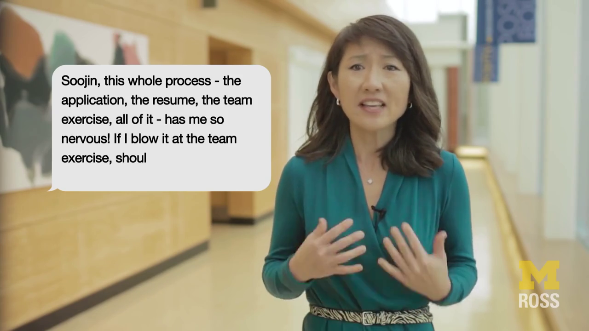

原视频帧71，时间2.367秒；对应关键位置[11]的回看范围。

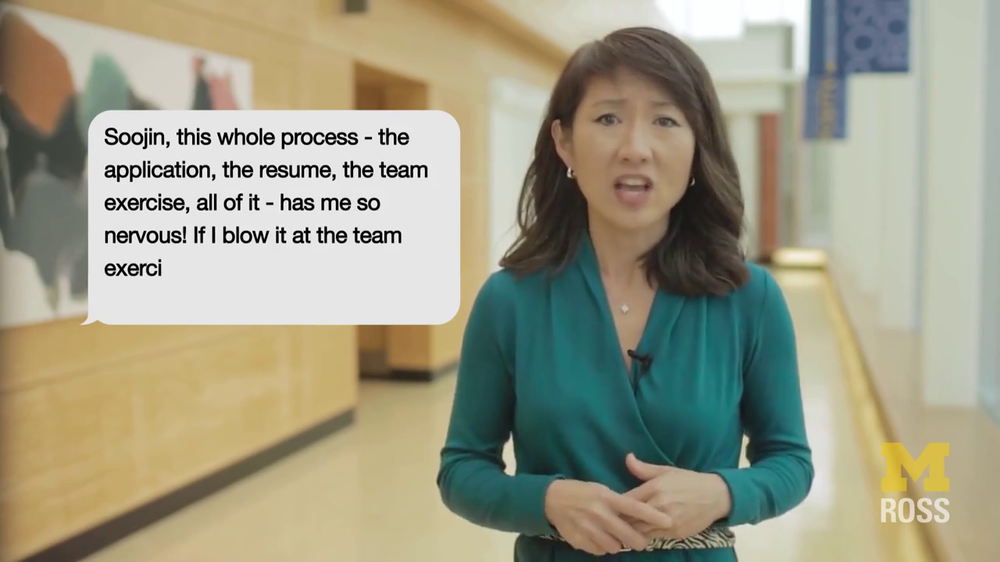

原视频帧57，时间1.900秒；对应关键位置[10]的回看范围。

**A关键证据：** 位置[16]，cheering，字符[[63, 71]]，分数-0.0052；短语级回看 3.38—3.92s；同步画面3.667s；
位置[15]，of，字符[[60, 62]]，分数-0.0048；词级候选 3.28—3.38s；同步画面3.333s；
位置[6]，the，字符[[16, 19]]，分数+0.0043；词级候选 1.15—1.21s；同步画面1.167s

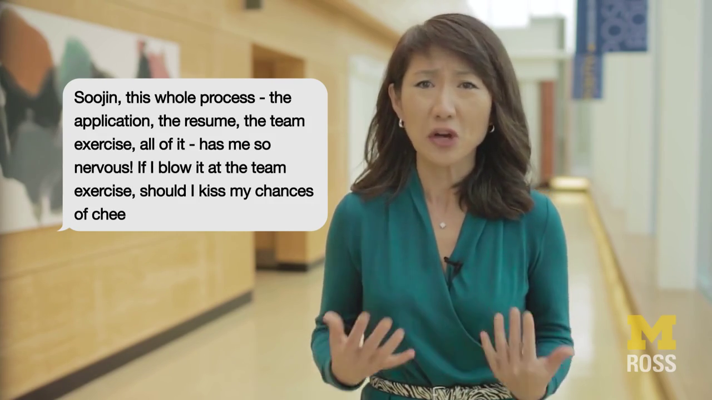

原视频帧110，时间3.667秒；对应关键位置[16]的回看范围。

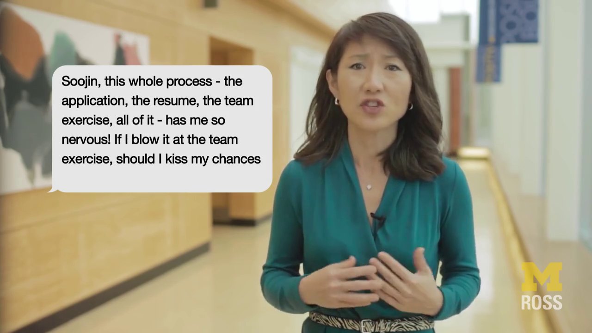

原视频帧100，时间3.333秒；对应关键位置[15]的回看范围。

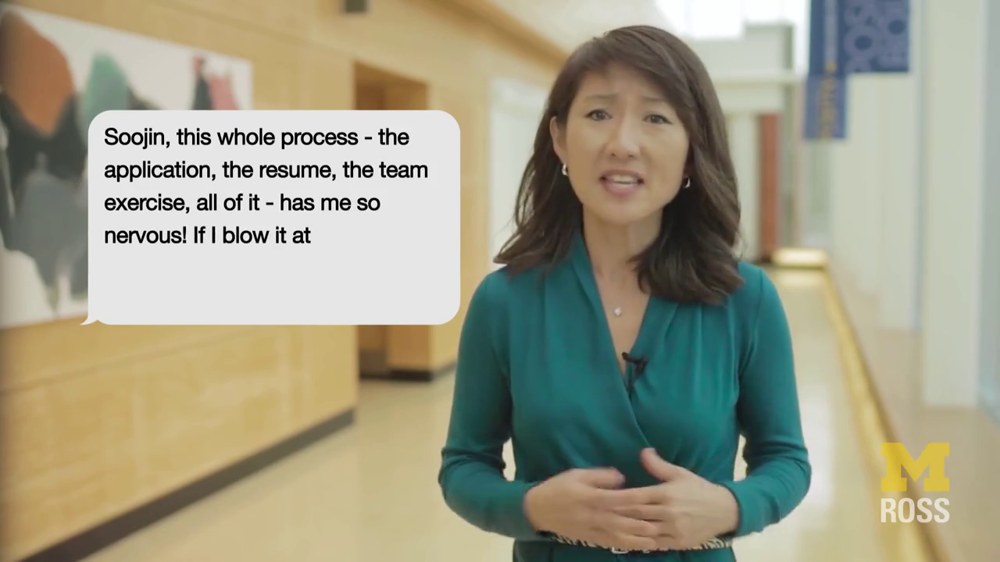

原视频帧35，时间1.167秒；对应关键位置[6]的回看范围。

**V关键证据：** 位置[15]，of，字符[[60, 62]]，分数+0.0040；词级候选 3.28—3.38s；同步画面3.333s；
位置[10]，should，字符[[35, 41]]，分数+0.0039；短语级回看 1.47—2.33s；同步画面1.900s；
位置[16]，cheering，字符[[63, 71]]，分数+0.0037；短语级回看 3.38—3.92s；同步画面3.667s

## 样本05

**预测极性 / 最终强度：** 正向 / +0.7983

**原始强度 / 竞争类别：** +0.7983 / 中性

**分类贡献 T / A / V：** 81.97% / 3.64% / 14.38%

**分类净分数 T / A / V：** +3.3402 / +0.1484 / +0.5861

**回归q贡献 T / A / V：** 77.34% / 3.99% / 18.68%

**分类 / 回归主要模态：** T / T

**分类间隔 / 偏置：** 4.5284 / +0.4537

**原文本：** Hi, my name is Chloe, video marketer for Red Wagon Marketing.

**媒体对应状态：** 未触发双模型低内容支持提示；候选时间按关键项分别标注

**视觉特征可用性：** 对齐版非零视觉行15；未对齐版非零视觉行90（分别按各自序列统计）

**T关键证据：** 位置[7]，,，字符[[20, 21]]，分数+0.3215；标点或符号，无独立发音区间；
位置[2]，,，字符[[2, 3]]，分数+0.2982；标点或符号，无独立发音区间；
位置[5]，is，字符[[12, 14]]，分数+0.2923；词级候选 2.27—2.39s；同步画面2.333s

原视频帧70，时间2.333秒；对应关键位置[5]的回看范围。

**A关键证据：** 位置[4]，name，字符[[7, 11]]，分数+0.0262；词级候选 2.10—2.27s；同步画面2.200s；
位置[5]，is，字符[[12, 14]]，分数+0.0251；词级候选 2.27—2.39s；同步画面2.333s；
位置[8]，video，字符[[22, 27]]，分数+0.0183；短语级回看 2.39—4.07s；同步画面3.233s

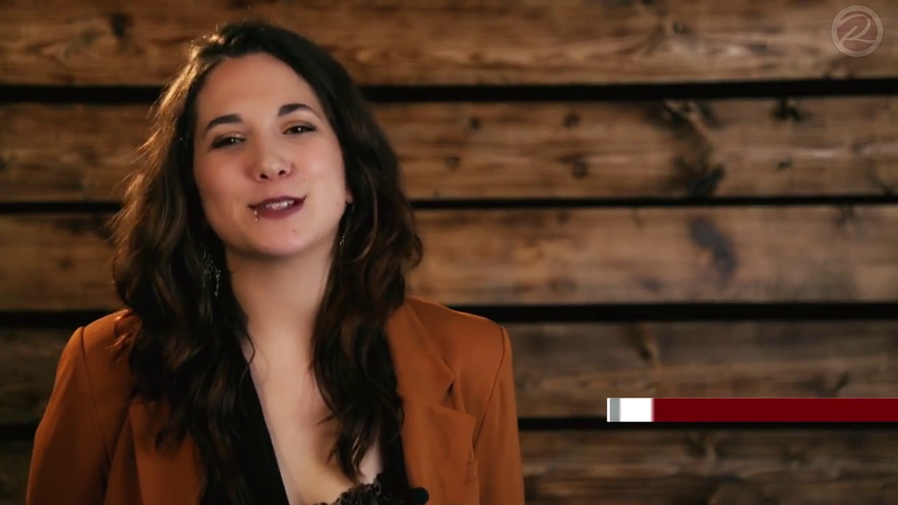

原视频帧66，时间2.200秒；对应关键位置[4]的回看范围。

原视频帧97，时间3.233秒；对应关键位置[8]的回看范围。

**V关键证据：** 位置[2]，,，字符[[2, 3]]，分数+0.0704；标点或符号，无独立发音区间；
位置[1]，Hi，字符[[0, 2]]，分数+0.0672；语音定位支持不足（局部声学边界支持不足）；
位置[4]，name，字符[[7, 11]]，分数+0.0649；词级候选 2.10—2.27s；同步画面2.200s

## 样本06

**预测极性 / 最终强度：** 正向 / +0.9139

**原始强度 / 竞争类别：** +0.9139 / 中性

**分类贡献 T / A / V：** 93.60% / 3.66% / 2.74%

**分类净分数 T / A / V：** +4.7967 / +0.1874 / -0.1405

**回归q贡献 T / A / V：** 69.88% / 12.15% / 17.97%

**分类 / 回归主要模态：** T / T

**分类间隔 / 偏置：** 5.2973 / +0.4537

**原文本：** If you're a fan of dancing in that sense, just like to watch people dance, see impressive dance moves then you might want to check out this movie solely for that

**媒体对应状态：** 未触发双模型低内容支持提示；候选时间按关键项分别标注

**视觉特征可用性：** 对齐版非零视觉行35；未对齐版非零视觉行123（分别按各自序列统计）

**T关键证据：** 位置[33]，solely，字符[[146, 152]]，分数+0.1871；短语级回看 6.71—7.33s；同步画面7.033s；
位置[14]，like，字符[[47, 51]]，分数+0.1757；词级候选 2.31—2.49s；同步画面2.400s；
位置[6]，fan，字符[[12, 15]]，分数+0.1736；词级候选 0.74—0.98s；同步画面0.867s

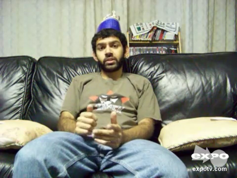

原视频帧211，时间7.033秒；对应关键位置[33]的回看范围。

原视频帧72，时间2.400秒；对应关键位置[14]的回看范围。

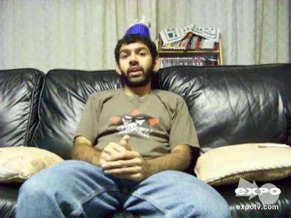

原视频帧26，时间0.867秒；对应关键位置[6]的回看范围。

**A关键证据：** 位置[21]，impressive，字符[[79, 89]]，分数+0.0153；短语级回看 3.91—5.69s；同步画面4.800s；
位置[23]，moves，字符[[96, 101]]，分数+0.0130；短语级回看 3.91—5.69s；同步画面4.800s；
位置[22]，dance，字符[[90, 95]]，分数+0.0129；短语级回看 3.91—5.69s；同步画面4.800s

原视频帧144，时间4.800秒；对应关键位置[21]的回看范围。

**V关键证据：** 位置[14]，like，字符[[47, 51]]，分数-0.0085；词级候选 2.31—2.49s；同步画面2.400s；
位置[15]，to，字符[[52, 54]]，分数-0.0082；词级候选 2.49—2.58s；同步画面2.533s；
位置[13]，just，字符[[42, 46]]，分数-0.0080；词级候选 2.14—2.31s；同步画面2.233s

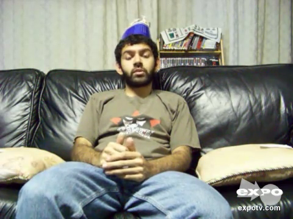

原视频帧76，时间2.533秒；对应关键位置[15]的回看范围。

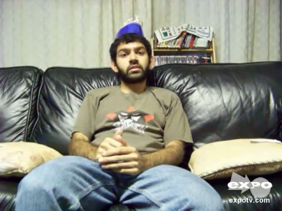

原视频帧67，时间2.233秒；对应关键位置[13]的回看范围。

## 样本07

**预测极性 / 最终强度：** 正向 / +0.8535

**原始强度 / 竞争类别：** +0.8535 / 中性

**分类贡献 T / A / V：** 90.50% / 2.19% / 7.31%

**分类净分数 T / A / V：** +2.6153 / +0.0632 / +0.2113

**回归q贡献 T / A / V：** 84.32% / 5.68% / 10.00%

**分类 / 回归主要模态：** T / T

**分类间隔 / 偏置：** 3.3435 / +0.4537

**原文本：** As Linn’s associate editor Michael Baadke reports in our November 28 issue, attendees “enthusiastically discussed the topics of growing the hobby, the future of stamp shows, and dealers and philatelic partnerships, along with ways the leading organizations involved in the stamp hobby can work together to make it succeed and grow

**媒体对应状态：** 未触发双模型低内容支持提示；候选时间按关键项分别标注

**视觉特征可用性：** 对齐版非零视觉行48；未对齐版非零视觉行319（分别按各自序列统计）

**T关键证据：** 位置[21]，enthusiastically，字符[[87, 103]]，分数+0.1252；语音定位支持不足（局部声学边界支持不足）；
位置[46]，ways，字符[[226, 230]]，分数+0.1243；短语级回看 12.88—15.04s；同步画面13.967s；
位置[44]，along，字符[[215, 220]]，分数+0.1240；短语级回看 12.88—15.04s；同步画面13.967s

原视频帧419，时间13.967秒；对应关键位置[46]的回看范围。

**A关键证据：** 位置[45]，with，字符[[221, 225]]，分数+0.0086；短语级回看 12.88—15.04s；同步画面13.967s；
位置[22]，discussed，字符[[104, 113]]，分数+0.0082；语音定位支持不足（原文与识别结果未形成唯一精确匹配）；
位置[24]，topics，字符[[118, 124]]，分数+0.0079；短语级回看 7.44—8.82s；同步画面8.133s

原视频帧244，时间8.133秒；对应关键位置[24]的回看范围。

**V关键证据：** 位置[42]，partnerships，字符[[201, 213]]，分数+0.0118；短语级回看 12.88—15.04s；同步画面13.967s；
位置[44]，along，字符[[215, 220]]，分数+0.0116；短语级回看 12.88—15.04s；同步画面13.967s；
位置[43]，,，字符[[213, 214]]，分数+0.0114；标点或符号，无独立发音区间

## 样本08

**预测极性 / 最终强度：** 正向 / +0.5174

**原始强度 / 竞争类别：** +0.5174 / 中性

**分类贡献 T / A / V：** 98.47% / 0.46% / 1.07%

**分类净分数 T / A / V：** +4.1137 / +0.0192 / -0.0449

**回归q贡献 T / A / V：** 75.87% / 2.45% / 21.68%

**分类 / 回归主要模态：** T / T

**分类间隔 / 偏置：** 4.5417 / +0.4537

**原文本：** That brings us to tonight, the Universal Design Grand Challenge

**媒体对应状态：** 未触发双模型低内容支持提示；候选时间按关键项分别标注

**视觉特征可用性：** 对齐版非零视觉行11；未对齐版非零视觉行74（分别按各自序列统计）

**T关键证据：** 位置[8]，Universal，字符[[31, 40]]，分数+0.4617；语音定位支持不足（局部声学边界支持不足）；
位置[9]，Design，字符[[41, 47]]，分数+0.4302；语音定位支持不足（局部声学边界支持不足）；
位置[2]，brings，字符[[5, 11]]，分数+0.4274；词级候选 0.85—1.08s；同步画面0.967s

原视频帧29，时间0.967秒；对应关键位置[2]的回看范围。

**A关键证据：** 位置[1]，That，字符[[0, 4]]，分数+0.0332；词级候选 0.54—0.85s；同步画面0.700s；
位置[2]，brings，字符[[5, 11]]，分数+0.0153；词级候选 0.85—1.08s；同步画面0.967s；
位置[8]，Universal，字符[[31, 40]]，分数-0.0148；语音定位支持不足（局部声学边界支持不足）

原视频帧21，时间0.700秒；对应关键位置[1]的回看范围。

**V关键证据：** 位置[7]，the，字符[[27, 30]]，分数-0.0081；词级候选 1.85—1.90s；同步画面1.867s；
位置[3]，us，字符[[12, 14]]，分数-0.0074；词级候选 1.08—1.20s；同步画面1.133s；
位置[5]，tonight，字符[[18, 25]]，分数-0.0071；短语级回看 1.39—1.90s；同步画面1.633s

原视频帧56，时间1.867秒；对应关键位置[7]的回看范围。

原视频帧34，时间1.133秒；对应关键位置[3]的回看范围。

原视频帧49，时间1.633秒；对应关键位置[5]的回看范围。

## 样本09

**预测极性 / 最终强度：** 负向 / -2.2932

**原始强度 / 竞争类别：** -2.2932 / 中性

**分类贡献 T / A / V：** 99.50% / 0.19% / 0.31%

**分类净分数 T / A / V：** +9.9869 / +0.0195 / -0.0307

**回归q贡献 T / A / V：** 93.83% / 5.53% / 0.64%

**分类 / 回归主要模态：** T / T

**分类间隔 / 偏置：** 10.3740 / +0.3983

**原文本：** (uhh) I did not like this movie at all, I would not recommend it

**媒体对应状态：** 未触发双模型低内容支持提示；候选时间按关键项分别标注

**视觉特征可用性：** 对齐版非零视觉行18；未对齐版非零视觉行75（分别按各自序列统计）

**T关键证据：** 位置[18]，it，字符[[62, 64]]，分数+0.5707；语音定位支持不足（局部声学边界支持不足）；
位置[16]，not，字符[[48, 51]]，分数+0.5688；语音定位支持不足（局部声学边界支持不足）；
位置[9]，this，字符[[21, 25]]，分数+0.5667；词级候选 1.62—1.82s；同步画面1.733s

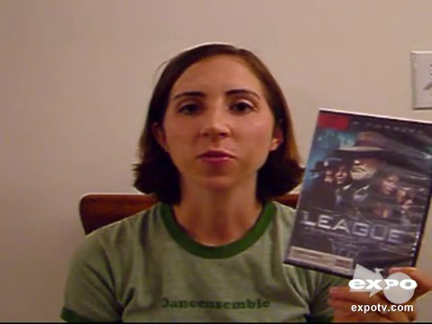

原视频帧52，时间1.733秒；对应关键位置[9]的回看范围。

**A关键证据：** 位置[15]，would，字符[[42, 47]]，分数+0.0059；语音定位支持不足（局部声学边界支持不足）；
位置[12]，all，字符[[35, 38]]，分数+0.0058；语音定位支持不足（局部声学边界支持不足）；
位置[13]，,，字符[[38, 39]]，分数+0.0058；标点或符号，无独立发音区间

**V关键证据：** 位置[15]，would，字符[[42, 47]]，分数-0.0037；语音定位支持不足（局部声学边界支持不足）；
位置[13]，,，字符[[38, 39]]，分数-0.0029；标点或符号，无独立发音区间；
位置[11]，at，字符[[32, 34]]，分数-0.0029；语音定位支持不足（局部声学边界支持不足）

## 样本10

**预测极性 / 最终强度：** 负向 / -2.1598

**原始强度 / 竞争类别：** -2.1598 / 中性

**分类贡献 T / A / V：** 99.37% / 0.63% / 0.01%

**分类净分数 T / A / V：** +9.5801 / +0.0603 / -0.0006

**回归q贡献 T / A / V：** 91.16% / 5.35% / 3.49%

**分类 / 回归主要模态：** T / T

**分类间隔 / 偏置：** 10.0380 / +0.3983

**原文本：** (umm) And you know I really do like to see fluffy chick flicks sometimes so I'm not against that but this one was pretty terrible

**媒体对应状态：** 未触发双模型低内容支持提示；候选时间按关键项分别标注

**视觉特征可用性：** 对齐版非零视觉行30；未对齐版非零视觉行147（分别按各自序列统计）

**T关键证据：** 位置[30]，terrible，字符[[121, 129]]，分数+0.3731；语音定位支持不足（局部声学边界支持不足）；
位置[28]，was，字符[[110, 113]]，分数+0.3649；短语级回看 7.20—8.60s；同步画面7.900s；
位置[29]，pretty，字符[[114, 120]]，分数+0.3630；短语级回看 7.20—8.60s；同步画面7.900s

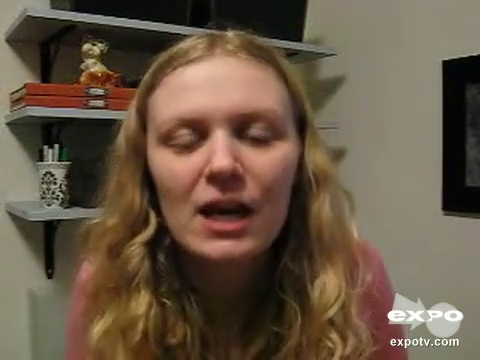

原视频帧237，时间7.900秒；对应关键位置[28]的回看范围。

**A关键证据：** 位置[24]，that，字符[[92, 96]]，分数+0.0046；短语级回看 5.29—6.94s；同步画面6.100s；
位置[11]，to，字符[[36, 38]]，分数+0.0038；词级候选 2.70—2.84s；同步画面2.767s；
位置[10]，like，字符[[31, 35]]，分数+0.0038；词级候选 2.48—2.70s；同步画面2.600s

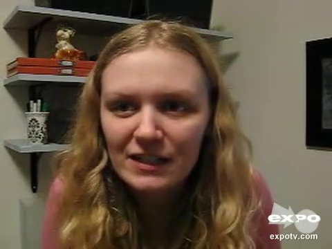

原视频帧183，时间6.100秒；对应关键位置[24]的回看范围。

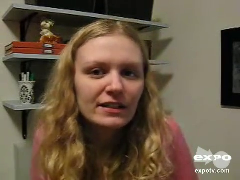

原视频帧83，时间2.767秒；对应关键位置[11]的回看范围。

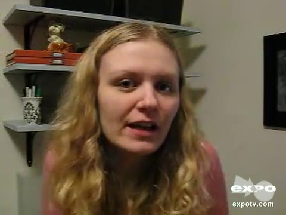

原视频帧78，时间2.600秒；对应关键位置[10]的回看范围。

**V关键证据：** 位置[6]，know，字符[[14, 18]]，分数+0.0023；词级候选 1.42—1.68s；同步画面1.567s；
位置[7]，I，字符[[19, 20]]，分数+0.0019；短语级回看 1.42—1.97s；同步画面1.700s；
位置[2]，umm，字符[[1, 4]]，分数-0.0018；语音定位支持不足（原文与识别结果未形成唯一精确匹配）

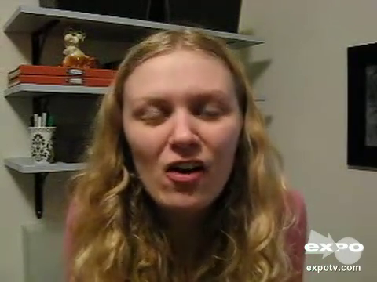

原视频帧47，时间1.567秒；对应关键位置[6]的回看范围。

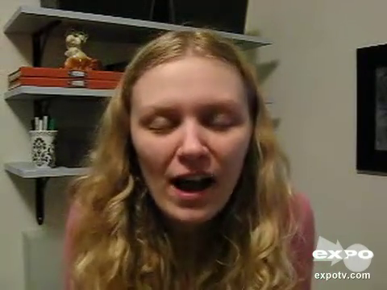

原视频帧51，时间1.700秒；对应关键位置[7]的回看范围。

## 样本11

**预测极性 / 最终强度：** 负向 / -1.7402

**原始强度 / 竞争类别：** -1.7402 / 中性

**分类贡献 T / A / V：** 99.40% / 0.52% / 0.08%

**分类净分数 T / A / V：** +6.7794 / -0.0357 / +0.0052

**回归q贡献 T / A / V：** 95.72% / 1.64% / 2.64%

**分类 / 回归主要模态：** T / T

**分类间隔 / 偏置：** 7.1471 / +0.3983

**原文本：** I would be ashamed to have made this film if I was a director

**媒体对应状态：** 未触发双模型低内容支持提示；候选时间按关键项分别标注

**视觉特征可用性：** 对齐版非零视觉行14；未对齐版非零视觉行86（分别按各自序列统计）

**T关键证据：** 位置[4]，ashamed，字符[[11, 18]]，分数+0.5581；短语级回看 0.87—3.34s；同步画面2.100s；
位置[6]，have，字符[[22, 26]]，分数+0.5324；词级候选 3.34—3.49s；同步画面3.400s；
位置[3]，be，字符[[8, 10]]，分数+0.5289；词级候选 0.74—0.87s；同步画面0.800s

原视频帧63，时间2.100秒；对应关键位置[4]的回看范围。

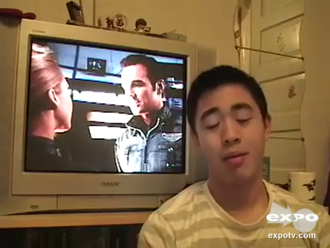

原视频帧102，时间3.400秒；对应关键位置[6]的回看范围。

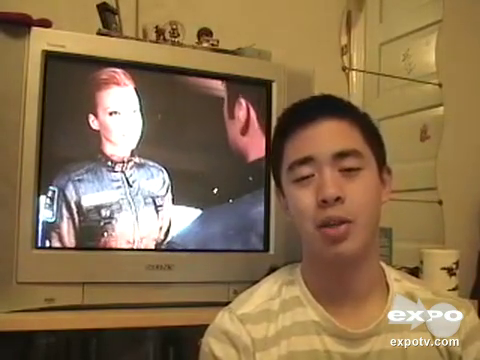

原视频帧24，时间0.800秒；对应关键位置[3]的回看范围。

**A关键证据：** 位置[9]，film，字符[[37, 41]]，分数-0.0082；词级候选 3.85—4.25s；同步画面4.033s；
位置[12]，was，字符[[47, 50]]，分数-0.0061；词级候选 4.56—4.78s；同步画面4.667s；
位置[3]，be，字符[[8, 10]]，分数-0.0058；词级候选 0.74—0.87s；同步画面0.800s

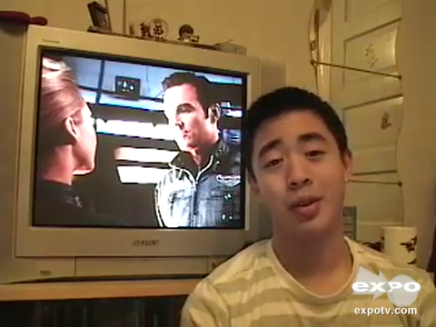

原视频帧121，时间4.033秒；对应关键位置[9]的回看范围。

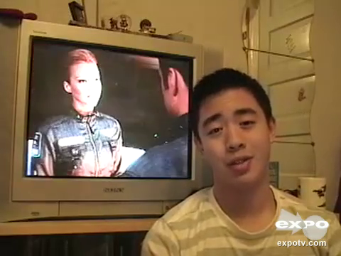

原视频帧140，时间4.667秒；对应关键位置[12]的回看范围。

**V关键证据：** 位置[1]，I，字符[[0, 1]]，分数+0.0020；语音定位支持不足（局部声学边界支持不足）；
位置[2]，would，字符[[2, 7]]，分数+0.0020；词级候选 0.64—0.74s；同步画面0.700s；
位置[13]，a，字符[[51, 52]]，分数+0.0013；语音定位支持不足（原文与识别结果未形成唯一精确匹配）

原视频帧21，时间0.700秒；对应关键位置[2]的回看范围。

## 样本12

**预测极性 / 最终强度：** 负向 / -0.6896

**原始强度 / 竞争类别：** -0.6896 / 中性

**分类贡献 T / A / V：** 96.60% / 2.59% / 0.81%

**分类净分数 T / A / V：** +4.1652 / -0.1116 / +0.0351

**回归q贡献 T / A / V：** 86.14% / 6.50% / 7.36%

**分类 / 回归主要模态：** T / T

**分类间隔 / 偏置：** 4.4870 / +0.3983

**原文本：** Or worse, an individual previously had good credit, but usually by no fault of their own, or perhaps by fault of their own, they have let their credit sag, and credit scores is very low.

**媒体对应状态：** 未触发双模型低内容支持提示；候选时间按关键项分别标注

**视觉特征可用性：** 对齐版非零视觉行42；未对齐版非零视觉行193（分别按各自序列统计）

**T关键证据：** 位置[41]，low，字符[[182, 185]]，分数+0.1494；语音定位支持不足（连续片段的信息锚点不足）；
位置[36]，and，字符[[156, 159]]，分数+0.1437；语音定位支持不足（局部声学边界支持不足）；
位置[30]，let，字符[[134, 137]]，分数+0.1401；词级候选 9.02—9.24s；同步画面9.133s

原视频帧274，时间9.133秒；对应关键位置[30]的回看范围。

**A关键证据：** 位置[12]，usually，字符[[56, 63]]，分数-0.0065；短语级回看 1.20—4.86s；同步画面3.033s；
位置[20]，or，字符[[90, 92]]，分数-0.0061；短语级回看 6.12—7.71s；同步画面6.900s；
位置[21]，perhaps，字符[[93, 100]]，分数-0.0057；短语级回看 6.12—7.71s；同步画面6.900s

原视频帧91，时间3.033秒；对应关键位置[12]的回看范围。

原视频帧207，时间6.900秒；对应关键位置[20]的回看范围。

**V关键证据：** 位置[35]，,，字符[[154, 155]]，分数+0.0034；标点或符号，无独立发音区间；
位置[34]，g，字符[[153, 154]]，分数+0.0034；语音定位支持不足（局部声学边界支持不足）；
位置[33]，sa，字符[[151, 153]]，分数+0.0033；语音定位支持不足（局部声学边界支持不足）

## 样本13

**预测极性 / 最终强度：** 中性 / +0.0000

**原始强度 / 竞争类别：** +0.1131 / 正向

**分类贡献 T / A / V：** 93.27% / 6.73% / 0.00%

**分类净分数 T / A / V：** +1.8412 / -0.1328 / +0.0000

**回归q贡献 T / A / V：** 63.07% / 36.93% / 0.00%

**分类 / 回归主要模态：** T / T

**分类间隔 / 偏置：** 1.2547 / -0.4537

**原文本：** For example, I could take a set of data and from that data, I can find a relationship between any two of the given factors or more.

**媒体对应状态：** 未触发双模型低内容支持提示；候选时间按关键项分别标注

**视觉特征可用性：** 对齐版非零视觉行0；未对齐版非零视觉行17（分别按各自序列统计）

**T关键证据：** 位置[19]，a，字符[[71, 72]]，分数+0.1115；语音定位支持不足（局部声学边界支持不足）；
位置[21]，between，字符[[86, 93]]，分数+0.1050；短语级回看 5.03—6.48s；同步画面5.767s；
位置[25]，the，字符[[105, 108]]，分数+0.0878；词级候选 6.86—6.92s；同步画面6.900s

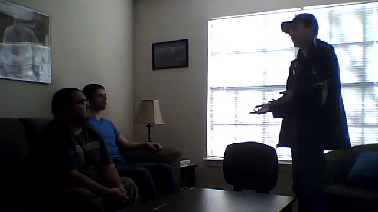

原视频帧173，时间5.767秒；对应关键位置[21]的回看范围。

原视频帧207，时间6.900秒；对应关键位置[25]的回看范围。

**A关键证据：** 位置[22]，any，字符[[94, 97]]，分数-0.0107；短语级回看 5.03—6.48s；同步画面5.767s；
位置[23]，two，字符[[98, 101]]，分数-0.0086；词级候选 6.48—6.71s；同步画面6.600s；
位置[26]，given，字符[[109, 114]]，分数-0.0074；语音定位支持不足（局部声学边界支持不足）

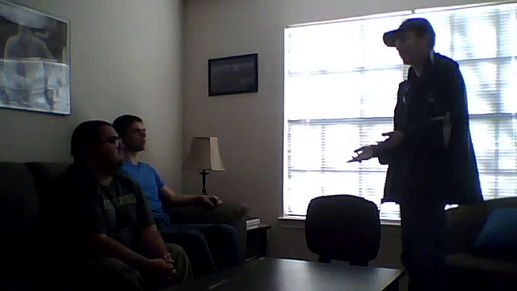

原视频帧198，时间6.600秒；对应关键位置[23]的回看范围。

**V关键证据：** 无有效视觉观测。

**解读：** 原视觉数组全零，视觉单项及关联交互关闭，视觉贡献为0。当前判断来自可观测的文本与语音，分类输出为中性。缺失是输入的观测事实，不能由这一案例推断若补充视觉就会改变类别。

## 样本14

**预测极性 / 最终强度：** 中性 / +0.0000

**原始强度 / 竞争类别：** +0.2018 / 正向

**分类贡献 T / A / V：** 80.66% / 4.35% / 14.99%

**分类净分数 T / A / V：** +3.6700 / -0.1979 / -0.6822

**回归q贡献 T / A / V：** 36.71% / 22.20% / 41.09%

**分类 / 回归主要模态：** T / V

**分类间隔 / 偏置：** 2.3361 / -0.4537

**原文本：** He is the co-founder of Rossen and Vettese Limited and the former Executive Director of Uniform Final Examination (UFE) courses at Toronto's York University.

**媒体对应状态：** 未触发双模型低内容支持提示；候选时间按关键项分别标注

**视觉特征可用性：** 对齐版非零视觉行35；未对齐版非零视觉行153（分别按各自序列统计）

**T关键证据：** 位置[11]，Vet，字符[[35, 38]]，分数+0.1775；语音定位支持不足（原文与识别结果未形成唯一精确匹配）；
位置[1]，He，字符[[0, 2]]，分数+0.1516；语音定位支持不足（连续片段的信息锚点不足）；
位置[2]，is，字符[[3, 5]]，分数+0.1426；语音定位支持不足（连续片段的信息锚点不足）

**A关键证据：** 位置[3]，the，字符[[6, 9]]，分数-0.0202；语音定位支持不足（连续片段的信息锚点不足）；
位置[10]，and，字符[[31, 34]]，分数-0.0190；语音定位支持不足（原文与识别结果未形成唯一精确匹配）；
位置[6]，founder，字符[[13, 20]]，分数-0.0185；语音定位支持不足（连续片段的信息锚点不足）

**V关键证据：** 位置[19]，Director，字符[[76, 84]]，分数-0.0350；语音定位支持不足（局部声学边界支持不足）；
位置[34]，University，字符[[146, 156]]，分数-0.0321；语音定位支持不足（局部声学边界支持不足）；
位置[33]，York，字符[[141, 145]]，分数-0.0319；语音定位支持不足（局部声学边界支持不足）

**解读：** 分类判为中性，最终强度置零；回归q中视觉净作用占41.09%，高于其他单个模态。中性类别并不意味着各模态没有作用，局部支持、反对以及输出偏置共同决定最终分类间隔。

## 样本15

**预测极性 / 最终强度：** 正向 / +0.6387

**原始强度 / 竞争类别：** +0.6387 / 中性

**分类贡献 T / A / V：** 73.61% / 15.05% / 11.34%

**分类净分数 T / A / V：** +2.5627 / +0.5240 / +0.3947

**回归q贡献 T / A / V：** 68.34% / 5.10% / 26.57%

**分类 / 回归主要模态：** T / T

**分类间隔 / 偏置：** 3.9351 / +0.4537

**原文本：** However, despite their poverty, the family prioritize education because they believed in its power to transform lives

**媒体对应状态：** 两个识别模型均显示原文内容支持偏低；媒体对应待确认

**视觉特征可用性：** 对齐版非零视觉行21；未对齐版非零视觉行110（分别按各自序列统计）

**T关键证据：** 位置[20]，transform，字符[[102, 111]]，分数+0.3343；语音定位支持不足（原文与识别结果未形成唯一精确匹配）；
位置[19]，to，字符[[99, 101]]，分数+0.2809；语音定位支持不足（原文与识别结果未形成唯一精确匹配）；
位置[18]，power，字符[[93, 98]]，分数+0.2699；语音定位支持不足（原文与识别结果未形成唯一精确匹配）

**A关键证据：** 位置[15]，believed，字符[[77, 85]]，分数+0.0471；语音定位支持不足（原文与识别结果未形成唯一精确匹配）；
位置[16]，in，字符[[86, 88]]，分数+0.0361；语音定位支持不足（原文与识别结果未形成唯一精确匹配）；
位置[18]，power，字符[[93, 98]]，分数+0.0338；语音定位支持不足（原文与识别结果未形成唯一精确匹配）

**V关键证据：** 位置[21]，lives，字符[[112, 117]]，分数+0.0625；语音定位支持不足（原文与识别结果未形成唯一精确匹配）；
位置[20]，transform，字符[[102, 111]]，分数+0.0362；语音定位支持不足（原文与识别结果未形成唯一精确匹配）；
位置[12]，education，字符[[54, 63]]，分数+0.0210；语音定位支持不足（原文与识别结果未形成唯一精确匹配）

## 样本16

**预测极性 / 最终强度：** 负向 / -2.6363

**原始强度 / 竞争类别：** -2.6363 / 中性

**分类贡献 T / A / V：** 99.04% / 0.01% / 0.95%

**分类净分数 T / A / V：** +10.6589 / +0.0014 / -0.1020

**回归q贡献 T / A / V：** 99.06% / 0.94% / 0.00%

**分类 / 回归主要模态：** T / T

**分类间隔 / 偏置：** 10.9566 / +0.3983

**原文本：** It's a terrible, this is a terrible movie

**媒体对应状态：** 未触发双模型低内容支持提示；候选时间按关键项分别标注

**视觉特征可用性：** 对齐版非零视觉行11；未对齐版非零视觉行40（分别按各自序列统计）

**T关键证据：** 位置[5]，terrible，字符[[7, 15]]，分数+0.9867；短语级回看 0.76—1.60s；同步画面1.167s；
位置[3]，s，字符[[3, 4]]，分数+0.9829；语音定位支持不足（连续片段的信息锚点不足）；
位置[10]，terrible，字符[[27, 35]]，分数+0.9827；词级候选 1.72—2.14s；同步画面1.933s

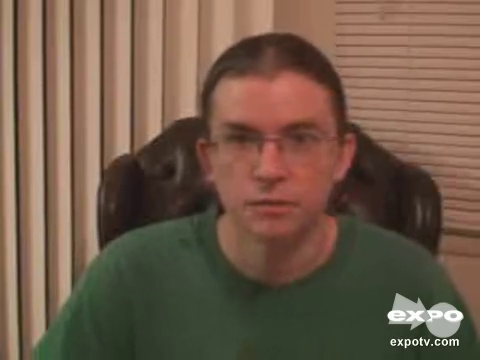

原视频帧35，时间1.167秒；对应关键位置[5]的回看范围。

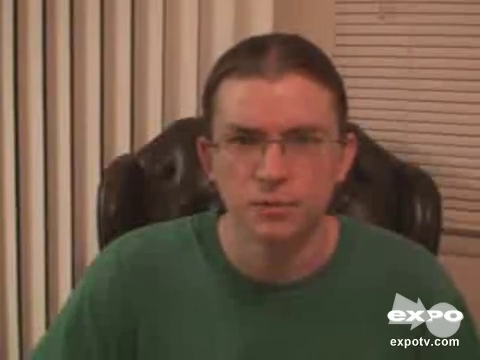

原视频帧58，时间1.933秒；对应关键位置[10]的回看范围。

**A关键证据：** 位置[7]，this，字符[[17, 21]]，分数+0.0080；短语级回看 0.76—1.60s；同步画面1.167s；
位置[8]，is，字符[[22, 24]]，分数-0.0041；词级候选 1.60—1.66s；同步画面1.633s；
位置[1]，It，字符[[0, 2]]，分数-0.0037；语音定位支持不足（连续片段的信息锚点不足）

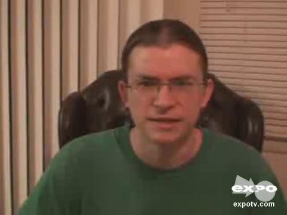

原视频帧49，时间1.633秒；对应关键位置[8]的回看范围。

**V关键证据：** 位置[7]，this，字符[[17, 21]]，分数-0.0160；短语级回看 0.76—1.60s；同步画面1.167s；
位置[5]，terrible，字符[[7, 15]]，分数-0.0153；短语级回看 0.76—1.60s；同步画面1.167s；
位置[6]，,，字符[[15, 16]]，分数-0.0153；标点或符号，无独立发音区间

**解读：** 预测为负向，最终强度为−2.6363。文本净贡献占99.04%，原句中两处terrible可在局部图中回查；这些读出已包含全句上下文，不能解释为词自身独立产生的因果效应。

## 样本17

**预测极性 / 最终强度：** 正向 / +1.7645

**原始强度 / 竞争类别：** +1.7645 / 中性

**分类贡献 T / A / V：** 94.11% / 1.66% / 4.23%

**分类净分数 T / A / V：** +7.2874 / +0.1285 / +0.3275

**回归q贡献 T / A / V：** 93.38% / 1.40% / 5.22%

**分类 / 回归主要模态：** T / T

**分类间隔 / 偏置：** 8.1970 / +0.4537

**原文本：** Applying these four design concepts to your presentations is simple, easy and will make people think you turned into a design guru.

**媒体对应状态：** 未触发双模型低内容支持提示；候选时间按关键项分别标注

**视觉特征可用性：** 对齐版非零视觉行24；未对齐版非零视觉行143（分别按各自序列统计）

**T关键证据：** 位置[14]，will，字符[[78, 82]]，分数+0.3360；短语级回看 3.04—6.90s；同步画面4.967s；
位置[13]，and，字符[[74, 77]]，分数+0.3331；短语级回看 3.04—6.90s；同步画面4.967s；
位置[7]，your，字符[[39, 43]]，分数+0.3313；词级候选 2.93—3.04s；同步画面3.000s

原视频帧149，时间4.967秒；对应关键位置[14]的回看范围。

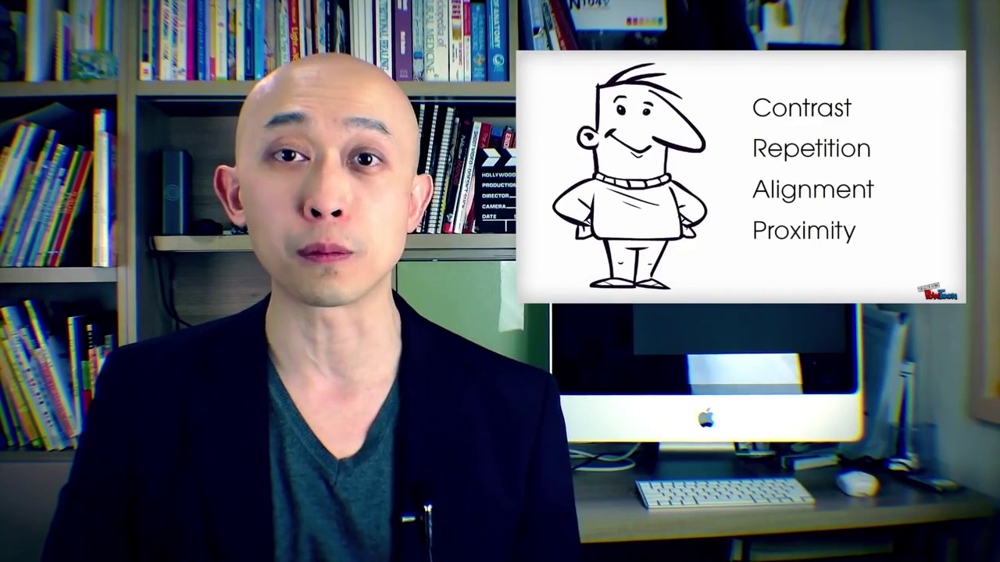

原视频帧90，时间3.000秒；对应关键位置[7]的回看范围。

**A关键证据：** 位置[4]，design，字符[[20, 26]]，分数+0.0185；语音定位支持不足（局部声学边界支持不足）；
位置[2]，these，字符[[9, 14]]，分数+0.0157；语音定位支持不足（局部声学边界支持不足）；
位置[1]，Applying，字符[[0, 8]]，分数+0.0145；语音定位支持不足（局部声学边界支持不足）

**V关键证据：** 位置[19]，turned，字符[[105, 111]]，分数+0.0350；词级候选 7.78—8.04s；同步画面7.900s；
位置[20]，into，字符[[112, 116]]，分数+0.0319；词级候选 8.04—8.22s；同步画面8.133s；
位置[8]，presentations，字符[[44, 57]]，分数+0.0241；短语级回看 3.04—6.90s；同步画面4.967s

原视频帧237，时间7.900秒；对应关键位置[19]的回看范围。

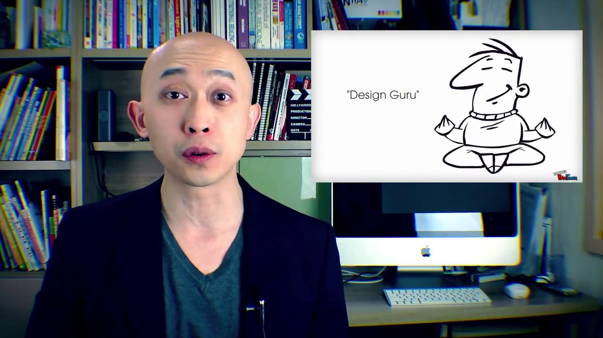

原视频帧244，时间8.133秒；对应关键位置[20]的回看范围。

## 样本18

**预测极性 / 最终强度：** 负向 / -0.5241

**原始强度 / 竞争类别：** -0.5241 / 中性

**分类贡献 T / A / V：** 93.28% / 0.09% / 6.63%

**分类净分数 T / A / V：** +1.3974 / -0.0013 / -0.0993

**回归q贡献 T / A / V：** 83.55% / 13.76% / 2.69%

**分类 / 回归主要模态：** T / T

**分类间隔 / 偏置：** 1.6951 / +0.3983

**原文本：** -And in Denmark - the first Baltic Cod fishery has been MSC – certified -Meanwhile, the Faeroese Mackerel Fishery has been denied MSC certification based on the fact that the fishery has failed to reach an agreement on mackerel quotas with Norway and the European Union.

**媒体对应状态：** 未触发双模型低内容支持提示；候选时间按关键项分别标注

**视觉特征可用性：** 对齐版非零视觉行48；未对齐版非零视觉行280（分别按各自序列统计）

**T关键证据：** 位置[17]，Meanwhile，字符[[73, 82]]，分数+0.1514；语音定位支持不足（局部声学边界支持不足）；
位置[35]，fact，字符[[161, 165]]，分数+0.1484；词级候选 11.60—11.94s；同步画面11.767s；
位置[32]，based，字符[[148, 153]]，分数+0.1430；短语级回看 8.97—11.54s；同步画面10.267s

原视频帧353，时间11.767秒；对应关键位置[35]的回看范围。

原视频帧308，时间10.267秒；对应关键位置[32]的回看范围。

**A关键证据：** 位置[4]，Denmark，字符[[8, 15]]，分数-0.0025；短语级回看 0.80—1.66s；同步画面1.233s；
位置[14]，–，字符[[60, 61]]，分数-0.0023；标点或符号，无独立发音区间；
位置[34]，the，字符[[157, 160]]，分数-0.0018；词级候选 11.54—11.60s；同步画面11.567s

原视频帧37，时间1.233秒；对应关键位置[4]的回看范围。

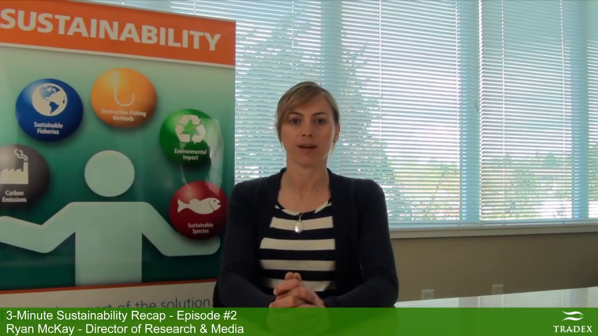

原视频帧347，时间11.567秒；对应关键位置[34]的回看范围。

**V关键证据：** 位置[35]，fact，字符[[161, 165]]，分数-0.0028；词级候选 11.60—11.94s；同步画面11.767s；
位置[36]，that，字符[[166, 170]]，分数-0.0025；词级候选 11.94—12.05s；同步画面12.000s；
位置[7]，first，字符[[22, 27]]，分数-0.0025；词级候选 1.66—2.01s；同步画面1.833s

原视频帧360，时间12.000秒；对应关键位置[36]的回看范围。

原视频帧55，时间1.833秒；对应关键位置[7]的回看范围。

## 样本19

**预测极性 / 最终强度：** 正向 / +0.6309

**原始强度 / 竞争类别：** +0.6309 / 中性

**分类贡献 T / A / V：** 71.34% / 8.08% / 20.58%

**分类净分数 T / A / V：** +1.7239 / +0.1951 / +0.4973

**回归q贡献 T / A / V：** 59.92% / 2.07% / 38.01%

**分类 / 回归主要模态：** T / T

**分类间隔 / 偏置：** 2.8700 / +0.4537

**原文本：** People are surprisingly forgiving brands when they own up to mistakes, and unfortunately some haters out there love to point fingers and jump all over imperfections, but for the most part, people understand

**媒体对应状态：** 未触发双模型低内容支持提示；候选时间按关键项分别标注

**视觉特征可用性：** 对齐版非零视觉行39；未对齐版非零视觉行204（分别按各自序列统计）

**T关键证据：** 位置[3]，surprisingly，字符[[11, 23]]，分数+0.1747；短语级回看 0.83—2.99s；同步画面1.900s；
位置[36]，part，字符[[183, 187]]，分数+0.1671；词级候选 11.80—12.09s；同步画面11.933s；
位置[35]，most，字符[[178, 182]]，分数+0.1658；词级候选 11.52—11.80s；同步画面11.667s

原视频帧57，时间1.900秒；对应关键位置[3]的回看范围。

原视频帧358，时间11.933秒；对应关键位置[36]的回看范围。

原视频帧350，时间11.667秒；对应关键位置[35]的回看范围。

**A关键证据：** 位置[1]，People，字符[[0, 6]]，分数+0.0155；语音定位支持不足（局部声学边界支持不足）；
位置[2]，are，字符[[7, 10]]，分数+0.0146；词级候选 0.75—0.83s；同步画面0.800s；
位置[3]，surprisingly，字符[[11, 23]]，分数+0.0129；短语级回看 0.83—2.99s；同步画面1.900s

原视频帧24，时间0.800秒；对应关键位置[2]的回看范围。

**V关键证据：** 位置[21]，love，字符[[111, 115]]，分数+0.0261；短语级回看 6.30—9.12s；同步画面7.700s；
位置[22]，to，字符[[116, 118]]，分数+0.0249；短语级回看 6.30—9.12s；同步画面7.700s；
位置[20]，there，字符[[105, 110]]，分数+0.0241；短语级回看 6.30—9.12s；同步画面7.700s

原视频帧231，时间7.700秒；对应关键位置[21]的回看范围。

## 样本20

**预测极性 / 最终强度：** 正向 / +0.5035

**原始强度 / 竞争类别：** +0.5035 / 中性

**分类贡献 T / A / V：** 62.90% / 17.33% / 19.77%

**分类净分数 T / A / V：** +1.4070 / +0.3876 / +0.4422

**回归q贡献 T / A / V：** 65.99% / 9.51% / 24.50%

**分类 / 回归主要模态：** T / T

**分类间隔 / 偏置：** 2.6905 / +0.4537

**原文本：** And of course, click in the link of the description of this video for more, and we'll have more live updates and a stock market video (wrap-up) at the end of the day today.

**媒体对应状态：** 未触发双模型低内容支持提示；候选时间按关键项分别标注

**视觉特征可用性：** 对齐版非零视觉行43；未对齐版非零视觉行162（分别按各自序列统计）

**T关键证据：** 位置[36]，at，字符[[144, 146]]，分数+0.0975；语音定位支持不足（连续片段的信息锚点不足）；
位置[23]，more，字符[[91, 95]]，分数+0.0945；语音定位支持不足（局部声学边界支持不足）；
位置[26]，and，字符[[109, 112]]，分数+0.0821；语音定位支持不足（局部声学边界支持不足）

**A关键证据：** 位置[40]，the，字符[[158, 161]]，分数+0.0230；语音定位支持不足（连续片段的信息锚点不足）；
位置[36]，at，字符[[144, 146]]，分数+0.0191；语音定位支持不足（连续片段的信息锚点不足）；
位置[30]，video，字符[[128, 133]]，分数+0.0190；语音定位支持不足（局部声学边界支持不足）

**V关键证据：** 位置[13]，this，字符[[55, 59]]，分数+0.0212；语音定位支持不足（局部声学边界支持不足）；
位置[16]，more，字符[[70, 74]]，分数+0.0201；词级候选 3.44—3.87s；同步画面3.667s；
位置[15]，for，字符[[66, 69]]，分数+0.0188；词级候选 3.24—3.44s；同步画面3.333s

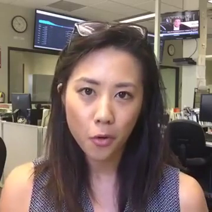

原视频帧110，时间3.667秒；对应关键位置[16]的回看范围。

原视频帧100，时间3.333秒；对应关键位置[15]的回看范围。
