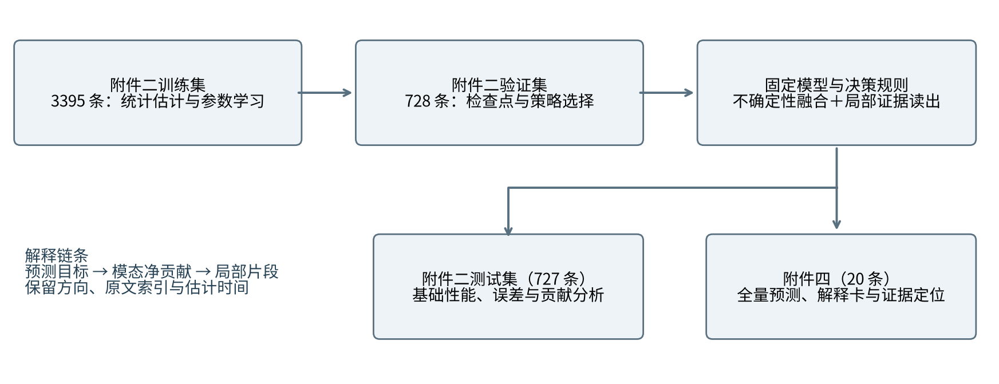
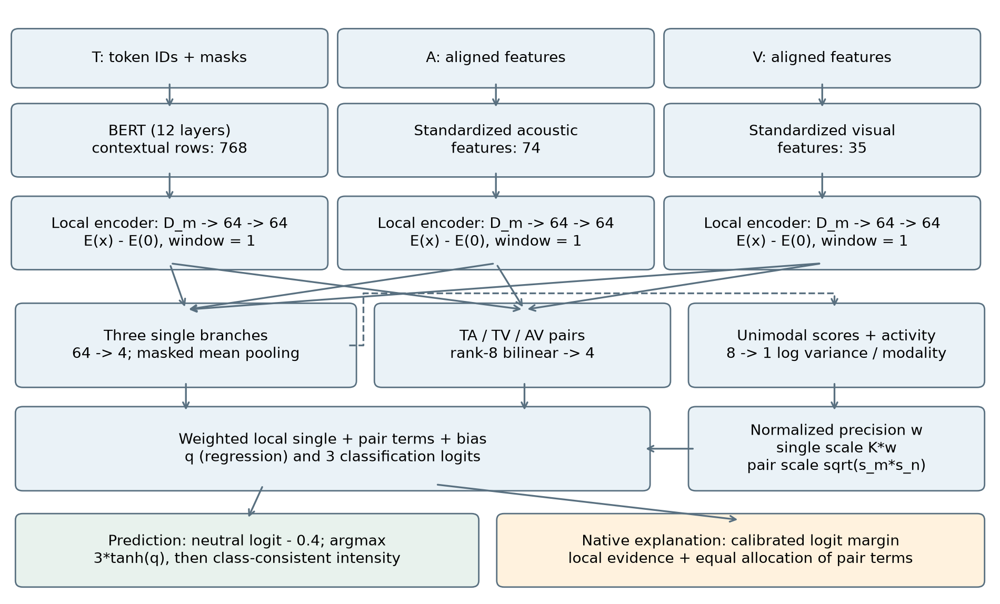
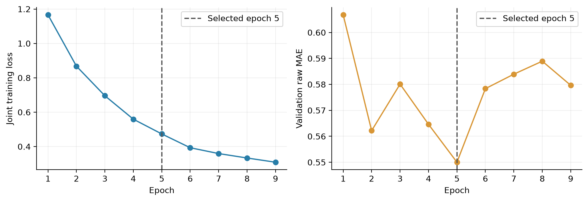
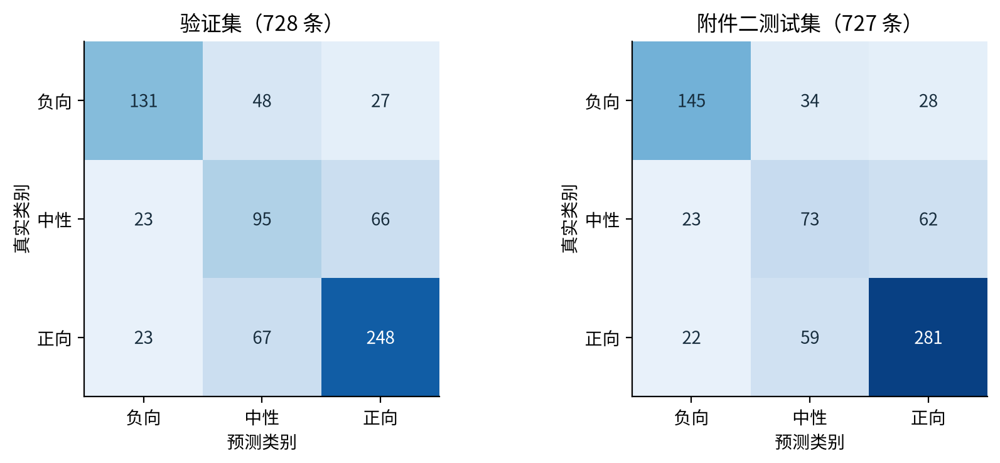
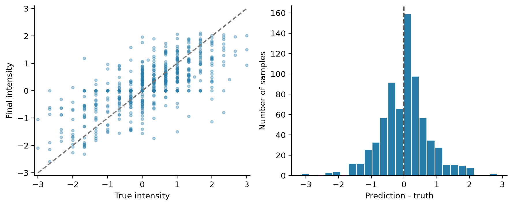
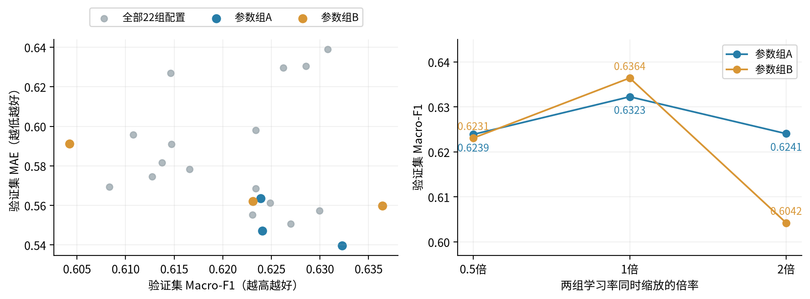
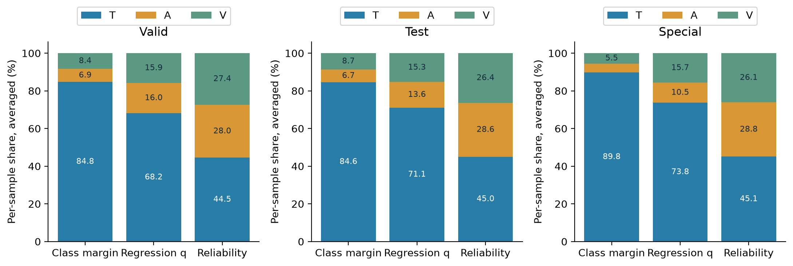
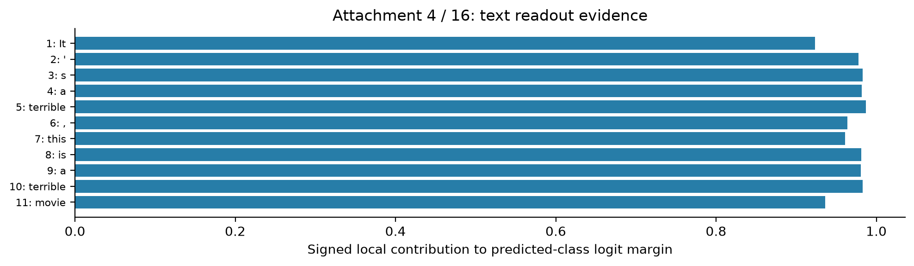
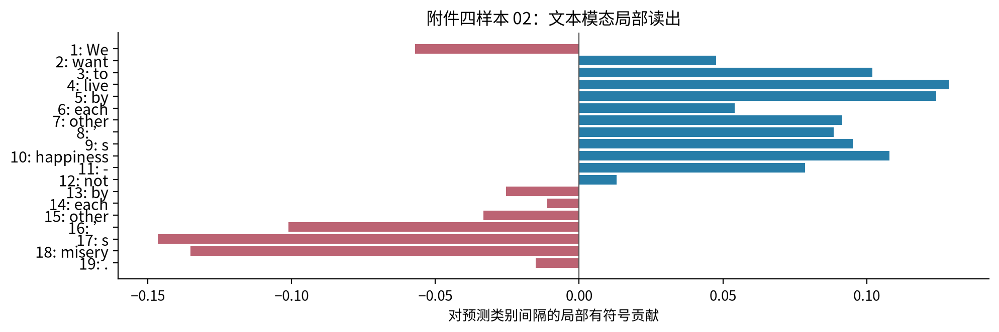

# 基于不确定性融合与局部可加证据的多模态情感识别

问题三：可解释性模型的建立、求解与结果分析

## 摘要

针对复杂场景下文本、语音与视觉信息不一致、部分观测缺失以及预测依据难以定位的问题，建立兼顾情感极性分类、强度估计与证据解释的多模态联合模型。本文采用题目给定的对齐版数据，在统一读出结构中保留单模态局部证据与显式成对交互，使预测分数能够按模态及输入位置核算。

在模型建立方面，以BERT提取上下文化文本表示，对语音和视觉特征进行训练集统计标准化；构建零参考局部编码和低秩双线性交互，以单模态回归残差方差估计可靠性，并对实际参与预测的证据进行精度缩放。以Huber损失、分类交叉熵及辅助监督联合优化，利用验证集选择检查点和中性判别策略。解释以预测类别相对最强竞争类别的间隔为目标，通过交互项等分给出三模态净贡献、主要参考模态及关键片段。

在结果检验方面，附件二验证集准确率为65.11%、Macro-F1为0.6323、强度MAE为0.5397；测试集相应为68.64%、0.6493和0.6006。与SELF-MM和TETFN的比赛适配基线比较，主模型在测试分类指标与原生解释能力之间取得较好的折中，但并非所有指标均占优。补充原生结构对照和学习率成组试验表明，组合模块和增大学习率未必改善验证结果。验证集主要错误集中在中性与正向之间，说明弱情感边界仍是模型改进重点。

对附件四20条无标签样本给出全量预测与解释汇总，并结合典型解释卡和局部重要性图展示证据方向与位置。附件四中，文本在分类间隔中的平均净贡献占89.78%，在回归预激活中的占比为73.76%；可靠性权重与贡献比例存在明显差异。结果说明极性判断和强度估计对三模态的利用方式不同，可加读出为这种差异提供了直接的数值解释。

关键词：多模态情感识别；不确定性融合；局部可加证据；成对交互；可解释性

## 1 问题重述与分析

### 1.1 问题三的任务

问题三要求模型同时给出情感极性、连续强度、三模态作用程度、主要参考模态和关键证据定位。输入由文本、语音、视觉三种模态构成，模型既要完成预测，也要说明该判断由哪些输入片段支撑。本文为问题三独立章节稿，使用附件二给定划分建立和检验模型，对附件四无标签专项样本进行最终预测与解释。

### 1.2 建模难点与总体思路

第一，三模态的数值尺度、观测质量和情感线索不同，简单拼接难以说明各模态作用。第二，模态之间存在补充、冲突与抵消，单独解释各模态不能覆盖融合后的判断。第三，分类与回归具有不同输出空间；用于选择模态的可靠性系数，也不等于模态对某个预测目标的贡献。第四，附件四需要把关键证据关联到原文本和媒体，而对齐特征并未提供精确的音视特征时间戳。

据此，采用“局部编码—单项与成对读出—可靠性缩放—联合预测与核算”的建模路线。以可加结构保证分数可分解，以成对项表达跨模态共同作用，以残差方差抑制相对不可靠的读出；分别解释分类间隔和回归预激活，并通过原词元位置及机器估计时间建立证据索引。总体流程见图1。

## 2 模型假设与符号说明

### 2.1 基本假设

假设1：题目给定的对齐位置可以作为三模态局部读出的共同索引。该索引用于模型计算；机器估计的媒体时间只用于证据回查，不假设其等于原音视特征的精确提取时间。

假设2：无有效数值的音视行不提供局部观测信息，对应项和关联交互置零。缺失状态本身不被赋予正向、负向或中性含义；是否缺失以原始观测掩码判断。

假设3：在上下文化局部编码之后，用单模态项与两两交互近似融合关系，不另设不可分解的融合残差。三方高阶作用未被显式建模，由此得到可核算性与表达能力之间的折中。

假设4：单模态回归残差的条件方差可作为该模态读出的相对可靠性线索。此假设用于构造缩放系数；是否提高泛化性能需由数据检验，方差不直接视为分类置信度或人类证据可信程度。

### 2.2 主要符号

表1　主要符号及含义

| 符号 | 含义 |
|---|---|
| m，n；j | 模态索引T/A/V；有效局部窗口索引 |
| xₘⱼ，oₘⱼ | 局部输入及其有效观测掩码 |
| y，c；ŷ，ĉ | 真实强度及类别；预测强度及类别 |
| dₘⱼ；aₘⱼ，iₘₙⱼ | 零参考局部表示；单项与成对四维读出 |
| vₘ，pₘ，κₘ | 对数方差、归一化精度及单项缩放系数 |
| q，ℓ；β | 回归预激活、三分类logit；共享读出偏置 |
| M；Φₘ，ψₘⱼ | 预测类别间隔；模态净分数与局部净分数 |
| ρₘ | 模态净分数绝对值占比；不包含偏置 |

## 3 数据观察与预处理

标签强度y∈[−3,3]，y<0、y=0、y>0分别对应负向、中性、正向，类别编码为0、1、2。不将接近零但非零的标签重定义为中性。附件二各集合的样本量与类别分布见表2；附件四有20条无标签专项样本，仅列样本量和推理用途。

表2　题目数据划分与用途

| 集合 | 样本数 | 负向 | 中性 | 正向 | 用途 |
|---|---|---|---|---|---|
| 训练集 | 3395 | 967 | 758 | 1670 | 参数学习、统计估计 |
| 验证集 | 728 | 206 | 184 | 338 | 结构、参数及策略选择 |
| 附件二测试集 | 727 | 207 | 158 | 362 | 固定模型的基础评价 |
| 附件四 | 20 | — | — | — | 最终预测与解释 |

每条样本最多50个对齐位置，给定文本特征768维、语音特征74维、视觉特征35维，另有BERT词元编号、注意力掩码及类型编号。本模型选择text_bert输入预训练BERT[1]，不把text与text_bert视为两个模态。剔除特殊词元和填充位置后保留原序列位置source_index，文本隐状态经LayerNorm后回填到局部窗口。

语音、视觉全零行按无有效数值观测处理。对模态m的第d维，仅在训练集有效观测上计算均值μₘd和总体标准差sₘd，并标准化为(xₘⱼd−μₘd)/sₘd；标准差小于10⁻⁶时置为1。缺失行保持为零且保留掩码，验证、测试和附件四复用训练统计，避免把待评价集合的信息用于归一化参数估计。

模型评估基于既有探索实验：历史研究中曾多次查看附件二测试表现，最终方案同时考虑已有性能与解释要求。因而本文报告的是单种子探索性比较，不能作为完全独立、确认性的模型优越性结论；附件四在正式展示中只报告模型输出。

## 4 模型建立

### 4.1 上下文化局部证据与成对交互

借鉴神经可加模型[2]与成对交互建模[3]，采用“局部非线性编码—显式加性读出”的结构。BERT提供语言上下文，局部编码保留证据位置，成对分支表达同位置的跨模态共同作用。可靠性缩放在样本层调整这些读出项，不额外设置无法核算的融合残差。预测及解释共享同一次前向中的实际数值。

记m∈{T,A,V}，j为有效内容窗口。当前窗口宽度为1；每模态局部编码器由逐行线性映射与GELU、窗口拼接线性映射与GELU构成，投影维度与局部隐层均为64。文本BERT隐状态先作LayerNorm，再按source_index回填局部位置。用相同观测结构下的零输入编码作为参考，得到下式。参考为特征坐标基准，不代表真实中性情绪。

dₘⱼ = Eₘ(xₘⱼ, oₘⱼ) − Eₘ(0, oₘⱼ)　（1）

单模态读出为无偏置64→4线性映射。均值汇聚权重ωₘⱼ正比于该窗口内有效观测数；成对权重ωₘₙⱼ以两端权重几何均值构造，限制在共同有效窗口，再按样本归一化。TA、TV、AV各使用独立的秩8双线性投影，分别输出4维交互。

aₘⱼ = ωₘⱼ Wₘdₘⱼ；  iₘₙⱼ = ωₘₙⱼ Vₘₙ[(Pₘₙdₘⱼ) ⊙ (Qₘₙdₙⱼ)]　（2）

P、Q、V均不含偏置；某一模态没有有效观测时，该单项与关联交互严格为零。BERT使单个文本读出含有全句上下文，因此不能把一个局部值解释为只由该词自身产生的独立效应。成对模块连接对齐位置，文本上下文来自BERT，模型不另设音视跨位置注意力或三方高阶交互。

### 4.2 由残差方差驱动的可靠性融合

首先从未进行精度缩放的单项计算每模态四维净分数uₘ=β+Σⱼaₘⱼ，同时统计各输出维度局部读出的绝对活性Σⱼ|aₘⱼ|。拼接后得到8维输入，通过每模态一个8→1线性层预测有界对数方差。训练时活性来自模态丢弃后的单项，单模态监督仍使用丢弃前的实际单项。

vₘ = −1 + 4 tanh(wₘᵀ[uₘ; Σⱼ|aₘⱼ|] + bₘ)； σₘ² = exp(vₘ)　（3）

pₘ = 1ₘ exp(−vₘ) / Σₙ 1ₙ exp(−vₙ)； κₘ = K pₘ，K = Σₘ 1ₘ　（4）

1ₘ表示当前保留且可观测的模态。单项按κₘ缩放，成对项按√(κₘκₙ)缩放。精度相同时κₘ=1，恢复基础加性读出；方差被限制在exp(−5)至exp(3)之间。方差监督针对单模态回归残差，它既不是分类概率校准，也不是融合后预测区间。归一化精度pₘ是可靠性系数，不能直接作为模态贡献百分比。

s = β + Σₘⱼ κₘaₘⱼ + Σ₍ₘ,ₙ₎∈P,ⱼ √(κₘκₙ)iₘₙⱼ； q=s₀； ℓ=(s₁,s₂,s₃)　（5）

P={(T,A),(T,V),(A,V)}为无序模态对的集合，每个成对项只计入一次。

### 4.3 联合输出与模态贡献定义

回归原始输出r=3 tanh(q)。冻结分类策略为中性logit加−0.4后取最大值：ℓ′=ℓ+(0,−0.4,0)，ĉ=argmax ℓ′。最终强度按类别保持符号一致：负向min(r,−10⁻⁶)，中性0，正向max(r,10⁻⁶)。所有主表MAE均评价该最终强度，同时另存raw_intensity。分类和回归共享全部编码及交互参数，输出层有各任务对应的行，联合训练；主模型未启用有序分类头，但保留强度的有序辅助损失。

对每条样本，以预测类别ĉ与最强竞争类别c₂的校准logit差M=ℓ′ĉ−ℓ′c₂为分类解释目标。将所有4维读出投影到这一类别差后，记单模态总项Aₘ、交互总项Iₘₙ。每个成对交互的一半分配给相关两端，得到模态净分数与位置净分数：

Φₘ = Aₘ + ½ Σₙ≠ₘ Iₘₙ； ψₘⱼ = ãₘⱼ + ½ Σₙ≠ₘ ĩₘₙⱼ； M = βM + ΣₘΦₘ　（6）

ρₘ = |Φₘ| / Σₙ|Φₙ|； principal = argmaxₘ |Φₘ|　（7）

ã和ĩ表示已缩放、已投影到解释目标的读出。βM包括两个对应输出偏置之差，以及中性−0.4校准项对该类别差的影响。解释卡同时保留符号：正值支持预测类别相对于竞争类别，负值反对该判断。ρ采用模态净值的绝对值归一化，偏置βM单列；它不同于把所有局部绝对值先相加得到的活性比例。若分母近零则标为未定义，主要模态不能强制指定。回归解释以q为目标同样核算，不能将其比例称为最终非线性强度的线性分配。动态可靠性与BERT上下文均随输入变化，因此当前分数项删除不等于重新运行被修改输入后的输出变化。

## 5 模型求解与训练方案

### 5.1 多任务目标函数

L = LHuber(r,y) + 0.5 LCE(ℓ,c) + 0.1 Lord + 0.001 Lpair + 0.1 Luni + 0.1 Lneutral + 0.1 Lpolarity + 0.1 LNLL　（8）

Huber阈值δ=1。Lpair为每样本所有已缩放成对项回归分量的绝对值之和，再在批内平均。Luni在实际可观测模态上平均Huber单模态回归损失与0.5倍单模态交叉熵；它使用uₘ的回归、分类分量。Lneutral使用中性logit减去正负logsumexp作为二分类log-odds；Lpolarity仅在非中性样本上对正负logit差进行二元交叉熵。Lord用固定带宽0.3、温度0.2构造两个累计logit：((r+0.3)/0.2, (r−0.3)/0.2)，分别以1[c>0]和1[c>1]为目标计算二元交叉熵并平均；该项不是启用独立的可学习有序头。

LNLL = mean有效模态{ ½[exp(−vₘ)(3 tanh(uₘ,₀)−y)² + vₘ] }　（9）

式（9）在批内所有实际可观测的“样本—模态”对上取平均，记这些索引对的集合为O、数量为N_O；abs表示绝对值。i为样本索引，uᵢₘ,₀为对应单模态读出的回归分量。模态丢弃不改变此项的实际观测监督范围。

异方差回归的NLL建模[4]用于单模态残差方差，使可靠性模块获得可监督训练信号。该损失不是三模态贡献的监督真值，预测方差的绝对大小不能直接等同于人类对证据可靠性的判断。整个模型用AdamW更新，BERT编码层和其他层使用固定分组学习率，当前实验没有学习率衰减或warmup。

### 5.2 求解流程与关键参数

求解分为五步：①在附件二训练集估计有效观测的标准化统计量；②载入公开预训练BERT，初始化局部编码、成对读出与方差模块；③按批次执行模态丢弃、联合前向与目标函数求导，使用AdamW更新参数；④每轮在验证集比较分类策略，保存三个选优目标对应的检查点；⑤选择固定检查点与决策策略，在测试集计算评价指标，在附件四输出预测及解释。附件四不参与上述训练和验证策略搜索。

表3　主模型训练与推理参数

| 参数 | 冻结主模型设置 |
|---|---|
| 随机种子 / 批大小 | 17 / 32 |
| BERT / 其他层学习率 | 2×10⁻⁵ / 3×10⁻⁴，固定 |
| AdamW权重衰减 / 梯度裁剪 | 0.01（二维以上参数）/ 1.0 |
| 窗口 / 行投影 / 局部维度 / 交互秩 | 1 / 64 / 64 / 8 |
| 局部dropout / 模态丢弃率 | 0.2 / 0.1 |
| 最大轮次 / 早停耐心值 | 20 / 连续4轮三个选优目标均无刷新 |
| 实际轮数 / 采用检查点 | 9 / 第5轮 |
| 可训练BERT层 / AMP | 12层，embedding和pooler冻结 / 关闭 |
| 总参数 / 可训练参数 | 109,555,007 / 85,127,231 |
| 分类最终策略 | 中性logit偏置−0.4；最大logit类别 |

每轮仅在验证集搜索策略：441组回归中性阈值和31个中性logit偏置，共472个候选；分别按Macro-F1、Accuracy及最终强度MAE维护独立最佳检查点。任一目标排序刷新即重置早停计数，不是只监测训练损失。本文主表统一取验证Macro-F1策略，不能混合不同轮次、不同偏置的最好指标。第5轮之后训练损失继续降低但验证原始MAE未刷新，支持保留早停；增加训练上限不自动增加有效训练轮数。

## 6 模型检验与误差分析

### 6.1 评价指标与对比设置

附件二验证集的正向样本占46.43%，负向和中性分别占28.30%和25.27%，类别分布不均衡。因此同时采用准确率、Macro-F1和中性F1评价分类，采用平均绝对误差MAE与Pearson相关系数评价强度。所有回归指标均以类别一致性处理后的最终强度计算。

Accuracy = N⁻¹ Σᵢ 1[ĉᵢ=cᵢ]； Macro-F1 = (F1负 + F1中 + F1正)/3　（10）

F1ₖ = 2TPₖ/(2TPₖ+FPₖ+FNₖ)； MAE = N⁻¹ Σᵢ |ŷᵢ−yᵢ|　（11）

Pearson为真实强度与预测强度的样本相关系数，反映线性变化的一致程度；其数值不能替代绝对误差。分类指标按负向、中性、正向三类计算；不得与剔除中性的二分类成绩直接比较。

选择两个具有已训练检查点的开源适配基线。SELF-MM[5]采用BERT文本编码、音视LSTM、融合及单模态读出和中心驱动动态伪标签；本实现增加比赛三分类读出、有效观测打包与数值稳定处理。TETFN[6]直接使用MMSA工具库[7]固定版本的网络源码，恢复对齐音视位置，增加比赛分类头及有界回归输出，并使用本地联合训练目标。二者均为比赛数据适配实验，不是原论文数据规模、训练目标和配置下的严格复现。

所有方法仅以3395条训练样本学习，在同一728条验证集上选轮次和策略；本表统一使用各自验证Macro-F1版本。主模型最终按分类logit决策，而两基线的验证最优策略为回归阈值决策，策略差异一并列出，避免把结果误认为统一最后一层阈值的比较。

### 6.2 基础性能与可视化分析

表4　验证集（728条）模型性能比较

| 模型 | Acc(%) | Macro-F1 | MAE | Pearson | 中性F1 |
|---|---|---|---|---|---|
| SELF-MM适配 | 64.56 | 0.6390 | 0.5491 | 0.6910 | 0.5145 |
| TETFN源码适配 | 64.01 | 0.6321 | 0.5730 | 0.6569 | 0.5012 |
| 不确定性融合（主） | 65.11 | 0.6323 | 0.5397 | 0.6993 | 0.4822 |

表5　附件二测试集（727条）模型性能比较

| 模型 | Acc(%) | Macro-F1 | MAE | Pearson | 中性F1 |
|---|---|---|---|---|---|
| SELF-MM适配 | 66.16 | 0.6389 | 0.5966 | 0.6978 | 0.4712 |
| TETFN源码适配 | 65.61 | 0.6285 | 0.6226 | 0.6735 | 0.4355 |
| 不确定性融合（主） | 68.64 | 0.6493 | 0.6006 | 0.7046 | 0.4506 |

表6　模型选优轮次与决策策略

| 模型 | 检查点轮次 | 验证选定的最终策略 |
|---|---|---|
| SELF-MM适配 | 3 | 回归双阈值：-0.05 / 0.35 |
| TETFN源码适配 | 1 | 回归双阈值：0.00 / 0.55 |
| 不确定性融合（主） | 5 | 中性logit偏置-0.4，取最大类别 |

主模型验证Macro-F1并非三者最高：SELF-MM为0.6390，主模型为0.6323。附件2测试中，主模型比SELF-MM准确率高2.48个百分点、Macro-F1高约0.0104，而MAE稍高约0.0040；相比TETFN，测试准确率、Macro-F1和MAE均更优。选择主模型同时考虑其原生可核算解释，不能称其在所有指标上领先。当前为单随机种子的代表配置比较，未给出多种子方差或统计显著性。

表7　验证集逐类别性能

| 验证类别 | Precision | Recall | F1 | 支持数 |
|---|---|---|---|---|
| 负向 | 0.7401 | 0.6359 | 0.6841 | 206 |
| 中性 | 0.4524 | 0.5163 | 0.4822 | 184 |
| 正向 | 0.7273 | 0.7337 | 0.7305 | 338 |

### 6.3 原生结构对照与性能取舍

在开源基线之外，补充原生骨干上“有序分类头”和“不确定性融合”两个模块的四格对照。四种设置均采用种子17、最多20轮、早停耐心4轮，以及相同的BERT学习率、其他层学习率、模态丢弃率和联合监督基础权重；各自按验证Macro-F1选择轮次和决策策略。有序分类头指可学习的累计阈值输出，与四种设置均保留的强度有序辅助损失不同。

表8　原生骨干的四种结构设置在验证集上的对照

| 结构设置 | 有序头 | 不确定性 | 轮次 | Acc(%) | Macro-F1 | MAE |
|---|---|---|---|---|---|---|
| 联合监督基础 | 关 | 关 | 11 | 65.25 | 0.6412 | 0.5578 |
| 仅有序分类头 | 开 | 关 | 1 | 63.46 | 0.6230 | 0.5706 |
| 有序头＋不确定性 | 开 | 开 | 3 | 63.74 | 0.6165 | 0.5688 |
| 不确定性融合（主） | 关 | 开 | 5 | 65.11 | 0.6323 | 0.5397 |

仅加入有序分类头时，验证Macro-F1为0.6230、MAE为0.5706；同时加入有序头与不确定性时，相应为0.6165和0.5688，均弱于本文主模型的0.6323和0.5397。对应的既有冻结测试结果中，两种有序设置的准确率均为66.02%，Macro-F1分别为0.6342和0.6212，MAE分别为0.6210和0.6184，也未优于主模型。由此可见，更强的输出约束或更多融合模块并不自动带来更好的分类与回归表现。

联合监督基础设置在验证集的Macro-F1为0.6412，高于主模型；主模型的MAE则降低约0.0181。因此，四格对照支持不同结构之间存在性能取舍，不能据其中两个较弱设置宣称不确定性模块对所有指标均有增益。各设置使用各自验证最优策略，比较包含训练与策略选择的共同影响；单种子结果也不构成稳定提升的证据。

### 6.4 学习率成组对照与较弱配置分析

进一步从既有不确定性模型搜索中，提取两组完整的0.5倍、1倍、2倍学习率试验。A组采用本文主模型的监督权重与模态丢弃率；B组采用较强分类监督，分类、中性、极性、不确定性损失权重依次为4、1、2、1，模态丢弃率为0.05。两组单模态损失权重均为0.1。在每组内部，仅同时缩放BERT与其他层学习率，其余模型与训练参数保持一致；种子均为17、上限20轮、早停耐心6轮，每行仍取该配置自己的验证Macro-F1最优记录。

表9　不确定性模型的成组学习率对照（验证集）

| 组别 | 倍率 | BERT LR | 其他层LR | 轮次 | Acc(%) | Macro-F1 | MAE |
|---|---|---|---|---|---|---|---|
| A | 0.5 | 1.0e-05 | 1.5e-04 | 5 | 64.29 | 0.6239 | 0.5636 |
| A | 1 | 2.0e-05 | 3.0e-04 | 5 | 65.11 | 0.6323 | 0.5397 |
| A | 2 | 4.0e-05 | 6.0e-04 | 4 | 62.50 | 0.6241 | 0.5471 |
| B | 0.5 | 2.0e-05 | 1.5e-04 | 2 | 63.87 | 0.6231 | 0.5622 |
| B | 1 | 4.0e-05 | 3.0e-04 | 8 | 64.56 | 0.6364 | 0.5599 |
| B | 2 | 8.0e-05 | 6.0e-04 | 14 | 60.99 | 0.6042 | 0.5912 |

A组中，学习率减半或加倍均未改善参考配置的验证Macro-F1与MAE。B组的两组学习率从4×10⁻⁵/3×10⁻⁴同时加倍后，验证Macro-F1由0.6364降至0.6042，准确率由64.56%降至60.99%，MAE由0.5599增至0.5912，构成较明确的退化案例。该结果对应完整训练过程中的验证最优记录，并非从训练轨迹中抽取较差轮次；但它只能说明这组联合学习率设置不合适，不能分别归因于BERT或其他层的学习率。

B组参考配置的验证Macro-F1高于A组，但MAE较大，也说明分类与回归目标之间仍有取舍。图6同时展示全部22个固定种子候选，完整参数表随结果提供；其余宽搜索点同时改变了多个超参数，不用于推断某个单独参数的因果作用。本节不额外使用测试集或附件四挑选较弱参数，也不将缺少对应冻结测试记录的配置填入测试成绩。

### 6.5 验证集错误归因

验证集728条中分类错误254条。真实中性的184条中，89条被判为非中性（23条负向、66条正向），中性召回率51.63%；真实正向338条中67条被判中性，真实负向206条中48条被判中性。中性与正向混淆构成主要误差来源。中性边界校准改善取舍，仍不能解决说明性文本、弱情感与标注差异；继续扩大偏置会同时改变正负样本被归零的比例。

表10　验证集标签与观测分组的误差

| 验证分组 | 样本数 | 分类错误数 | 错误率 | 最终MAE |
|---|---|---|---|---|
| 真实负向 | 206 | 75 | 36.41% | 0.7233 |
| 真实中性 | 184 | 89 | 48.37% | 0.2580 |
| 真实正向 | 338 | 90 | 26.63% | 0.5811 |
| 视觉无有效观测 | 15 | 6 | 40.00% | 0.4789 |
| 视觉存在有效观测 | 713 | 248 | 34.78% | 0.5410 |

分组差异同时受标签分布、语句内容和观测质量影响，只能作为错误诊断线索，不构成模态缺失的因果效应。分类贡献在文本上的集中说明模型更依赖语言判别；语音与视觉的较低分类净贡献也可能来自内部正负项抵消，不能视为它们没有可用信息。强度预测的收缩与中性归零会对强情感样本产生较大残差，图5可用于检查这种系统偏差。

### 6.6 解释完备性检验

表11　分类间隔与回归预激活的分解误差

| 解释检查 | 验证 | 测试 | 附件4 |
|---|---|---|---|
| 分类间隔最大核算误差 | 1.52e-06 | 1.52e-06 | 5.29e-07 |
| 回归q最大核算误差 | 1.53e-07 | 1.53e-07 | 3.35e-08 |
| 逐样本核查数量 | 728 | 727 | 20 |

将三模态净分数与偏置相加，并与同次前向的目标分数逐条比较。1475条样本的分解误差均处于浮点计算误差范围。该检查说明解释忠实于当前读出的数值，不证明某个证据词是人类情感成因。本主模型没有单独完成随机扰动对照、多种子解释稳定性或人类证据标注评价，局部读出核算与输入扰动忠实性仍需分别检验。

## 7 三模态作用差异与局部重要性

### 7.1 分类、回归与可靠性的区别

表12　三模态净贡献占比的样本均值

| 集合/解释目标 | 文本(%) | 语音(%) | 视觉(%) |
|---|---|---|---|
| 验证集/分类间隔 | 84.76 | 6.88 | 8.36 |
| 验证集/回归q | 68.16 | 15.98 | 15.86 |
| 附件二测试集/分类间隔 | 84.62 | 6.71 | 8.68 |
| 附件二测试集/回归q | 71.14 | 13.58 | 15.28 |
| 附件四/分类间隔 | 89.78 | 4.71 | 5.51 |
| 附件四/回归q | 73.76 | 10.53 | 15.71 |

上述比例先在每条样本内归一化，再对样本等权平均。验证与测试的分类文本占比均约85%，而回归文本占比约68%—71%，语音和视觉对强度的作用相对更高。附件4分类主要参考模态为文本20/20，回归主要模态为文本18/20、视觉2/20（02、14）；02与14的视觉回归净贡献占比分别为48.12%与41.09%。因此“分类主要看文本”不能推导出“强度估计中的视觉无作用”。

附件4平均可靠性权重T/A/V为45.07%/28.80%/26.12%，分类净贡献却为89.78%/4.71%/5.51%。这来自不同模态证据大小、方向和抵消程度的共同影响，表明直接把可靠性权重写成贡献会失真。附件4的13号视觉数组全部为零，视觉单项和交互关闭，其视觉贡献应为0；验证和测试分别有15、28条视觉无有效数值观测。

### 7.2 主要参考模态内的局部证据分布

局部重要性按分类间隔的有符号读出绘制。为避免只呈现支持结论的片段，图中保留每个有效位置及其正负方向：蓝色为支持预测类，红色为反对预测类。横轴采用原始分数量纲，纵轴保留原BERT位置与原文词元；这使典型解释可以回查到输入，而不只给出无位置的模态占比。

## 8 附件四全量预测与典型解释

### 8.1 全量预测与三模态作用程度

附件四按题目中的无标签专项集处理。表中给出全部20条样本的预测极性、最终强度、分类间隔的三模态净贡献占比及主要参考模态。比例均由同次前向的有符号净分数取绝对值后归一化；少量行因四舍五入可能不恰好合计100%。

表13　附件四20条样本的预测与分类贡献汇总

| 编号 | 预测极性 | 最终强度 | 文本(%) | 语音(%) | 视觉(%) | 主模态 |
|---|---|---|---|---|---|---|
| 01 | 中性 | +0.0000 | 96.43 | 3.50 | 0.06 | T |
| 02 | 正向 | +1.0e-06 | 74.42 | 22.81 | 2.76 | T |
| 03 | 负向 | -0.6588 | 98.46 | 0.41 | 1.13 | T |
| 04 | 负向 | -0.4144 | 98.67 | 0.31 | 1.02 | T |
| 05 | 正向 | +0.7983 | 81.97 | 3.64 | 14.38 | T |
| 06 | 正向 | +0.9139 | 93.60 | 3.66 | 2.74 | T |
| 07 | 正向 | +0.8535 | 90.50 | 2.19 | 7.31 | T |
| 08 | 正向 | +0.5174 | 98.47 | 0.46 | 1.07 | T |
| 09 | 负向 | -2.2932 | 99.50 | 0.19 | 0.31 | T |
| 10 | 负向 | -2.1598 | 99.37 | 0.63 | 0.01 | T |
| 11 | 负向 | -1.7402 | 99.40 | 0.52 | 0.08 | T |
| 12 | 负向 | -0.6896 | 96.60 | 2.59 | 0.81 | T |
| 13 | 中性 | +0.0000 | 93.27 | 6.73 | 0.00 | T |
| 14 | 中性 | +0.0000 | 80.66 | 4.35 | 14.99 | T |
| 15 | 正向 | +0.6387 | 73.61 | 15.05 | 11.34 | T |
| 16 | 负向 | -2.6363 | 99.04 | 0.01 | 0.95 | T |
| 17 | 正向 | +1.7645 | 94.11 | 1.66 | 4.23 | T |
| 18 | 负向 | -0.5241 | 93.28 | 0.09 | 6.63 | T |
| 19 | 正向 | +0.6309 | 71.34 | 8.08 | 20.58 | T |
| 20 | 正向 | +0.5035 | 62.90 | 17.33 | 19.77 | T |

模型预测的类别分布为负向8条、中性3条、正向9条。该分布是预测输出的统计。样本02的最终强度为+1.0×10⁻⁶，来自类别一致性处理，故以科学计数法保留其正号，避免将其显示为中性0。

### 8.2 关键证据定位与结果文件

对每条样本，按局部贡献绝对值选取关键项，同时保留其支持或反对的方向。表中列主要参考模态内最显著的局部词元及原序列索引；完整结果文件同时给出三模态关键证据、原文本字符区间及估计时间。表内的语音时间来自MMS强制对齐[8]，仅用于媒体回查；同位置视觉时间为粗略检索区间，不视为原视觉特征的精确帧时间。

表14　附件四20条样本的主要证据定位索引

| 编号 | 主模态关键位置 / 原词元 | 有符号贡献 | 估计时段(s) |
|---|---|---|---|
| 01 | [7] / the | +0.1881 | 2.61—2.69 |
| 02 | [17] / s | -0.1465 | 2.23—2.43 |
| 03 | [14] / just | +0.1889 | 2.73—2.89 |
| 04 | [24] / Absolutely | +0.2844 | 5.37—5.95 |
| 05 | [7] / , | +0.3215 | 未定位 |
| 06 | [33] / solely | +0.1871 | 6.82—7.14 |
| 07 | [21] / enthusiastically | +0.1252 | 5.96—7.02 |
| 08 | [8] / Universal | +0.4617 | 2.02—2.52 |
| 09 | [18] / it | +0.5707 | 3.72—3.82 |
| 10 | [30] / terrible | +0.3731 | 8.67—9.17 |
| 11 | [4] / ashamed | +0.5581 | 0.88—1.38 |
| 12 | [41] / low | +0.1494 | 12.03—12.29 |
| 13 | [19] / a | +0.1115 | 5.03—5.05 |
| 14 | [11] / Vet | +0.1775 | 2.14—2.48 |
| 15 | [20] / transform | +0.3343 | 6.92—7.18 |
| 16 | [5] / terrible | +0.9867 | 0.79—1.21 |
| 17 | [14] / will | +0.3360 | 6.80—6.94 |
| 18 | [17] / Meanwhile | +0.1514 | 6.33—6.89 |
| 19 | [3] / surprisingly | +0.1747 | 0.94—1.68 |
| 20 | [36] / at | +0.0975 | 8.75—8.87 |

完整预测与解释以CSV汇总：一行对应一个样本，含类别、最终及原始强度、分类与回归净分数及比例、主要模态、三模态关键证据和可用状态。全部20条详细解释卡与该表使用同一批固定预测记录生成。

### 8.3 典型样本解释卡

选取02、13、14、16号样本，分别展示分类与回归分歧、视觉缺失、中性决策以及文本高度主导的读出。每张卡同时列预测、三模态作用程度、主要模态、证据位置及数值方向；其解读仅说明模型如何形成当前判断。字符区间采用原文本的半开区间，序列位置为零基BERT索引。

### 样本02

表15　样本02解释卡

| 项目 | 内容 |
|---|---|
| 预测极性 / 最终强度 | 正向 / +1.0e-06 |
| 原始强度 / 竞争类别 | -0.0347 / 中性 |
| 分类贡献 T / A / V | 74.42% / 22.81% / 2.76% |
| 分类净分数 T / A / V | +0.4064 / -0.1246 / -0.0151 |
| 回归q贡献 T / A / V | 30.04% / 21.84% / 48.12% |
| 分类 / 回归主要模态 | T / V |
| 分类间隔 / 偏置 | 0.7204 / +0.4537 |
| 原文本 | We want to live by each other’s happiness - not by each other’s misery. |

T关键证据：位置[17]，s，字符[[62, 63]]，分数-0.1465；估计2.23—2.43s；
位置[18]，misery，字符[[64, 70]]，分数-0.1352；估计2.47—2.75s；
位置[4]，live，字符[[11, 15]]，分数+0.1288；估计0.82—0.94s

A关键证据：位置[18]，misery，字符[[64, 70]]，分数-0.0120；估计2.47—2.75s

V关键证据：位置[16]，’，字符[[61, 62]]，分数-0.0014；估计2.23—2.43s

解读：分类主要参考文本，回归q主要参考视觉，两项任务的主要模态不同。原始强度为负而分类判为正，最终强度经一致性处理成为接近零的正值；这是当前双任务输出间的分歧，不应把最终微小正值写成强正向判断。文本中支持项与反对项同时存在，词面含义不能替代上下文化读出。

### 样本13

表16　样本13解释卡

| 项目 | 内容 |
|---|---|
| 预测极性 / 最终强度 | 中性 / +0.0000 |
| 原始强度 / 竞争类别 | +0.1131 / 正向 |
| 分类贡献 T / A / V | 93.27% / 6.73% / 0.00% |
| 分类净分数 T / A / V | +1.8412 / -0.1328 / +0.0000 |
| 回归q贡献 T / A / V | 63.07% / 36.93% / 0.00% |
| 分类 / 回归主要模态 | T / T |
| 分类间隔 / 偏置 | 1.2547 / -0.4537 |
| 原文本 | For example, I could take a set of data and from that data, I can find a relationship between any two of the given factors or more. |

T关键证据：位置[19]，a，字符[[71, 72]]，分数+0.1115；估计5.03—5.05s；
位置[21]，between，字符[[86, 93]]，分数+0.1050；估计5.75—6.09s；
位置[25]，the，字符[[105, 108]]，分数+0.0878；估计6.86—6.94s

A关键证据：位置[22]，any，字符[[94, 97]]，分数-0.0107；估计6.29—6.43s

V关键证据：无有效视觉观测；不列视觉证据。

解读：原视觉数组全零，视觉单项及关联交互关闭，视觉贡献为0。当前判断来自可观测的文本与语音，分类输出为中性。缺失是输入的观测事实，不能由这一案例推断若补充视觉就会改变类别。

### 样本14

表17　样本14解释卡

| 项目 | 内容 |
|---|---|
| 预测极性 / 最终强度 | 中性 / +0.0000 |
| 原始强度 / 竞争类别 | +0.2018 / 正向 |
| 分类贡献 T / A / V | 80.66% / 4.35% / 14.99% |
| 分类净分数 T / A / V | +3.6700 / -0.1979 / -0.6822 |
| 回归q贡献 T / A / V | 36.71% / 22.20% / 41.09% |
| 分类 / 回归主要模态 | T / V |
| 分类间隔 / 偏置 | 2.3361 / -0.4537 |
| 原文本 | He is the co-founder of Rossen and Vettese Limited and the former Executive Director of Uniform Final Examination (UFE) courses at Toronto's York University. |

T关键证据：位置[11]，Vet，字符[[35, 38]]，分数+0.1775；估计2.14—2.48s；
位置[1]，He，字符[[0, 2]]，分数+0.1516；估计0.50—0.56s；
位置[2]，is，字符[[3, 5]]，分数+0.1426；估计0.60—0.64s

A关键证据：位置[3]，the，字符[[6, 9]]，分数-0.0202；估计0.66—0.72s

V关键证据：位置[19]，Director，字符[[76, 84]]，分数-0.0350；估计4.26—4.66s

解读：分类判为中性，最终强度置零；回归q中视觉净作用占41.09%，高于其他单个模态。中性类别并不意味着各模态没有作用，局部支持、反对以及输出偏置共同决定最终分类间隔。

### 样本16

表18　样本16解释卡

| 项目 | 内容 |
|---|---|
| 预测极性 / 最终强度 | 负向 / -2.6363 |
| 原始强度 / 竞争类别 | -2.6363 / 中性 |
| 分类贡献 T / A / V | 99.04% / 0.01% / 0.95% |
| 分类净分数 T / A / V | +10.6589 / +0.0014 / -0.1020 |
| 回归q贡献 T / A / V | 99.06% / 0.94% / 0.00% |
| 分类 / 回归主要模态 | T / T |
| 分类间隔 / 偏置 | 10.9566 / +0.3983 |
| 原文本 | It's a terrible, this is a terrible movie |

T关键证据：位置[5]，terrible，字符[[7, 15]]，分数+0.9867；估计0.79—1.21s；
位置[3]，s，字符[[3, 4]]，分数+0.9829；估计0.08—0.58s；
位置[10]，terrible，字符[[27, 35]]，分数+0.9827；估计1.79—2.18s

A关键证据：位置[7]，this，字符[[17, 21]]，分数+0.0080；估计1.51—1.61s

V关键证据：位置[7]，this，字符[[17, 21]]，分数-0.0160；估计1.51—1.61s

解读：预测为负向，最终强度为−2.6363。文本净贡献占99.04%，原句中两处terrible可在局部图中回查；这些读出已包含全句上下文，不能解释为词自身独立产生的因果效应。

## 9 模型评价与改进方向

### 9.1 模型特点与适用性

本模型将预测与解释建立在同一组实际读出上。局部项保留原输入索引，单项和成对项能够逐层汇总到模态贡献，便于满足题目要求的“预测—模态—片段”解释链条。可靠性模块仅增加27个参数，不需要为每条解释重复训练模型；主要计算开销仍来自BERT。分类间隔与回归预激活分别分析，也避免了用单一贡献比例概括两项不同任务。

### 9.2 模型局限

首先，有限训练数据与多次验证选择带来过拟合和选择偏差，当前比较只有一个随机种子，未给出多次重复的方差。其次，分类文本贡献较高，中性与弱极性边界仍有明显混淆；较低音视净贡献可能由证据弱或内部抵消造成，不能仅凭比例判断其信息无用。再次，可加读出保证的是当前前向的数值完备性，不是独立词效应或输入删除的因果忠实性；方差针对单模态回归残差，未验证为融合后的概率区间。最后，音视精确时间戳缺失限制了证据定位精度，三方高阶交互也未显式建模。

### 9.3 后续改进方向

后续优先扩展本次单种子结构与学习率对照，进行多随机种子重复和独立确认实验，并进一步分离成对项、辅助监督等模块的作用；围绕中性边界采用嵌套验证控制策略选择偏差，分别考察分类、回归与校准质量。在解释层面，可增加保持训练数据分布的局部扰动实验、跨种子稳定性评价和人工证据核验，区分数值完备、预测忠实与人类可理解三个维度。上述扩展内容为待验证方向，不计入本文已完成结果。

## 参考文献

[1] Devlin J, Chang M W, Lee K, Toutanova K. BERT: Pre-training of Deep Bidirectional Transformers for Language Understanding. NAACL-HLT, 2019: 4171–4186. https://aclanthology.org/N19-1423/

[2] Agarwal R, Melnick L, Frosst N, et al. Neural Additive Models: Interpretable Machine Learning with Neural Nets. NeurIPS, 2021, 34: 4699–4711. https://arxiv.org/abs/2004.13912

[3] Lou Y, Caruana R, Gehrke J, Hooker G. Accurate Intelligible Models with Pairwise Interactions. KDD, 2013: 623–631. https://doi.org/10.1145/2487575.2487579

[4] Kendall A, Gal Y. What Uncertainties Do We Need in Bayesian Deep Learning for Computer Vision? NeurIPS, 2017, 30. https://arxiv.org/abs/1703.04977

[5] Yu W, Xu H, Yuan Z, Wu J. Learning Modality-Specific Representations with Self-Supervised Multi-Task Learning for Multimodal Sentiment Analysis. AAAI, 2021, 35(12): 10790–10797. https://arxiv.org/abs/2102.04830

[6] Wang D, Guo X, Tian Y, Liu J, He L, Luo X. TETFN: A Text Enhanced Transformer Fusion Network for Multimodal Sentiment Analysis. Pattern Recognition, 2023, 136: 109259. https://doi.org/10.1016/j.patcog.2022.109259

[7] thuiar. MMSA: Multimodal Sentiment Analysis Toolkit[EB/OL]. https://github.com/thuiar/MMSA, 访问日期：2026-09-26. 本文采用固定源码版本a94e65d的比赛适配实现。

[8] Pratap V, Tjandra A, Shi B, et al. Scaling Speech Technology to 1,000+ Languages. Journal of Machine Learning Research, 2024, 25(97): 1–52. https://jmlr.org/papers/v25/23-1318.html.

